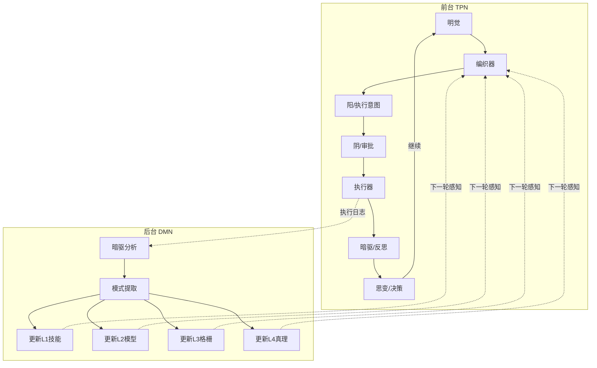

# 太极循环的精髓：TPN + DMN 双循环持续推进目标

> 为什么大多数 AI Agent 框架只在"执行"上卷，而太极架构在学"怎么学习"？

---

## 引言：Agent 架构的盲区

2025年的 Agent 框架市场，可以用一个词概括——**执行器竞赛**。

AutoGPT 能循环调用工具了。CrewAI 能编排多个 Agent 协作执行了。LangGraph 能用有向图组织复杂工作流了。OpenAI Agents SDK 把护栏和工具调用标准化了。

这些框架在「执行」这件事上做得越来越好——更快、更稳、更安全。

**但它们在同一个地方翻车了：不会从执行中学习。**

你让 AutoGPT 做一个任务，它做得很好。你再让它做一个类似的任务，它**从头再来**——同样的问题、同样的试错、同样的过拟合。它没有"经验"这个概念。

**太极（Taiji）架构的核心理念**：一个真正智能的 Agent 系统，不能只有"做"的能力，必须有"学"的能力——而且"学"和"做"必须并行，不互相阻塞。

这就是本文要阐述的核心论点——**太极循环的精髓，就是 TPN + DMN 双循环持续推进目标。**

---

## 一、问题的本质：为什么现有框架不会"学习"？

### 1.1 单循环架构的局限

所有主流 Agent 框架采用的都是**单循环架构**：

```
感知 → 决策 → 执行 → 感知 → 决策 → 执行 → ...
```

这个循环在每个轮次都做同样的事：看当前状态，决定做什么，执行动作。**没有"反思"环节**——或者说，反思被压缩在 prompt 中的"请分析你的结果并改进"这样一句指令里。

这种模式的本质问题是：

- **短期记忆 = 长期记忆**：对话历史就是全部知识，没有分层提取
- **没有模式提炼**：成功经验和失败教训都混在对话历史里，下次启动又是白纸
- **认知不增长**：系统做了 1000 个任务，还是和做第一个任务时一样"聪明"

### 1.2 人类大脑的双系统启示

神经科学研究表明，人类大脑并不是单线程工作的。我们有两套并行运行的网络：

- **TPN（Task Positive Network，任务正相关网络）**：当你专注做事时激活——写代码、回邮件、做饭。这是"执行模式"。
- **DMN（Default Mode Network，默认模式网络）**：当你走神、休息、发呆时激活——回忆过去、规划未来、整合经验。这是"学习模式"。

**关键发现**：DMN 在 TPN 活跃时并不是完全关闭的——它只是被抑制了。它会在后台持续处理信息。当你停下来思考时，DMN 活跃度急剧上升，把之前 TPN 积累的"素材"整合成"经验"。

太极架构把这两套系统都搬进了 Agent 框架——**TPN 驱动任务推进，DMN 驱动认知演化。**

---

## 二、TPN + DMN：太极架构的双循环设计

### 2.1 TPN（前台任务执行循环）

TPN 对应太极架构的**六爻循环**——一个完整的认知-执行流程：

```
明觉(Mingjue) → 编织器(Weaver) → 阳(Yang/执行意图)
  → 阴(Yin/审批) → 执行器(Executor) → 暗驱(Anqu/反思)
  → 思变(Sixiang/决策)
```

六个爻位（角色）加一个循环决策点，形成一个闭环：

| 爻位 | 角色 | 职责 | 类比人类 |
|------|------|------|---------|
| 初爻 · 明觉 | 感知者 | 评估目标进展，查看蓝图和完成标准 | "我现在在哪？" |
| 二爻 · 编织器 | 策略师 | 读取八卦格栅，动态编织系统提示词 | "我该怎么思考这个问题？" |
| 三爻 · 阳 | 执行者 | 提出执行意图，决定做什么 | "我要做这个" |
| 四爻 · 阴 | 审批者 | 双层安全审批（硬编码规则+LLM语义检查） | "这安全吗？" |
| 五爻 · 执行器 | 行动者 | 实际执行被批准的操作 | "做！" |
| 上爻 · 暗驱 | 分析师 | 分析执行结果，提取经验模式 | "我学到了什么？" |
| 循环点 · 思变 | 决策者 | 决定继续/完成/回炉/失败 | "下一步怎么办？" |

TPN 的核心设计原则：**禁止连续两轮纯读**。每一轮 TPN 循环必须有实际产出——写文件、调 API、生成代码。这是架构级别的"行动强制"，防止 Agent 陷入"只读不做"的死循环。

### 2.2 DMN（后台认知演化循环）

DMN 由两个组件构成，在 TPN 执行的同时**并行运行**：

**组件一：暗驱（Anqu）**

暗驱的名字来自「安」（安定观察）和「曲」（曲径通幽）。它持续扫描 TPN 的执行日志，做两件事：

- **微进化**：单任务完成后，立即分析日志，提取可复用的成功模式和需要避免的失败教训
- **宏进化**：当任务经验积累达到阈值时，触发全面的认知库整理

**组件二：DMN 消费者**

一旦暗驱触发了认知演化任务，DMN 消费者执行实际的认知库更新：

```
暗驱分析日志 → 提取模式 → DMN消费者更新认知库
  → L1技能库更新（新增/废弃技能）
  → L2模型库更新（提炼/修正执行模式）
  → L3格栅更新（调整八卦间连接权重）
  → L4真理更新（提炼经过验证的原则）
```

这个过程类似人类的**「日省吾身」**——每天结束时，大脑回放当天的经历，提取经验，更新认知。

### 2.3 双循环的并行协同

TPN 和 DMN 不是串行的两阶段——它们是**并行运行**的两套系统：



**关键协同机制**：

1. TPN 的执行结果（日志）被 DMN 消化
2. DMN 的认知更新（格栅、模式、真理）在下一轮 TPN 中被 Weaver 感知
3. TPN 和 DMN 互不阻塞——TPN 不需要等 DMN 分析完才继续执行

这意味着：**太极架构的 Agent 越做越聪明**。执行 100 个任务后，它的认知库已经迭代了 100 次——它知道什么模式有效、什么模式无效、什么原则不可动摇。

---

## 三、双循环 vs 单循环：一个对比实验

让我们用一个假想的任务来对比单循环架构和太极双循环架构的表现：

**任务：写一篇关于光伏行业的市场分析报告**

### 单循环架构（AutoGPT 式）

```
第1轮：搜索"光伏行业2025" → 收集到10篇文章
第2轮：搜索"光伏政策" → 收集到5篇文章
第3轮：搜索"光伏技术趋势" → 收集到8篇文章
第4轮：开始写报告 → 写了500字
第5轮：继续写 → 卡在"数据太多了" → 超时
```

**问题在哪？** 没有"反思"环节。系统不知道"我收集了太多信息，需要先分类整理"——它只是机械地循环执行 prompt 里的指令。

### 太极双循环架构

**TPN 推进：**
```
第1轮·明觉：评估任务 → "市场分析报告，需要结构化和数据支撑"
第1轮·Weaver：编织策略 → 读取八卦格栅 → 确定用巽卦（分析渗透）
第1轮·执行：搜索"光伏行业2025市场规模"
第1轮·暗驱：分析 → "获取了5条规模数据，但缺少政策维度"
第1轮·思变：继续 → "补充政策信息"
```

DMN 并行分析日志，提炼模式：**"做市场分析时，应先收集行业规模、政策、技术三个维度的数据，再综合撰写。"** 这个模式被写入 L2 模型库。

```
第2轮·明觉：评估进展 → "已收集规模数据，需要政策数据"
第2轮·Weaver：感知到 L2 有新的市场分析模式 → 调整策略
第2轮·执行：搜索"光伏2025政策" + 写入临时数据文件分类整理
第2轮·暗驱：分析 → "政策数据已获取，技术数据待补充"
第2轮·思变：继续 → "补充技术趋势"
```

DMN 继续运行：**"发现光伏政策分补贴类和标准类，下次搜索应区分。"** 再次更新 L2。

```
第3轮：搜索技术数据 → 结合前两轮数据开始写报告
第4轮：完成报告 → 参考了 DMN 积累的"市场分析工作流模式"
```

**差别在哪？** 太极架构在第 2 轮感知到上一轮提炼的「市场分析三维度模式」，自动调整了搜索策略——这就是从经验中学习。而单循环架构即使做了同一个任务 10 次，也不会积累出"市场分析应该分维度收集数据"这个经验。

---

## 四、DMN 的认知演化机制详解

### 4.1 微进化：每轮积累

每次 TPN 执行完成，暗驱立即做三件事：

```python
def micro_evolution(task_log):
    # 1. 提取成功模式
    success_patterns = extract_patterns(task_log, type="success")
    # → "当使用巽卦搜索时，配合离卦评估效果更好"
    
    # 2. 提取失败教训
    failure_patterns = extract_patterns(task_log, type="failure")  
    # → "连续两轮纯读会导致认知停滞"
    
    # 3. 更新 L2 模型库（如果模式足够可靠）
    for pattern in success_patterns:
        if pattern.confidence > 0.7:
            models_library.add(pattern)
```

### 4.2 宏进化：系统级重构

当任务的 experience_counter 达到阈值（如 20 的倍数）时，触发全面认知库整理：

```python
def macro_evolution():
    # 1. 聚类相似模式
    clusters = cluster_patterns(models_library.all())
    # → 所有与"搜索策略"相关的模式聚成一类
    
    # 2. 提炼新真理（L4）
    for cluster in clusters:
        if cluster.consistency > 0.9:
            truths_library.add(cluster.core_principle)
    # → "有效的搜索策略应包含：多维度 + 分阶段 + 交叉验证"
    
    # 3. 调整格栅权重（L3）
    grids_library.adjust_weights(experience_data)
    # → 巽卦与离卦的连接权重增加（数据分析+评估的协同效果好）
```

### 4.3 认知库的五层架构

DMN 的认知演化作用于五层认知库：

| 层级 | 名称 | 内容 | 演化方式 |
|------|------|------|---------|
| L5 | 自我意识 | 身份、长期记忆、人格特征 | 不自动演化（需手动更新） |
| L4 | 真理库 | 经过多次验证的不动摇原则 | 宏进化时提炼 |
| L3 | 格栅库 | 八卦间连接权重 | 宏进化时调整 |
| L2 | 模型库 | 可复用的执行模式 | 微进化时添加/修正 |
| L1 | 技能库 | 可安装的工具和能力 | 微进化时新增/废弃 |

这五层构成一个完整的知识金字塔——从底层具体的工具使用技能（L1），到顶层抽象的自我认知（L5），每一层都在 DMN 的驱动下持续演化。

---

## 五、太极双循环的真正价值

### 5.1 从"执行器"到"学习者"

传统框架 = 执行器。给它一个任务，它执行——仅此而已。

太极架构 = 学习者。给它一个任务，它执行，**同时从中学习**，下次做得更好。

### 5.2 从"固定认知"到"演化认知"

传统框架的认知是固定的——system prompt 怎么写，它就怎么思考。

太极架构的认知是演化的——每次任务执行都在微调认知库，下一次的 Weaver 编织策略已经不同。

### 5.3 从"单线程"到"双线程"

传统框架是单线程的——感知→执行→感知→执行，所有大脑资源都在前台。

太极架构是双线程的——前台 TPN 推动目标前进，后台 DMN 默默积累经验，两条线程互不阻塞。

---

## 六、总结：太极循环的精髓

太极循环的精髓可以用一句话概括：

> **TPN 推动目标前进，DMN 驱动认知进化——双循环并行，不阻塞、不浪费、持续迭代。**

这不是另一个 Agent 框架的营销话术——这是一个根本性的架构选择。

- 单循环架构 → Agent 会做，但不会学
- 双循环架构 → Agent 会做，**同时**会学

**这就是为什么太极不只是一个"更好的工作流引擎"——它是一种认知范式。**

下一篇，我们将深入六爻的具体实现，看看每一个爻位在代码层面如何工作。敬请期待。

---

*本文是「太极循环系列」第一篇。系列预告：*

1. ✅ **太极循环的精髓：TPN + DMN 双循环** ← 你在这里
2. 🔲 六爻详解：每一轮都包含"行动"和"反思"
3. 🔲 DMN vs TPN：双模式的大脑级分工
4. 🔲 Weaver 编织器：虚而待物，每轮从空开始
5. 🔲 L1-L5 认知库：技能到自我意识的五层进化

---

**关于太极架构**：一个将《易经》智慧注入 AI Agent 认知循环的开源架构。由 Torch Pages 开发，完全免费、零 API 依赖、CLI-first。了解更多请访问 GitHub 仓库。
