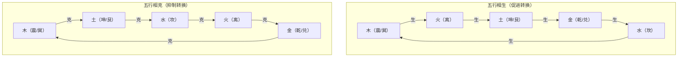
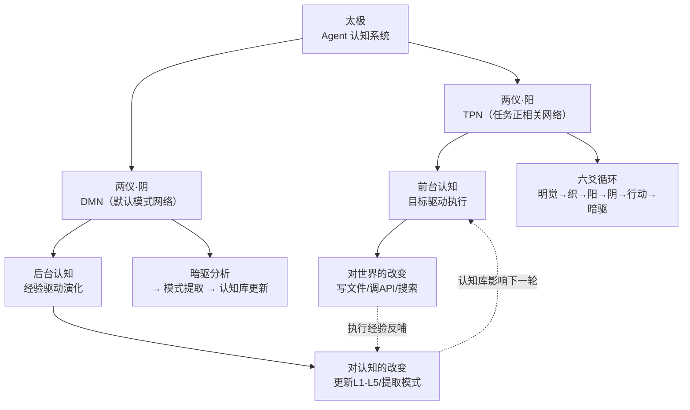
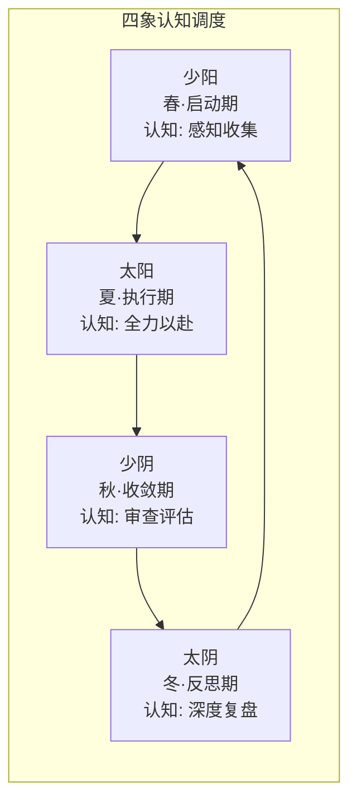
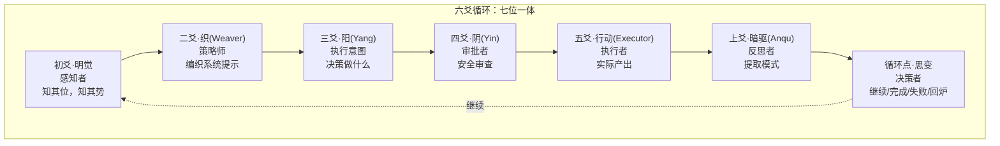
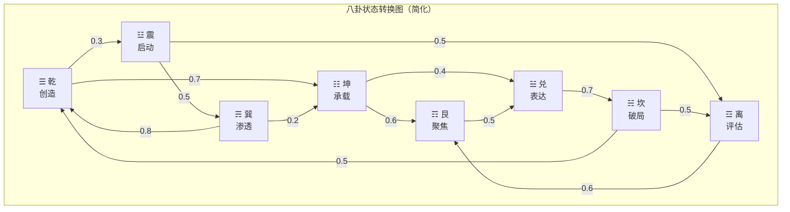
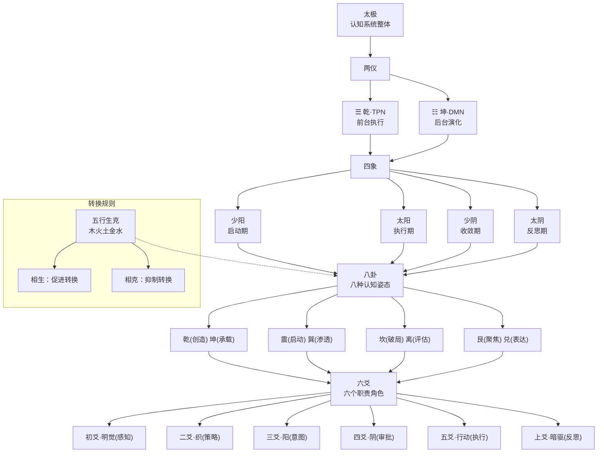
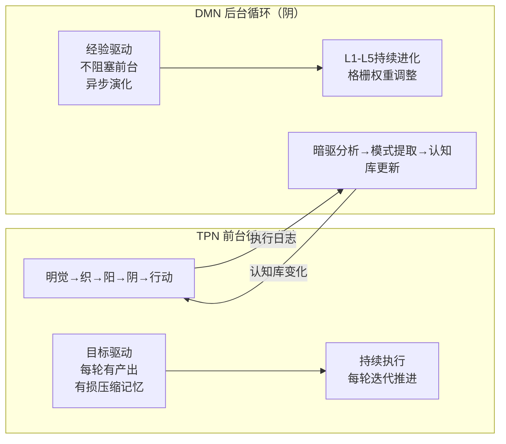

# 从《易经》到AI认知——八卦不是玄学，是动态平衡模型

> 太极架构如何将三千年前的《易经》哲学转化为现代AI Agent的认知调度引擎

---

## 引言：一个AI框架为什么需要《易经》？

2025年的AI Agent框架，技术栈是Python、异步编程、函数调用、协程池——这些和两千多年前的《易经》有什么关系？

如果你打开太极架构（Taiji）的L3格栅配置文件，会看到这样的结构：

```json
{
  "qian": {
    "name": "乾",
    "trigram": "☰",
    "attitude": "创造/开创",
    "element": "金",
    "lifecycle": "生",
    "workflow": ["vision", "initiative", "breakthrough"]
  },
  "kun": {
    "name": "坤",
    "trigram": "☷",
    "attitude": "承载/执行",
    "element": "土",
    "lifecycle": "长",
    "workflow": ["accumulate", "stabilize", "build"]
  }
}
```

这不是装饰性的命名——这是一个**完整的认知调度系统**。八卦在太极架构中担任的角色，相当于操作系统的进程调度器：它决定AI Agent在每一轮应该"怎么思考"。

本文要证明的核心论点是：**八卦不是玄学，而是一种被三千年实践验证的动态平衡模型**。太极架构用现代工程实现了这个模型，使其成为AI Agent的认知调度引擎。

---

## 第一章：《易经》的核心不是算命，是变化模型

### 1.1 易经的本质：系统动态学

《易经》常被误解为"算命书"。但它的真正本质是一套**系统动态学（System Dynamics）模型**：

```
《易传·系辞》："易之为书也，不可远。为道也屡迁，变动不居，周流六虚，上下无常，刚柔相易，不可为典要，唯变所适。"
```

翻译成现代语言："《易经》这本书不可远离。它的规律是不断迁移的，变动不居，周流于六个爻位之间，上下没有固定位置，刚柔相互转化，不能把它当作死板的教条——**只有变化是唯一不变的**。"

这正是现代系统动态学的核心观点：系统处于持续变化中，**动态平衡比静态稳定更重要**。

| 《易经》概念 | 系统动态学对应 | 太极架构实现 |
|------------|--------------|------------|
| 太极 | 系统整体状态 | Agent认知系统 + 目标 |
| 两仪 | 正负反馈循环 | TPN（前馈）+ DMN（反馈） |
| 四象 | 四类系统行为 | 少阳/太阳/少阴/太阴认知姿态 |
| 八卦 | 八种系统状态 | 八种认知工作流模式 |
| 六爻 | 六个系统层级 | 六个爻位的认知职责 |
| 五行生克 | 状态间的转换规则 | 格栅连接权重与过渡逻辑 |

**这不是比附，是结构上的同构。**

### 1.2 八卦：八种系统状态，八种认知模式

八卦不是随机符号组合——它是一个**完整的状态空间**。用现代视角看：

```
                  ☰ 乾 (创造)
                     |
    ☲ 离 (评估) ---  --- ☵ 坎 (破局)
                  / \
    ☳ 震 (启动) /     \ ☱ 兑 (表达)
                /       \
    ☴ 巽 (渗透)         ☶ 艮 (止定)
                     |
                  ☷ 坤 (承载)
```

这个空间覆盖了系统可能处于的所有基本状态：

| 卦 | 状态类型 | 系统行为 | AI Agent 中的角色 |
|----|---------|---------|-----------------|
| **☰ 乾** | 创造态 | 从0到1，突破创新 | 生成新思路、新方案、新代码 |
| **☷ 坤** | 执行态 | 稳定执行，积累成果 | 按既定策略执行任务 |
| **☳ 震** | 启动态 | 快速激发，收集信息 | 探索未知领域，建立初步认知 |
| **☴ 巽** | 渗透态 | 深度潜入，细致分析 | 分析数据，拆解复杂问题 |
| **☵ 坎** | 挑战态 | 面对风险，突破障碍 | 处理故障，突破瓶颈 |
| **☲ 离** | 评估态 | 审视反思，照亮盲点 | 审查结果，评估质量 |
| **☶ 艮** | 聚焦态 | 限定范围，收窄目标 | 限制范围，防止发散 |
| **☱ 兑** | 表达态 | 输出交付，外化结果 | 写文档，生成报告，发布内容 |

### 1.3 五行不是神秘主义——它是状态转换规则

五行（木、火、土、金、水）常被视为神秘主义符号。但在太极架构中，**五行是八卦之间的转换规则**——它的作用类似于状态机中的过渡矩阵。



**相生**表示一种状态自然地引导到另一种状态：
- 震卦（启动/木）→ 离卦（评估/火）：收集完信息之后，自然会去评估这些信息
- 坤卦（承载/土）→ 乾卦（创造/金）：稳定构建之后，突破自然涌现

**相克**表示一种状态会抑制另一种状态：
- 兌卦（表达/金）克震卦（启动/木）：过度输出会抑制后续的信息收集
- 坎卦（挑战/水）克离卦（评估/火）：处于风险突破状态时，不适合做全面评估

Weaver 在进行认知调度时，会利用这些转换规则**预测**当前认知姿态可能产生的副作用。如果当前是震卦（木），Weaver 知道这会抑制坤卦（土）的执行稳定性——因此会在系统提示词中提醒 Agent 注意保持基础工作的质量。

---

## 第二章：太极架构中的"两仪"——TPN与DMN的双循环

### 2.1 太极生两仪：认知活动的根本二分

《易传·系辞》："易有太极，是生两仪。"

太极架构的核心分层也遵循这一原理：



**TPN（阳）**：当Agent需要专注完成具体任务时激活——前台执行、目标驱动、工具调用。

**DMN（阴）**：当Agent处于"空闲"或"反思"状态时激活——后台分析、模式提取、认知库演化。

这个设计直接对应了人类大脑的两个核心功能网络。神经科学研究表明（Raichle et al., 2001），这两个网络在功能上互为拮抗：TPN激活时DMN被抑制（专注做事），DMN激活时TPN被抑制（走神反思）。

太极架构在工程上实现了这种"两仪"的动态平衡。

### 2.2 四象：认知调度的四种模式

两仪进一步演化为四象——四种认知调度模式，分别对应任务生命周期的四个阶段：



| 四象 | 生命周期 | TPN活跃度 | DMN活跃度 | 认知策略 | 典型任务阶段 |
|------|---------|----------|----------|---------|------------|
| **少阳** | 启动期 | 中 | 高 | 开放探索，信息收集 | 任务初始、环境感知 |
| **太阳** | 执行期 | 高 | 低 | 专注执行，目标驱动 | 编码、写作、API调用 |
| **少阴** | 收敛期 | 中 | 中 | 审查评估，质量把关 | 代码审查、结果验证 |
| **太阴** | 反思期 | 低 | 高 | 深度反思，模式提取 | 任务复盘、认知库整理 |

Weaver 根据明觉感知的任务生命周期阶段，选择对应的四象模式，再进一步细化为具体的八卦认知姿态。

### 2.3 六爻：认知生命周期的七个角色

六爻（六个爻位加思变决策点）映射了认知行为的七个阶段：



这六个爻位不是串行的六个"步骤"——它们是六个**职责角色**，各自承担特定的认知职能。这和《易经》中六爻的象征意义完全一致：初爻代表"底层基础"，上爻代表"顶层反思"。

---

## 第三章：真实案例——「六爻调度」如何处理一个跨领域调研任务

### 3.1 任务背景

假设太极架构收到一个复杂目标："调研2025年AI Agent开源框架的发展趋势，并产出一份面向开发者的技术趋势报告。"

这是一个典型的认知密集型任务，需要多轮循环、多种认知姿态的切换。让我们看看六爻循环和八卦调度如何协作完成。

### 3.2 调度日志（简化版）

**第1轮：震卦（启动/激发）— 快速收集信息**

| 爻位 | 角色 | 具体行为 |
|------|------|---------|
| 明觉 | 感知者 | 评估目标：需调研框架 → 确定搜索关键词 |
| 织 | 编织器 | 读取格栅 → 震卦工作流 → 编织探索导向的系统提示 |
| 阳 | 执行意图 | 提交搜索计划：搜索5个主流框架的最新版本和社区动态 |
| 阴 | 审批者 | 审批通过：搜索范围合理，无安全风险 |
| 行动 | 执行者 | 调用web_search搜索AutoGPT/CrewAI/LangGraph/OpenAI Agents SDK/Taiji |
| 暗驱 | 反思者 | 分析搜索结果：[成功收集12个框架信息] 但 [结构杂乱] → 模式：下一轮需要聚焦 |
| 思变 | 决策者 | **继续** — 目标未完成，进入第2轮 |

**第2轮：巽卦（渗透/分析）— 深度比对分析**

| 爻位 | 角色 | 具体行为 |
|------|------|---------|
| 明觉 | 感知者 | 感知第1轮结果：12个框架信息已收集，但需要深度分析 |
| 织 | 编织器 | 读取格栅 → 巽卦工作流 → 编织分析导向的系统提示 |
| 阳 | 执行意图 | 提交分析计划：聚焦Top5框架，对比3个核心维度 |
| 阴 | 审批者 | 审批通过 |
| 行动 | 执行者 | 读取每框架的技术文档，提取架构特性、工具集、认知策略 |
| 暗驱 | 反思者 | 分析结果：[深度分析完成] 但 [缺乏创新视角] → 模式：需要跳出框架看框架 |
| 思变 | 决策者 | **继续** — 目标未完成，进入第3轮 |

**第3轮：乾卦（创造/开创）— 构建新分类框架**

| 爻位 | 角色 | 具体行为 |
|------|------|---------|
| 明觉 | 感知者 | 感知第2轮结果：深入理解了各框架，但需要独创性产出 |
| 织 | 编织器 | 读取格栅 → 乾卦工作流 → 编织创造导向的系统提示 |
| 阳 | 执行意图 | 提交创造计划：基于分析结果，提出"Agent框架认知能力四象限" |
| 阴 | 审批者 | 审批通过 |
| 行动 | 执行者 | 产出分析框架，定义4个维度（感知深度/演化能力/安全设计/生态开放性） |
| 暗驱 | 反思者 | 分析结果：[创造性产出成功] → 模式：多轮切换认知姿态可提升产出质量 |
| 思变 | 决策者 | **继续** — 目标未完成，进入第4轮 |

**第4轮：兑卦（表达/输出）— 交付最终报告**

| 爻位 | 角色 | 具体行为 |
|------|------|---------|
| 明觉 | 感知者 | 感知前3轮：已收集、已分析、已创造 → 需要输出 |
| 织 | 编织器 | 读取格栅 → 兑卦工作流 → 编织表达导向的系统提示 |
| 阳 | 执行意图 | 提交输出计划：撰写完整报告，包含方法论、对比分析、趋势预测 |
| 阴 | 审批者 | 审批通过 |
| 行动 | 执行者 | 写入最终Markdown报告文件（含代码示例、mermaid图） |
| 暗驱 | 反思者 | 分析结果：[报告产出成功] → 提取可复用模式："四象限分析框架" → 存入L2 |
| 思变 | 决策者 | **完成** — 目标达成，交付物符合完成标准 |

### 3.3 八卦调度的核心发现

从上述案例中，可以总结出八卦调度在AI认知中的关键优势：

**1. 认知姿态的可预测切换**

Weaver 不是随机选择卦象——它根据明觉的评估和暗驱的反馈，**有意识地**切换认知姿态。每一轮的卦象切换都有明确理由：
- 第1轮震卦：需要快速建立认知基础
- 第2轮巽卦：需要深入分析已有材料
- 第3轮乾卦：需要跳出已有框架的创造
- 第4轮兑卦：需要将成果外化为可交付物

**2. 五行生克作为反作用力预测**

在震卦（木）状态下，Weaver 知道这会"克"坤卦（土）的执行稳定性。因此在系统提示词中提前提示："当前处于快速启动模式，但请注意收集信息的结构化程度——避免影响后续的执行阶段。"

这种**事前预测**能力是传统Agent框架不具备的。传统框架只有在问题发生之后才能通过错误反馈调整策略。

**3. 跨轮记忆的有损压缩**

暗驱在每轮结束时不是记录全部历史（会导致上下文膨胀），而是提取**核心模式**：
- 第1轮模式：需要聚焦——指导第2轮的巽卦策略
- 第2轮模式：缺乏创新视角——指导第3轮的乾卦策略
- 第3轮模式：多轮切换提升质量——作为经验存入L2模型

---

## 第四章：八卦不是玄学的工程技术论证

### 4.1 八卦 = 8状态 Markov 链

从纯工程角度看，八卦认知网格可以被建模为一个**8状态的隐Markov模型**：

```
状态空间 S = {乾, 坤, 震, 巽, 坎, 离, 艮, 兑}
观测空间 O = {任务类型, 生命周期阶段, 执行结果评估}
状态转换矩阵 T = 五行生克关系 + 经验调整权重
```

当Weaver从一个卦切换到另一个卦时，它不是在"占卜"——它是在查询一个8×8的转换矩阵，选择概率最高的下一个认知姿态。



**转换权重不是固定不变的**。暗驱在每次任务完成后，会分析实际执行效果：如果从震卦到巽卦的转换产生了高质量的分析结果，就增加这个转换的权重。这就是所谓的"格栅连接权重动态调整"——认知格栅会随着经验自我优化。

### 4.2 与其它状态管理方案的对比

| 维度 | 手动状态机 | LangGraph状态图 | 太极八卦网格 |
|------|-----------|----------------|------------|
| 状态数量 | 自定义（需手动定义） | 自定义（节点定义） | 预置8态 |
| 状态转换规则 | 硬编码 | 边定义 | 五行生克 + 经验权重 |
| 状态空间大小 | 线性增长 | 指数增长 | 固定8态（认知层面） |
| 自适应性 | 无 | 无 | 权重随经验调整 |
| 哲学基础 | 工程直觉 | 图论 | 三千年动态平衡实践 |

八卦网格的优势在于：**状态空间虽小，但覆盖了所有必要的认知模式**。它不需要像LangGraph那样定义复杂的节点图——8种认知姿态已经足够覆盖绝大多数任务场景。

### 4.3 八卦背后的完整认知哲学

太极架构的完整认知哲学可以用以下框架概括：

```
太极（认知系统整体）
  ├── 两仪（TPN + DMN）
  │   ├── 四象（少阳/太阳/少阴/太阴）
  │   │   └── 八卦（8种认知姿态）
  │   │       └── 六爻（6个职责角色）
  │   │           └── 五行生克（状态转换规则）
  │   └── 认知库（L1-L5层级）
  └── 编织器（Weaver作为调度引擎）
```

这六层结构不是装饰——每一层都在架构中有对应的工程实现。

---

## 第五章：为什么三千年后的AI架构仍然需要《易经》？

### 5.1 时间检验的普适性

《易经》之所以能存在三千年，不是因为它提供了"正确答案"——而是因为它提供了一个**描述变化的形式语言**。

八卦的八个符号不是预测工具，而是**分类系统**：它们把无限的变化归纳为有限的状态模式。这种"以有限描述无限"的思路，正是太极架构在设计认知调度时的核心方法论。

### 5.2 从易经到AI认知的桥梁

架接《易经》和AI认知的桥梁是**系统论**：

```
易经的阴阳变化 → 系统循环反馈 → 认知双循环（TPN/DMN）
易经的八卦状态 → 系统状态空间 → 认知姿态调度（8种工作流）
易经的五行生克 → 状态转换规则 → 格栅连接权重
易经的六爻层次 → 系统层级结构 → 六个职责角色
```

这不是文化符号的移植——这是结构同构的工程复用。

### 5.3 结语

八卦在太极架构中不是玄学，不是装饰，不是文化符号。

它是**用三千年实践验证的系统状态分类法+提供完整转换规则的动态平衡模型+被现代工程实现为8状态Markov链的认知调度引擎**。

当一个AI Agent需要在"探索"和"执行"之间切换时，当一个Agent需要从"深度分析"过渡到"创造产出"时，八卦网格提供了一套经过三千年考验的转换逻辑。

正如《易传》所说：「易，无思也，无为也，寂然不动，感而遂通天下之故。」

太极架构中的八卦网格也是一样的——它本身"空"的（没有固定答案），但它能"感"（感知任务状态），能"通"（适应任何任务类型）。

---

## 附录：Mermaid图集

### 图1：太极架构完整认知哲学结构



### 图2：TPN与DMN的双循环对比



---

*八卦不是玄学——它是一个被三千年实践验证的系统动态平衡模型。*
*下一篇：[无为而无不为：Weaver"不做事的组件"如何驱动认知进化]*
