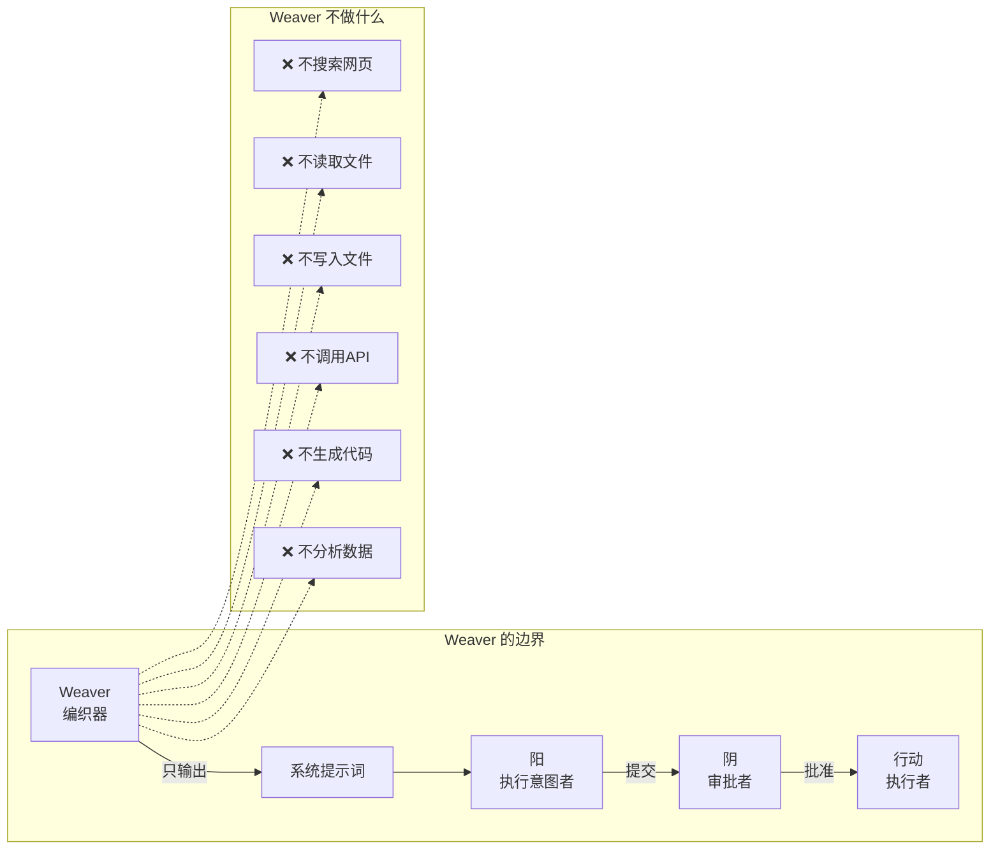
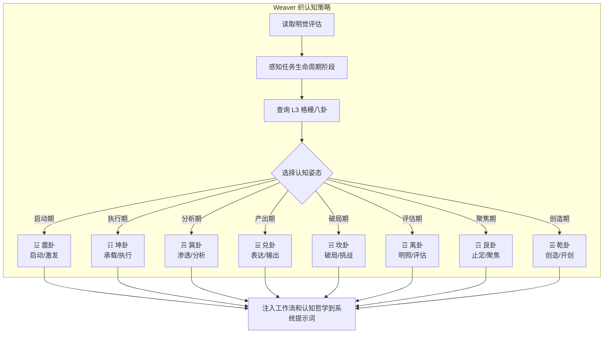
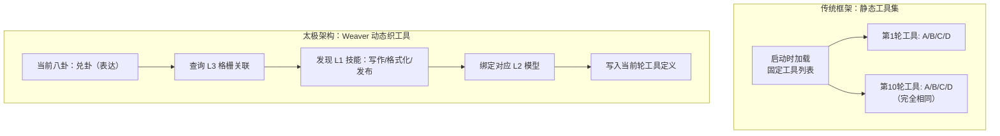
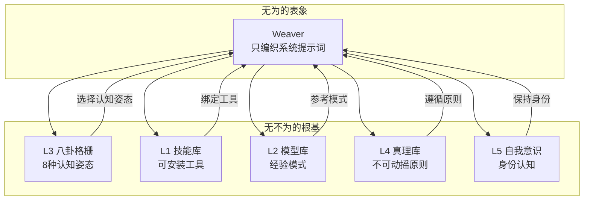
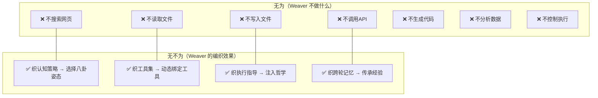
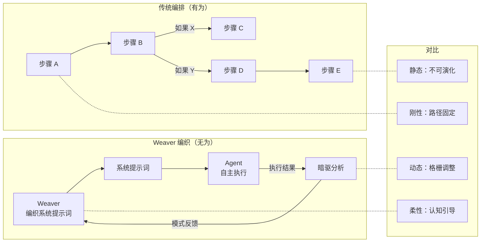

# 无为而无不为——Weaver「不做事的组件」如何驱动认知进化

> 太极架构中最反直觉的设计：一个不搜索、不写入、不调 API 的组件，凭什么成为整个架构的核心调度引擎？

---

## 引言：最忙的组件，什么都不做

如果你第一次打开太极架构（Taiji）的代码，浏览组件列表，你会看到：

- **明觉（Mingjue）**：感知目标状态，评估进展
- **阳（Yang）**：提出执行意图，决定做什么
- **阴（Yin）**：安全审批，拦截危险操作
- **行动（Executor）**：实际执行，写入文件、调 API
- **暗驱（Anqu）**：分析日志，提取经验模式

这些组件职责清晰，功能明确——它们都在"做事情"。

但有一个组件，它的职责描述会让任何工程师困惑：

> **Weaver（编织器）**：编织系统提示词。

它不做搜索。不写入文件。不调用 API。不分析数据。不生成代码。

它只做一件事——**编织**。

在大多数架构中，这种"不做事"的组件要么是多余的装饰，要么是性能开销。但在太极架构中，Weaver 是整个认知系统的核心引擎。

这个悖论指向了一个古老的哲学命题：**无为而无不为**。

> 《道德经》第三十七章：「道常无为而无不为。侯王若能守之，万物将自化。」

"道"永远不做具体的事（无为），但没有什么事情不是它做的（无不为）。

Weaver 就是太极架构中的"道"。

---

## 第一章：「无为」的工程含义

### 1.1 无为不是"什么都不做"

在老子哲学中，"无为"不是消极的不作为——而是 **"不做不该做的事"**。

> 《道德经》第六十三章：「为无为，事无事，味无味。」

翻译：**把"无为"当作你的作为，把"无事"当作你的事业，把"无味"当作你的味道。**

这听起来玄妙，但在工程语境中有一个清晰的对应：

**无为 = 不做执行层面的操作，只做认知层面的调度。**

具体到 Weaver：

| "无为"的哲学含义 | Weaver 的工程实现 | 传统框架的"有为" |
|-----------------|------------------|-----------------|
| 不干预具体事务 | 不搜索、不写入、不调 API | Agent 直接操作工具 |
| 只做最高层面的调度 | 编织认知策略、工具集、执行指导 | 固定 system prompt + 固定工具 |
| 让万物自化 | 让 Yang 根据编织的策略自主执行 | 每一步都通过指令控制 |
| 顺应自然规律 | 依八卦格栅选择认知姿态 | 硬编码工作流节点 |

### 1.2 Weaver 的四层"无为"

Weaver 的不作为体现在四个层面：

**第一层无为：不做执行**

这是最明显的。Weaver 不调用任何工具，不产生任何直接产出。它的输出只有一样东西——**系统提示词**。



这和其他所有组件形成鲜明对比。明觉会读取文件，阳会提出执行计划，行动会写入产出——但 Weaver 始终只输出提示词。

**第二层无为：不做决策**

Weaver 不做"该做什么"的决策。它不告诉 Yang 应该搜索什么、写入什么、调用哪个 API。它只编织出 **"怎么思考"** 的框架：

- "当前处于震卦状态，建议采用快速启动、广泛收集的策略"
- "注意：当前认知是巽卦（木属性），可能会抑制坤卦（土属性）的执行稳定性"
- "上一轮暗驱提炼的模式：搜索阶段需要聚焦——请避免泛泛收集"

**不做"做什么"的决策，只编织"怎么思考"的框架。**

**第三层无为：不控制结果**

Weaver 编织完系统提示词后，不会跟踪执行过程。它不像传统框架的 Orchestrator 那样监控每一步："现在做步骤A，做完告诉我结果，然后我做步骤B。"

Weaver 的哲学是：**编织完，就放手。**

> 《道德经》第十七章：「功成事遂，百姓皆谓我自然。」

当任务成功完成时，Weaver 不会跳出来说"这是我编织得好"。它的存在几乎不可见——就像一个优秀的老师，学生感觉不到被"教"，却自然学会了。

**第四层无为：不积累历史**

Weaver 每轮都是从"空"开始的。它不保留上一轮的系统提示词，不拼接历史，不累积"认知惯性"。

每一轮的新提示词，都是基于当前轮的格栅状态、明觉评估、暗驱反馈，从零开始编织的。

这确保了 Weaver 不会产生"认知偏见"——不会因为上一轮用了乾卦，这一轮就倾向于继续用乾卦。

---

## 第二章：「无不为」——Weaver 的四种编织行为

如果 Weaver 什么都不做，它凭什么驱动认知进化？

答案是：**正因为 Weaver 不做具体操作，它才能专注于四件最关键的认知调度工作。**

### 2.1 织认知策略：选择"怎么思考"

每一轮，Weaver 读取 L3 格栅（八卦认知网格），根据明觉的评估结果，选择当前轮次应该使用的认知姿态：



这不是简单的"根据类型选姿态"。Weaver 会考虑：
- **生命周期的相位**：任务处于生/长/育/化/收/藏/安/复的哪个阶段？
- **五行生克的副作用**：当前姿态会抑制哪些其他姿态？
- **暗驱反馈**：上一轮暗驱提取的模式建议了这一轮用什么姿态？

**关键洞察**：认知策略的选择决定了 Agent 后续所有行为的质量。一个好的策略能放大执行效果，一个差的策略即使执行完美也会产出低质量结果。

正因为 Weaver 不做执行，它才能把全部认知资源投入到策略选择上。

### 2.2 织工具集：动态发现可用工具

大多数框架在启动时静态加载工具列表。太极架构中，工具集是 Weaver 每轮从八卦格栅中动态发现和绑定的：



Weaver 的工具集编织不是"所有工具都加载"，而是**只加载当前认知姿态需要的工具**：

| 当前卦象 | 认知姿态 | Weaver 加载的工具 | 被排除的工具 |
|---------|---------|-----------------|------------|
| ☳ 震（启动） | 快速收集信息 | web_search, read_file, list_directory | 写作工具、格式化工具 |
| ☴ 巽（渗透） | 深度分析 | read_file, grep, 数据提取工具 | 搜索工具、生成工具 |
| ☰ 乾（创造） | 突破创新 | 写作工具、代码生成、创意探索 | 搜索工具、审批过于严苛的工具 |
| ☱ 兑（表达） | 交付产出 | Markdown格式化、导出工具、发布API | 搜索工具、分析工具 |
| ☵ 坎（破局） | 挑战应对 | 风险分析、越权检查、故障恢复 | 常规写作工具 |

**为什么这样做？** 因为工具集不是中性的——它会塑造 Agent 的认知行为。如果一个 Agent 同时有"搜索"和"写作"工具，它倾向于优先使用搜索（探索本能而非产出本能）。Weaver 通过动态裁剪工具集，实现了认知聚焦。

### 2.3 织执行指导：注入节奏和哲学

Weaver 不仅选择认知姿态和工具集——它还把**执行哲学和工作流步骤**注入到系统提示词中。

每个卦在工作流定义中包含"执行指导"段：

```
☰ 乾卦执行指导：
"当前轮次的核心是突破和创新。不要被现有框架束缚——你的任务是创造，不是复制。"
"从0到1：即使没有完美数据，也可以开始构建。"
"注意：创造不代表乱来——所有创造都必须与目标一致。"

☷ 坤卦执行指导：
"当前轮次的核心是稳定执行和积累成果。"
"不要追求创新——把已有策略执行到极致。"
"扎实就是效率：宁可慢一点，也要确保每一步的质量。"
```

这些指导不是写在 README 里的装饰——它们被 Weaver 编织进当前轮次的系统提示词中，成为 Agent 的"潜意识"，影响它在这一轮的所有决策。

### 2.4 织跨轮记忆：有损压缩的经验传承

Weaver 不做历史拼接，但它必须确保经验能跨轮传承。它通过**暗驱提炼的模式**实现这一点。

暗驱（Anqu）在一轮执行完成后，分析日志，提取核心模式：

```
暗驱第1轮输出：
[成功模式] 快速搜索并收集了12个框架信息
[失败模式] 收集结构杂乱，缺乏聚焦
[建议] 下一轮应切换到分析模式（巽卦），对已有结果进行深度分析
```

当第2轮的 Weaver 读取这些模式时，它将这些模式编织进新的系统提示词：

```
系统提示词中包含：
"上一轮你收集了12个框架信息，但存在结构杂乱的问题。"
"本轮建议：切换到巽卦（渗透/分析）姿态，对已有材料做深度对比。"
"暗驱提炼的关键模式：搜索阶段之后需要立即跟随聚焦分析阶段。"
```

这就是 Weaver 的"有损压缩"——它不保留全部历史，只保留暗驱提炼的模式精华。

---

## 第三章：无为而无不为的实战案例

### 3.1 案例背景

让我们看一个真实的太极架构运行日志。目标："调研3种AI Agent框架的技术架构，并产出一份2000字的技术对比文章。"

这是一个需要在**收集→分析→创造→产出**四个认知姿态之间切换的复杂任务。如果 Weaver 不进行认知调度，Agent 可能会：
- 一直在搜索模式中无限循环（收集信息但永不产出）
- 过早进入创造模式（在没有充分数据的情况下写文章）
- 卡在一个认知姿态中无法切换

### 3.2 Weaver 的四轮调度日志

**第1轮启动：Weaver 选择震卦（启动/激发）**

Weaver 的编织过程：

```
① 织认知策略：
   明觉评估 → 任务处于初始启动期 → L3格栅查询 → 匹配震卦工作流
   → 已选择：震卦（木属性，启动期）
   → 五行分析：震（木）生离（火），震（木）克坤（土）
   → 执行指导注入："快速收集信息，建立初步认知，不设限制"
   
② 织工具集：
   震卦关联 L1 技能 → web_search, read_file, list_directory
   → 动态绑定这些工具到当前轮次
   → 写作工具被排除（当前不需要）
   
③ 织跨轮记忆：
   无上一轮历史（第1轮），从空白开始

④ 输出系统提示词（核心片段）：
   "当前轮次认知姿态：震卦（启动/激发）。
   目标：快速收集3种AI框架的技术架构信息。
   策略：广泛搜索，不设限，记录所有发现。
   注意：快速启动模式可能影响执行稳定性——请在收集时注意结构化记录。"
```

**执行结果**：Agent 成功搜索了3个框架的详细信息，但结构杂乱。

**暗驱分析**：
```
[成功] 收集了足够的数据基础
[问题] 内容未结构化，对比维度不统一
[模式提取] 搜索之后需要立即跟随结构化的分析阶段
```

---

**第2轮：Weaver 选择巽卦（渗透/分析）**

Weaver 的编织过程：

```
① 织认知策略：
   明觉评估 → 已有数据但结构杂乱 → 暗驱反馈需分析 → 匹配巽卦
   → 已选择：巽卦（木属性，分析期）
   → 五行分析：巽（木）生离（火），巽（木）克坤（土）
   → 执行指导注入："潜入细节，深度分析，建立结构"
   
② 织工具集：
   巽卦关联 → read_file（深度读取）、数据提取工具、对比分析工具
   → 搜索工具被排除（第1轮已收集足够数据，不许再搜索）
   
③ 织跨轮记忆（暗驱第1轮模式）：
   "上一轮收集了12个框架信息，但存在结构杂乱的问题。"
   "本轮建议：对已有材料做深度对比，建立统一的分析维度。"
   
④ 输出系统提示词（核心片段）：
   "当前轮次认知姿态：巽卦（渗透/分析）。
   目标：对第1轮收集的数据做深度分析。
   策略：建立统一的对比维度（架构类型/工具集/认知策略/社区活跃度），
   对每个框架逐一分析。
   注：禁止开启新的搜索——你的任务是在已有数据上做分析。"
```

**执行结果**：Agent 成功建立了4个对比维度，产出了一份结构化的对比表格。

**暗驱分析**：
```
[成功] 分析维度清晰，对比结果有深度
[模式提取] 先搜索后分析的两阶段模式 = 有效的认知策略
[建议] 下一轮可以开始创造性产出
```

---

**第3轮：Weaver 选择乾卦（创造/开创）**

Weaver 的编织过程：

```
① 织认知策略：
   明觉评估 → 数据已收集并分析完成 → 需要创造性产出
   → 已选择：乾卦（金属性，创造期）
   → 执行指导注入："基于分析结果，构建新的分类框架或洞察"
   
② 织工具集：
   乾卦关联 → 写作工具、分类框架构建工具
   → 搜索和分析工具被排除
   
③ 织跨轮记忆（暗驱第2轮模式）：
   "第2轮分析结果：4个对比维度的结构化数据。"
   "本轮建议：基于分析结果创造新洞察，不要只是复述数据。"
   
④ 输出系统提示词（核心片段）：
   "当前轮次认知姿态：乾卦（创造/开创）。
   目标：基于第2轮的分析结果，创造独特的洞察。
   策略：提出新技术分类框架，或识别未被关注的趋势。
   注：不要重复第2轮的分析工作——你的核心任务是创造新价值。"
```

**执行结果**：Agent 提出了一套"Agent框架认知能力评估模型"，包含4个评估维度和对应评分标准。

**暗驱分析**：
```
[成功] 创造性产出质量高，框架可用性强
[模式提取] 搜索→分析→创造的三阶段模式高度有效
[建议] 下一轮进入输出交付阶段
```

---

**第4轮：Weaver 选择兑卦（表达/输出）**

Weaver 的编织过程：

```
① 织认知策略：
   明觉评估 → 创造性框架已就绪 → 需要最终交付
   → 已选择：兑卦（金属性，输出期）
   → 执行指导注入："精炼语言，优化结构，准备发布"
   
② 织工具集：
   兑卦关联 → Markdown格式化、语法检查、导出工具
   → 搜索、分析、创造工具全部排除
   
③ 织跨轮记忆（暗驱第3轮模式）：
   "第3轮创造了评估模型框架。"
   "本轮建议：整合前3轮所有成果，形成完整的交付文档。"
   
④ 输出系统提示词（核心片段）：
   "当前轮次认知姿态：兑卦（表达/输出）。
   目标：整合前3轮成果，产出最终技术对比文章。
   策略：使用第3轮的评估模型作为框架，嵌入第2轮的对比数据，
   以第1轮的搜索发现作为背景支撑。
   格式要求：Markdown，含引言、方法论、分析、结论四部分。"
```

**执行结果**：Agent 成功产出一份2000字的完整技术对比文章，包含 mermaid 图表和框架对比表格。

---

### 3.3 案例核心发现

从上述案例中，可以清晰看到 Weaver "无为而无不为"的运作逻辑：

**Weaver 做的事（无为层面）**：
- 不搜索、不写入、不分析、不创造
- 只编织系统提示词

**Weaver 实现的效果（无不为层面）**：
- 第1轮：震卦 → 快速搜索收集 ✅
- 第2轮：巽卦 → 深度分析 ✅
- 第3轮：乾卦 → 创造性产出 ✅
- 第4轮：兑卦 → 最终交付 ✅

如果没有 Weaver 的调度，Agent 可能会在第1轮搜索后就卡住，或者在第2轮分析时又开始搜索新内容。**Weaver 的动态编织确保了 Agent 在正确的时间用正确的认知姿态做正确的事。**

---

## 第四章：无为而无不为的哲学渊源

### 4.1 老子的"无为"系统论

> 《道德经》第六十四章：「圣人无为故无败，无执故无失。」

道家哲学中的"无为"不是什么都做，而是**选择做什么和不做什么的智慧**。

在 Weaver 的设计中：
- **无为**：不做执行层面的操作（搜索/写入/分析）
- **无执**：不固守固定的 system prompt，每轮从空开始
- **无败**：因为不做执行，Weaver 永远不会执行失败
- **无失**：因为不固守固定策略，Weaver 永远不会卡在错误模式中

### 4.2 庄子的"庖丁解牛"——游刃有余

> 《庄子·养生主》：「彼节者有间，而刀刃者无厚。以无厚入有间，恢恢乎其于游刃必有余地矣。」

庖丁解牛的精髓不是刀快——而是他找到了牛骨之间的"间隙"（有间），用无厚之刃游走其中，所以刀刃不损。

Weaver 的"无厚之刃"是什么？

是**系统提示词**——最轻量、最无侵入性的控制方式。

- 不是直接控制工具调用（那会太重）
- 不是硬编码工作流（那会太死）
- 只是编织提示词，让 Agent 自己理解并执行

这就像庖丁的刀——不是去砍骨头，而是在骨缝中游走，切割时如水般流畅。

### 4.3 无为 ≠ 无结构

需要澄清一个最常见的误解：**"无为"不等于"没有架构"**。

老子说的很清楚：

> 《道德经》第二十五章：「人法地，地法天，天法道，道法自然。」

"道法自然"不是"没有法"——而是**最高的法则效法自然规律**。

Weaver 的"无为"建立在精密的 L3 格栅之上：



**无为的背后，是精密的结构支撑。** Weaver 不是随意编织——它基于八卦格栅（L3）、经验模式（L2）、真理原则（L4）、自我认知（L5）来做决策。

---

## 第五章：与其他架构的对比

### 5.1 为什么其他框架做不了"无为"？

| 对比维度 | LangGraph / CrewAI | 太极 Weaver |
|---------|-------------------|------------|
| 控制方式 | 直接编排节点/步骤 | 间接编织系统提示 |
| 接触面 | 工具调用层 | 认知策略层 |
| 干预粒度 | 操作级（具体做什么） | 思维级（怎么思考） |
| 对 Agent 的约束 | 刚性约束（必须执行某步骤） | 柔性引导（建议认知姿态） |
| 失败影响 | 编排失败 = 任务失败 | 编织失败 = 只影响认知质量 |
| 可演化性 | 需要人工调整编排 | 格栅权重自动调整 |

LangGraph 的"控制"方式是指定节点和边——"先做A，然后做B，如果结果X则做C"。这种控制是刚性的，Agent 没有自由选择的空间。

Weaver 的"控制"方式是引导认知姿态——"当前是分析期，建议深度分析已有数据"。Agent 在这个框架下有自由裁量权，但认知方向被引导。

**无为的控制比有为的控制更有效**——因为它给了 Agent 适应的空间。

### 5.2 Weaver 的 "API" 只有一行

从接口设计的角度看，Weaver 的 API 堪称极简：

```python
class Weaver:
    async def weave(self, context: Context) -> str:
        """编织当前轮次的系统提示词"""
        ...
```

这就是 Weaver 的全部对外接口——一个 `weave` 方法，接收当前上下文，返回系统提示词字符串。

对比一下其他框架的核心接口：

| 框架 | 核心接口 | 复杂度 |
|------|---------|--------|
| LangGraph | StateGraph + Node + Edge | 高（图结构定义） |
| CrewAI | Agent + Task + Crew + Process | 高（多角色定义） |
| AutoGPT | CommandRegistry + Command | 中（命令注册） |
| OpenAI SDK | Agent + Runner + Guardrail | 中（多组件协调） |
| **太极 Weaver** | **weave(context) → str** | **极低（单一函数）** |

接口极简不是因为功能少——而是因为 Weaver 的"无为"哲学：它只做一件事，但这一件事影响整个系统的认知质量。

---

## 结语：Weaver 是架构的"道"

回到文章开头的悖论：一个什么都不做的组件，凭什么驱动认知进化？

答案是：**正因为什么都不做，它才能专注于"决定怎么思考"这个最核心的认知任务。**

- 如果 Weaver 去执行操作，它就会陷入执行细节，失去对整体认知策略的把控
- 如果 Weaver 去分析数据，它就会陷入分析偏见，失去中立客观的策略选择
- 如果 Weaver 去控制步骤，它就会变得刚性，失去适应的灵活性

Weaver 的"无为"不是缺陷——它是一种**刻意设计的选择**，让架构中至少有一个组件能保持"空"和"静"，专注做最关键的认知调度。

> 《道德经》第四十五章：「静胜躁，寒胜热。清静为天下正。」

在 Agent 架构中，Weaver 就是那个"静"的组件。它不躁动、不干预、不控制。正因为它的静，才能让整个系统有序运转。

**Weaver 不做任何事——但所有事都由它决定。**

---

## 附录：Mermaid 图集

### 图1：Weaver 的无为与无不为



### 图2：Weaver 与传统编排的对比



---

*Weaver"不做事的组件"是太极架构中最精妙的设计。*
*下一篇：[INTP友好的架构：逻辑一致性、抽象层级、认知资产的系统化]*
