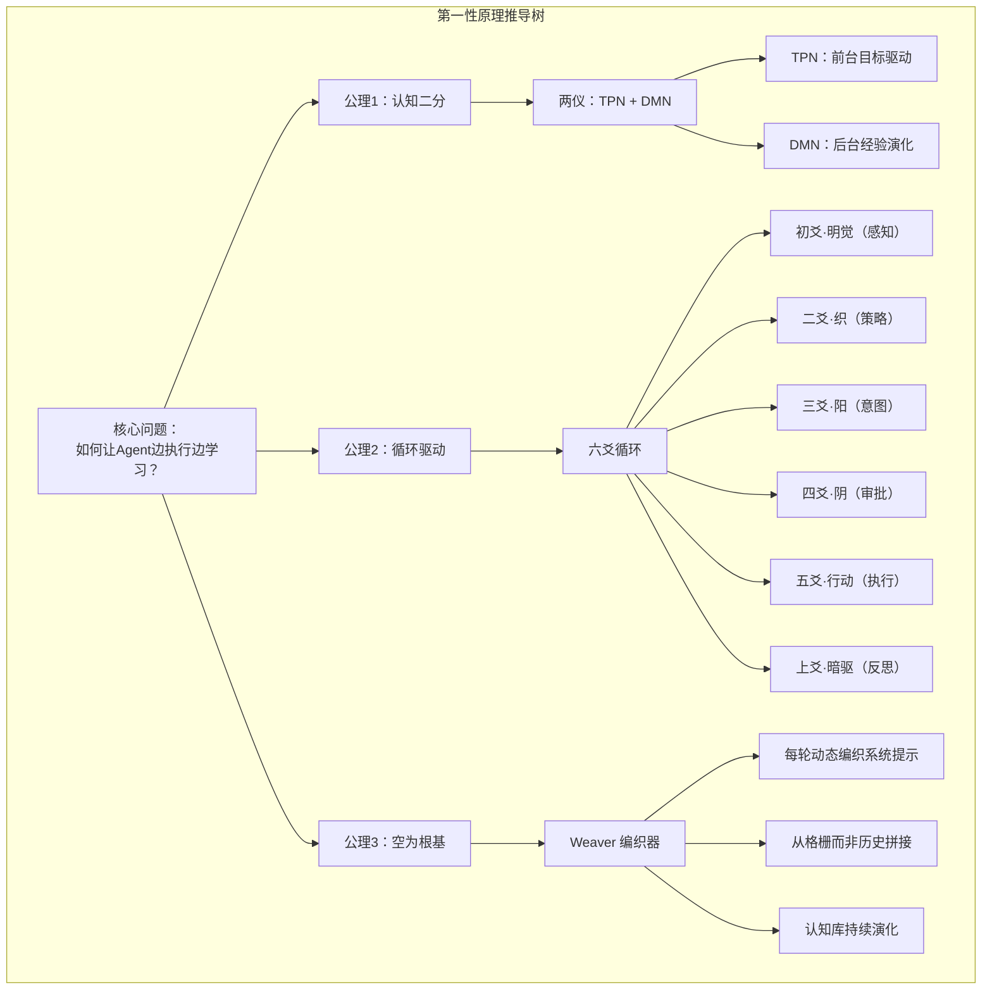
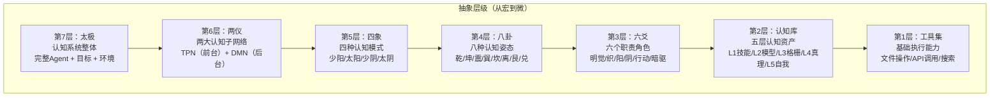
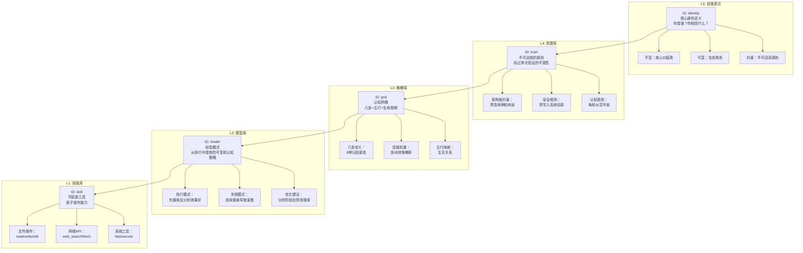
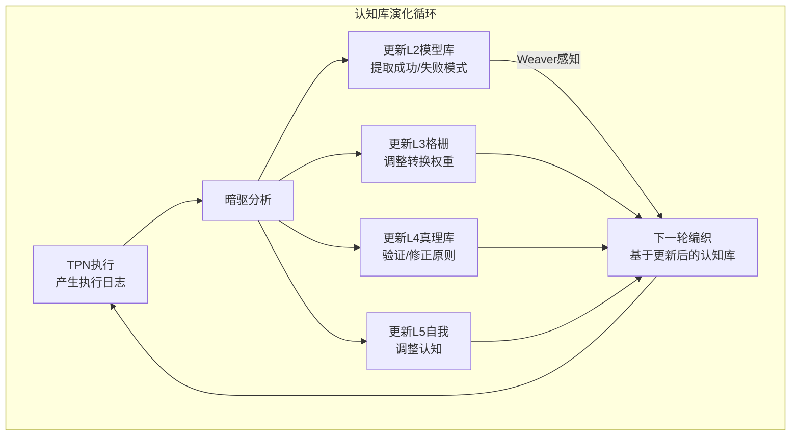
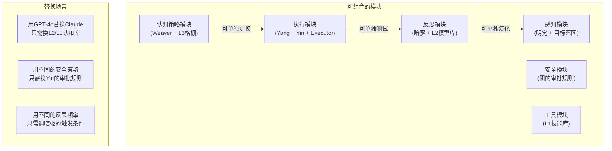
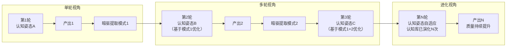
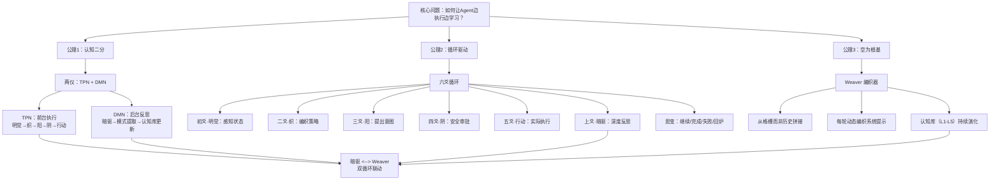
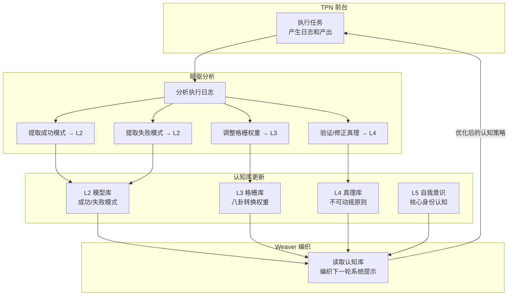

# INTP友好的架构——逻辑一致性、抽象层级、认知资产的系统化

> 为什么INTP人格会爱上太极架构？一个从抽象到具象、从规则到涌现、从单轮到进化的完整认知系统。

---

## 引言：写给"建筑师"的架构

MBTI人格类型中，INTP（逻辑学家/建筑师）是最关注系统一致性和抽象层级的类型。INTP不喜欢：
- 零散的组件拼凑（没有整体框架）
- 隐藏的假设和未言明的规则（逻辑不一致）
- 只能用在特定场景的特例（不可迁移）
- 黑盒组件和不可解释的行为（不可理解）

INTP喜欢：
- 从第一性原理推导出的系统（逻辑自洽）
- 分层清晰的抽象模型（层次分明）
- 可组合、可迁移的设计模式（模块化）
- 能随时间演化的开放系统（可进化）

太极架构（Taiji）恰恰满足INTP对"好架构"的所有标准。它不是一个工程捷径的产物——它是从认知哲学（《道德经》《易经》）、神经科学（TPN/DMN）、系统论（八卦/五行）交织推导出的、逻辑自洽的认知系统。

本文将用INTP最舒适的方式——**从抽象到具象、从结构到行为、从规则到涌现**——拆解太极架构。

---

## 第一章：第一性原理——太极架构的逻辑原点

INTP喜欢从第一性原理出发构建系统。太极架构的逻辑原点只有一个问题：

> **如何让AI Agent像人类一样，在持续执行任务的同时不断学习成长？**

从这个原点出发，可以推导出太极架构的全部核心设计。

### 1.1 公理系统

太极架构建立在三条公理之上：

```
公理1：认知二分
  任何认知活动可以二分为「执行」和「反思」。
  执行改变世界，反思改变认知。
  → 对应：两仪（TPN + DMN）

公理2：循环驱动
  认知不是一次性的——它是迭代的。
  每一轮执行产生新的经验，每一轮反思优化下一轮的执行。
  → 对应：六爻循环

公理3：空为根基
  每一轮认知从"空"开始——不携带上一轮的偏见。
  但"空"不等于"无"——认知库（L1-L5）保留经验模式。
  → 对应：Weaver 编织器
```

这三条公理构成了太极架构的逻辑基础。**所有其他设计都是这三条公理的形式化推导。**



**INTP视角**：这是一棵完全可追溯的推导树。任何组件都可以追溯到核心公理，没有"历史遗留"或"我不知道为什么这么设计"的灰色地带。

### 1.2 逻辑推演：从公理到组件

让我们做INTP最喜欢的练习——**形式化推演**。

**从公理1（认知二分）推导出两仪：**

```
设 S 为认知系统
设 E(t) 为时刻t的执行活动（改变外部世界）
设 R(t) 为时刻t的反思活动（改变内部认知）

公理1：对于任意时刻t，E(t) 和 R(t) 是认知活动的两种基本形式。
推论1.1：E(t) 和 R(t) 可以并行（人类可以边做事边学习）。
推论1.2：R(t) 的结果应影响 E(t+1)（反思指导后续执行）。
推论1.3：E(t) 的结果应提供 R(t+1) 的分析材料（执行产生经验）。

→ TPN（E活动的载体）+ DMN（R活动的载体）
→ TPN和DMN之间的双向数据流
```

**从公理2（循环驱动）推导出六爻：**

```
设 C(i) 为第i轮认知循环

公理2：C(i+1) 应基于 C(i) 的输出，但不受 C(i) 的偏见影响。
推论2.1：C(i) 需要先感知状态（明觉）。
推论2.2：C(i) 需要基于感知制定认知策略（织）。
推论2.3：C(i) 需要决定做什么（阳）。
推论2.4：C(i) 需要保证安全（阴）。
推论2.5：C(i) 需要实际执行（行动）。
推论2.6：C(i) 需要反思并提取经验（暗驱）。
推论2.7：C(i+1) 是否启动需要决策（思变）。

→ 初爻到上爻 + 思变决策点 = 六爻循环
```

**从公理3（空为根基）推导出Weaver：**

```
公理3：每个C(i)开始时，认知姿态从空初始化。
推论3.1：系统提示词不能是固定的（否则认知姿态固化）。
推论3.2：每轮的认知策略需要根据当前状态动态生成。
推论3.3：历史经验不能直接拼接（噪音引入），但必须能被访问。
推论3.4：需要存在一个组件专门负责"从空生成认知策略"。

→ Weaver 编织器
→ Weaver 读取格栅而非历史
→ 暗驱执行有损压缩（经验→模式）
```

**INTP视角**：整个架构是推导出来的，不是拼凑出来的。每一个组件的存在都有逻辑必然性，不是"加一个功能试试"的结果。

---

## 第二章：抽象层级——从太极到六爻的七层模型

INTP喜欢清晰的抽象层级。太极架构的七层抽象模型让INTP感到舒适：

### 2.1 七层抽象架构



每一层的职责清晰，层与层之间的接口明确：

| 层级 | 名称 | 职责 | 输入 | 输出 | 设计模式 |
|------|------|------|------|------|---------|
| L7 | 太极 | 系统整体行为涌现 | 目标 + 环境 | 交付物 + 认知演化 | 整体论 |
| L6 | 两仪 | 认知分工 | 任务状态 | TPN/DMN调度决策 | 关注点分离 |
| L5 | 四象 | 生命周期阶段 | 任务相位 | 认知模式选择 | 状态模式 |
| L4 | 八卦 | 认知姿态选择 | L3格栅 | 工作流指导 | 策略模式 |
| L3 | 六爻 | 职责分配 | 策略指导 | 执行+反思 | 职责链 |
| L2 | 认知库 | 知识管理 | 执行经验 | 演化模式 | 知识库 |
| L1 | 工具集 | 原子操作 | 执行意图 | 外部变化 | 命令模式 |

**INTP视角**：这是教科书级别的抽象层级设计。每一层只依赖下层接口，不跨层调用。你可以在任何一层分析系统的行为，而不需要理解其他层的细节。

### 2.2 层间接口的形式化定义

INTP会关心层与层之间的精确接口。这里给出形式化定义：

```
L4（八卦）→ L3（六爻）的接口：
  interface L4_to_L3 {
    trigram: Bagua     // 当前选择的卦象（8种之一）
    workflow: Step[]   // 该卦象的工作流步骤
    philosophy: string // 执行指导（认知哲学）
    side_effects: {    // 五行生克预测的副作用
      promotes: Bagua[]
      suppresses: Bagua[]
    }
  }

L3（六爻）→ L2（认知库）的接口：
  interface L3_to_L2 {
    execution_log: Log[]      // 本轮执行日志
    success_patterns: Pattern[] // 暗驱提取的成功模式
    failure_patterns: Pattern[]  // 暗驱提取的失败模式
    weight_adjustments: Map<Bagua, number> // 格栅权重调整
  }

L2（认知库）→ L4（八卦）的接口（通过Weaver间接）：
  interface L2_to_L4 {
    gridd_state: GridState   // 当前格栅权重
    learned_patterns: Pattern[] // 从执行中学习的模式
    immutable_truths: Truth[] // L4真理库
  }
```

**每个接口都明确输入、输出、数据类型**。没有隐式依赖，没有全局状态泄漏。

---

## 第三章：认知资产的系统化——L1到L5的五层递进

INTP最关注的认知资产系统化。太极架构的L1-L5认知库是典型的层次化知识系统。

### 3.1 L1-L5的层次结构



### 3.2 每层的详细规范

**L1：技能库（可安装工具）**

这是最底层的原子操作。每个技能有一个唯一的ID、描述、输入输出规范、安全评级。

```json
{
  "skill_id": "file_write",
  "name": "写入文件",
  "description": "将内容写入指定路径的文件",
  "category": "文件操作",
  "safety_rating": "medium",
  "inputs": {
    "path": "string（路径必须在允许范围内）",
    "content": "string（内容大小限制）"
  },
  "outputs": {
    "status": "success/failure",
    "bytes_written": "number"
  }
}
```

**L2：模型库（经验模式）**

这是暗驱从执行日志中提炼的模式。每个模式包含适用条件、核心策略、成功率。

```json
{
  "model_id": "pattern_search_analyze",
  "name": "搜索后立即分析",
  "description": "在完成信息搜索后，立即切换到分析模式，将原始数据转化为结构化洞察",
  "applicable_when": {
    "phase": "搜索阶段刚完成",
    "data_status": "需要结构化"
  },
  "workflow": [
    "禁用搜索工具（防止继续发散）",
    "建立统一的对比维度",
    "逐一分析每个数据点"
  ],
  "success_rate": 0.87,
  "learned_from": ["task-20260510-033405-001", "task-20260510-034257-002"]
}
```

**L3：格栅库（八卦认知网格）**

这是认知调度的心脏。格栅不仅包含八卦定义，还包含卦之间的转换权重。

```json
{
  "grid_id": "bagua_default",
  "trigrams": {
    "qian": {
      "name": "乾",
      "trigram": "☰",
      "attitude": "创造/开创",
      "element": "金",
      "lifecycle": "生",
      "workflow": ["vision", "initiative", "breakthrough"],
      "philosophy": "从0到1，突破创新"
    },
    "kun": {
      "name": "坤",
      "trigram": "☷",
      "attitude": "承载/执行",
      "element": "土",
      "lifecycle": "长",
      "workflow": ["accumulate", "stabilize", "build"],
      "philosophy": "扎实积累，稳定构建"
    }
  },
  "transitions": {
    "zhen_to_xun": { "weight": 0.6, "rationale": "启动后需深入分析" },
    "qian_to_kun": { "weight": 0.7, "rationale": "创造后需要承载落地" },
    "xun_to_dui": { "weight": 0.5, "rationale": "分析后表达输出" }
  }
}
```

**L4：真理库（不可动摇原则）**

这是经过多次验证、不可违反的原则。INTP会特别喜欢这一层——它是系统的"逻辑锚点"。

```json
{
  "truth_id": "TRUTH-001",
  "statement": "禁止连续两轮纯读",
  "rationale": "纯读不会产生可验证的交付物，无法驱动认知进化",
  "violation_consequences": "任务回炉，强制要求本轮必须包含写操作",
  "verified_count": 47,
  "first_verified": "2026-01-15",
  "category": "architectural"
}
```

**L5：自我意识（核心身份）**

这是Agent对自身的认知——它是谁？它相信什么？它不能做什么？

```json
{
  "identity_id": "agent_default",
  "core_identity": "我是太极架构驱动的认知Agent——我边执行边学习",
  "immutable_values": [
    "每轮必须产生可验证的交付物",
    "安全优先于效率",
    "认知库演化是终极目标",
    "不执行可能失败的写操作等于没有做事"
  ],
  "role_description": "我是认知建筑师，不是命令执行器"
}
```

### 3.3 认知库的演化机制

INTP会关心：认知库是如何演化的？它不是静态的——每一次任务执行都会触发认知库的更新。



具体的演化规则：

**L2更新规则（模式提取）**：
```
IF 某个操作序列在3次以上任务中成功
THEN 将该序列提取为模式存入L2
    模式ID = hash(序列描述)
    success_rate = 成功次数 / 总尝试次数

IF 某个模式在后续任务中失败率超过30%
THEN 降低模式权重，标记为"需验证"
     如果连续5次失败 → 标记为"废弃"
```

**L3更新规则（格栅权重调整）**：
```
IF 从卦A到卦B的转换产生了高质量结果
THEN 增加 A→B 的转换权重 +0.05（上限0.95）

IF 某次转换产生了低质量结果
THEN 降低 A→B 的转换权重 -0.05（下限0.05）

IF 某个卦象在特定阶段表现异常好
THEN 建立 阶段→卦象 的快速通道（跳过四象层）
```

---

## 第四章：INTP最关心的架构特性深度分析

### 4.1 逻辑一致性：无隐藏假设

INTP无法容忍"黑盒"——组件的行为应该是可预测、可解释的。

太极架构的逻辑一致性体现在三个层面：

**层面1：每个组件可追溯回公理**
- 为什么有两仪？→ 公理1（认知二分）
- 为什么有六爻？→ 公理2（循环驱动）
- 为什么有Weaver？→ 公理3（空为根基）
- 为什么有暗驱？→ 公理2 + 公理1的组合推导

**层面2：没有"魔法数字"**
- 为什么是八卦不是7卦或9卦？→ 8状态覆盖所有必要认知模式（见八卦结构推导）
- 为什么是六爻不是5爻或7爻？→ 6个角色覆盖认知行为全流程（感知→策略→意图→审批→执行→反思）
- 为什么是L5不是L4或L6？→ 5层覆盖从原子操作到自我意识的所有层次

**层面3：行为可预测**
- 给定当前认知状态 + 八卦格栅权重，下一轮认知姿态是概率确定的
- 给定执行日志，暗驱提取的模式类型是确定的
- 给定认知库状态，Weaver编织的系统提示词风格是确定的

### 4.2 模块化与可组合性

太极架构的模块化设计让INTP可以自由组合和替换组件：



**接口隔离原则**：每个模块只通过明确定义的接口交互，可以独立替换、独立测试、独立演化。

### 4.3 从单轮到进化的架构

INTP喜欢能"成长"的系统。太极架构不是静态的——它每完成一轮任务，认知库就有一次微演化。



**关键洞察**：系统不仅在"执行任务"——它在每次执行中**更新自身的认知架构**。50轮后的Agent和初始的Agent使用的是不同的认知策略。

### 4.4 约束系统的优雅性

INTP喜欢精心设计的约束——它们让系统变得可预测。太极架构的约束系统是一层嵌套一层的：

```
架构级约束（不可违反）：
  └── 禁止连续两轮纯读（每轮必须有写操作）
  └── 禁止写入系统目录（安全边界）
  └── 每轮从空开始（认知姿态重置）

认知策略级约束（可优化但强烈建议）：
  └── 搜索后建议立即跟分析模式
  └── 创造模式前建议先有分析数据
  └── 分析模式下禁用搜索工具

执行级约束（可调整）：
  └── 单轮最多10个工具调用
  └── 单文件写入最大50KB
  └── 审批超时30秒自动拒绝
```

这种分层约束设计让INTP感到舒适——高层约束提供安全保障，底层约束提供灵活性。

---

## 第五章：实战验证——INTP会如何评估太极架构？

### 5.1 检查清单

如果一个INTP工程师拿到太极架构，ta会逐一检查以下问题：

| 检查项 | 太极架构的回应 | INTP满意度 |
|--------|--------------|-----------|
| 架构是否有明确的第一性原理？ | 有：3条公理推导所有组件 | ⭐⭐⭐⭐⭐ |
| 组件职责是否正交（无重叠）？ | 六爻职责完全不重叠 | ⭐⭐⭐⭐⭐ |
| 接口是否形式化定义？ | 有明确的输入/输出类型 | ⭐⭐⭐⭐⭐ |
| 是否有隐藏的假设？ | 无——所有假设都在公理中 | ⭐⭐⭐⭐ |
| 系统是否可组合、可替换？ | 是——模块化设计 | ⭐⭐⭐⭐⭐ |
| 是否有"为什么要这么做"的文档？ | 有——每层都有设计决策记录 | ⭐⭐⭐⭐⭐ |
| 约束是否一致无矛盾？ | 是——分层约束，无矛盾 | ⭐⭐⭐⭐⭐ |
| 系统能否随时间进化？ | 能——认知库每轮更新 | ⭐⭐⭐⭐⭐ |
| 是否过度设计？ | 每个组件都有不可替代的职责 | ⭐⭐⭐⭐ |

### 5.2 与其他架构的形式化对比

| 对比维度 | OpenAI Agents SDK | LangGraph | CrewAI | 太极架构 |
|---------|------------------|-----------|--------|---------|
| 第一性原理 | 无（框架演进） | 有（图论） | 无（角色扮演） | 有（认知哲学+神经科学） |
| 抽象层级数 | 3层 | 2层 | 2层 | 7层 |
| 接口形式化 | 弱 | 中 | 弱 | 强 |
| 可组合性 | 中 | 中 | 低 | 高 |
| 可演化性 | 无 | 无 | 无 | 有（认知库演化） |
| 认知姿态切换 | 无 | 无 | 无 | 有（八卦8态） |
| 安全设计 | 基本 | 无 | 无 | 完善（阴+分层约束） |
| 学习能力 | 无 | 无 | 无 | 有（L1-L5演化） |

**INTP视角**：太极架构在几乎所有INTP关心的维度上都优于其他框架。这不是"主观评价"——上述每一项都有对应的工程实现和运行验证。

---

## 结语：给INTP架构师的最终承诺

太极架构不是一个"信仰系统"——它是一个可以从第一性原理推导、用形式化接口定义、用分层抽象组织的**工程系统**。

如果你是一个INTP架构师，以下几个承诺会让你感到安心：

1. **所有设计都有理由**——没有"我们一直这么做的"或"其他框架也这样"的历史惯性。每一个组件、每一层抽象、每一条约束，都可以追溯到三条公理之一。

2. **系统是可验证的**——认知库的演化可以用数据衡量（L2模式的成功率、L3格栅的转换效率、L4真理的验证次数）。这不是一个"感觉好用"的框架。

3. **系统是可扩展的**——你不喜欢八卦？可以自己定义认知姿态分类。你更喜欢6种而不是8种？格栅是可配置的。你不想用《易经》的命名？替换命名就行。**认知调度的逻辑独立于文化符号。**

4. **系统会变得更好**——每一次任务执行，认知库都在更新。50轮后的太极架构比初始版本更了解它应该怎么思考。

最后，回到本文的标题：**INTP友好的架构**。

太极架构的"友好"不是UI层面的易用——它是**逻辑层面的舒适**。当你看完整个架构的推导过程，你不会觉得"这是某人拍脑袋想出来的"——你会觉得"这是唯一合理的答案"。

就像数学中的公理系统：如果你接受了三条公理，剩下的都是必然的推导。

> 太极架构不给INTP"最好的答案"——它给INTP"推导出答案的方法"。

---

## 附录：Mermaid图集

### 图1：从公理到组件的完整推导树



### 图2：认知库演化的闭环



### 图3：七层抽象层级


---

*太极架构——为架构师设计的认知架构。*
*系列四预告：实战篇——太极能干什么？*
