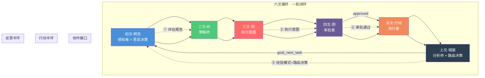

# 六爻详解：每一轮都是「行动 + 反思」的完整闭环

> 为什么太极循环的六个爻位不是六个步骤，而是一套「感知→编织→执行→反思→进化」的认知生命体？

---

## 引言：当「步骤」变成「爻位」

大多数 AI Agent 框架描述其工作流时，用的都是**线性步骤**：

- 步骤 1：收集信息
- 步骤 2：分析信息
- 步骤 3：执行操作
- 步骤 4：检查结果

这看起来没什么问题——直到你发现，**步骤之间没有反馈**。步骤 2 的分析结果不会改变步骤 1 的信息收集策略。步骤 4 的检查结果不会重塑步骤 2 的分析框架。这是一个单向流水线，不是循环。

太极架构（Taiji）用了一个完全不同的概念来组织认知流程：**爻（Yao）**。

爻不是步骤，而是**职责分工**。六个爻位（初爻到上爻）不是串行的六个阶段——它们是六个角色，各自承担特定的认知职责：

| 爻位 | 名称 | 核心职责 | 一句话 | 认知功能 |
|------|------|---------|--------|---------|
| 初爻 | 明觉（Mingjue） | 感知与评估 + 思变决策 | "我现在在哪？下一步怎么办？" | 情境感知 + 元决策 |
| 二爻 | 织（Weaver） | 策略编织 | "我该怎么思考？" | 认知策略 |
| 三爻 | 阳（Yang） | 执行意图 | "我要做什么？" | 决策与计划 |
| 四爻 | 阴（Yin） | 审批与校验 | "这安全合理吗？" | 安全与合规 |
| 五爻 | 行动（Executor） | 实际执行 | "做！" | 工具调用 |
| 上爻 | 暗驱（Anqu） | 深度反思 + 路由决策 | "我学到了什么？目标达成了吗？" | 经验提取 + 目标路由 |

**关键洞察**：这六个爻位构成一个**完整的认知闭环**。其中明觉（初爻）兼具"思变"之责——在感知现状的同时做出元决策（选择卦象、细化任务、评估进度）。每一轮循环都包含「行动」和「反思」两个不可分割的环节——行动不是终点，反思不是终点，只有「行动→反思→行动→反思→……」这个无穷螺旋才是太极循环的完整形态。

本文将逐爻深入剖析：每个爻位做什么、为什么这样设计、以及它们如何协作出「学习型 Agent」的核心能力。

---

## 一、初爻·明觉（Mingjue）：感知者——「知其位，知其时，知其势」

### 职责

明觉是一轮循环的起点。它的职责不是「做」，而是**「知」**——了解当前状态、目标进展、环境变化。

具体工作包括：

1. **评估目标进展**：查看目标的完成标准（done criteria）已经满足了哪些，还有哪些未满足
2. **检索当前轮次的任务信息**：读取任务蓝图（blueprint）、目标轨迹（trajectory）、认知资产（L1-L5），形成对当前轮次的全面认知
3. **感知上一个循环的输出**：读取上一轮暗驱提取的经验模式和路由决策（继续/完成/失败），感知 DMN 认知库的更新
4. **制定轮次执行计划**：基于以上信息，形成本轮的初步执行方向
5. **行使思变之责**：基于暗驱的路由决策和全局上下文，选择卦象（认知姿态），细化任务描述，评估目标进度——这是明觉的"思变"功能

### 为什么叫「明觉」？

「明」——明察秋毫，看清全局。「觉」——觉知当下，感知变化。这不是被动的「看」，而是主动的、有方向的**感知**。

### 设计中蕴含的哲学

明觉的设计对应《易经》中的**坤卦（☷）**——厚德载物，承载一切信息，不加评判地接纳。明觉不做分析、不做决策、不执行——它只负责把「场」看清楚。

这与其他框架形成鲜明对比：

| 维度 | 传统框架 | 太极·明觉 |
|------|---------|-----------|
| 感知方式 | 隐式加载上下文 | 显式评估目标与蓝图 |
| 输出 | 无独立输出 | 轮次评估报告 |
| 认知深度 | 看到「有什么」 | 看到「差距在哪」 |

### 类比人类

明觉就像你在开始一天工作前的**晨间复盘**——看看今天的日程，看看昨天的进展，看看还有什么没完成，然后决定今天的重点。你还没有动手做任何事，但你对自己的「位」（状态）和「势」（方向）已经有了清晰的认知。

---

## 二、二爻·织（Weaver）：策略师——「虚而待物，空故能纳」

### 职责

织是太极架构中最独特、也是最被误解的角色。它不执行任何实际操作——不搜索、不写入、不调 API——它只做一件事：**编织系统提示词**。

但这不是简单的 prompt 模板拼接。织的工作包括：

1. **读取 L3 格栅（八卦认知网格）**：根据明觉感知的当前情境，确定本轮的认知姿态——用哪个卦？乾（创造）、坤（承载）、震（行动）、巽（渗透）、坎（破局）、离（连接）、艮（固守）、兑（表达）？
2. **发现关联的 L1 技能和 L2 模型**：确定本轮需要哪些技能、参考哪些经验模式
3. **动态组合系统提示词**：将八卦格栅、技能定义、模型模式、目标蓝图、认知库信息编织成一条**完整的系统提示词**
4. **注入执行节奏**：设定本轮的 TPM（思考深度）、执行速率、安全边界

### 「空」的实战意义

织的设计哲学源自庄子的**「虚而待物」**。每一轮，织都是从「空」开始的——没有固定 template，没有固定 system prompt。它根据当前轮次的独特情境，从零开始动态组合。

这意味着：
- **第 1 轮**（探索期）：织编织的提示词引导 Agent 开放探索、广泛收集
- **第 3 轮**（产出期）：织编织的提示词引导 Agent 聚焦生成、精炼输出
- **第 7 轮**（复盘期）：织编织的提示词引导 Agent 深度反思、提取模式

**Agent 的「认知姿态」每轮都在变化**——因为它使用的 system prompt 每轮都是新的。

### 为什么叫「织」？

「织」取自织布——经线是固定的（架构、规则、安全边界），纬线是变化的（八卦格栅、技能模型、目标状态）。织的工作就是把经线和纬线交织成一块完整的「布」（系统提示词），交给下一爻去用。

### 类比人类

织就像你在动手做一件事之前的**策略准备**——你要写一篇文章，不是直接打开文档就写，而是先想想：这个文章写给谁看？什么风格合适？要用什么框架？需要参考哪些资料？这些「思考怎么思考」的过程，就是织在做的事。

---

## 三、三爻·阳（Yang）：执行者——「动而能止，行而能思」

### 职责

阳是「执行的意图」——它决定本轮要做什么操作，并提出具体的执行计划。

阳的工作包括：

1. **基于明觉的评估和织编织的策略，提出执行意图**：本轮的主要目标是什么？要产出什么？
2. **选择工具和操作**：用哪个工具、调哪个 API、写哪个文件
3. **制定执行序列**：如果有多步操作，规划先后顺序
4. **提交审批**：将执行意图提交给阴（审批者）

### 「阳」的命名深意

在《易经》中，阳代表主动、创造、行动。但太极架构中的阳不是「蛮干」——它的全称是「执行意图（execution intent）」，不是「执行」本身。阳负责**提出**做什么，而不是**实际做**。

这是一个精妙的设计：将「决策做什么」和「实际去做」解耦。这样做的原因是：

1. **安全**：执行意图先经过审批（阴），再交给执行器（行动），防止误操作
2. **清晰**：每一轮都有明确的执行意图，避免「做着做着忘记目标」
3. **可追溯**：每轮的执行意图都被记录，方便事后复盘

### 类比人类

阳就像你决定「我要写一段代码」的那个瞬间——你已经知道自己要做什么，但还没有真正动手。你脑子里已经规划好了要写什么、大概的步骤是什么——这就是「执行意图」。

---

## 四、四爻·阴（Yin）：审批者——「止而后能定，定而后能安」

### 职责

阴是安全与合规的守护者。它不执行操作，也不做决策——它只负责**审批**阳提交的执行意图。

阴的工作包含两层审批：

**前层：硬编码安全规则**
- 检查执行路径是否在允许范围内
- 拦截越界写入（如写入系统目录）
- 拦截危险命令（如 `rm -rf`、`chmod 777`）
- 检查并发调用次数是否超限

**后层：LLM 语义审批**
- 用 L4 真理（经过验证的不可动摇原则）检查执行意图的语义合理性
- 用 L5 自我意识检查执行意图是否与目标一致
- 检查写入的文件是否会影响其他目标的正常执行
- 检查执行意图是否违反了「禁止连续两轮纯读」等架构级约束

### 为什么叫「阴」？

阴代表收敛、审查、制约。它是对阳的「动」的平衡——阳要动，阴要止。这一动一止，构成了太极架构的第一层内部平衡。

### 审批结果

阴的审批有三种结果：

| 结果 | 含义 | 后续流程 |
|------|------|---------|
| **approved** | 执行意图安全合理 | 进入五爻·行动 |
| **rejected** | 执行意图存在风险 | 返回三爻·阳，重新制定执行意图 |
| **modified** | 执行意图基本合理但需要调整 | 阴可以提出修改建议，阳调整后重新提交 |

### 类比人类

阴就像你写代码前的**代码审查**——你有了一个修改方案，但不是直接提交到生产环境。你先自己检查一遍：这个修改会不会影响其他模块？有没有安全风险？需不需要回滚方案？确认一切安全后，才真正执行。

---

## 五、五爻·行动（Executor）：行动者——「行于当行，止于当止」

### 职责

行动是一轮循环中**唯一实际执行操作**的爻位。前四个爻位（明觉、织、阳、阴）都在准备和规划，只有行动真正调用工具、写入文件、搜索信息。

行动的工作包括：

1. **执行被批准的操作**：按阳提交、阴批准的序列执行
2. **高并发执行**：用纯 Python 协程池实现每秒并发执行
3. **路径检查二次确认**：每个写操作都检查目标路径是否在允许范围内
4. **速率限制**：单轮最多 10 个工具调用，防止失控
5. **记录执行结果**：将执行日志记录到目标轨迹

### 「禁止连续两轮纯读」的架构级约束

太极架构有一个核心设计原则：**禁止连续两轮纯读**。

这意味着每一轮 TPN 循环必须至少包含一个**可失败的写操作**——写文件、调 API、生成代码——而不是只做搜索和读取。

这是架构级别的「行动强制」。为什么需要这个约束？

- **防止 Agent 陷入「只读不做」的死循环**：AutoGPT 的一个常见问题就是无限搜索不输出
- **确保每轮都有可验证的产出**：只有写操作才能产生可被后续轮次验证的交付物
- **驱动 DMN 进化**：DMN 需要真实的执行经验来提取模式——纯读取不会产生有意义的学习素材

### 类比人类

行动就是**动手做**的那一刻。你已经想好了（明觉）、规划好了（织）、决定了（阳）、确认安全了（阴）——现在，开始写代码、开始写文章、开始调 API。思想的准备已经完成，现在是行动的兑现。

---

## 六、上爻·暗驱（Anqu）：分析师——「反者道之动，弱者道之用」

### 职责

暗驱是太极架构中最被低估的角色。在一轮循环的执行完成后，暗驱接手——它**不做新的操作，只分析已经发生的事情**。

暗驱的工作包括：

1. **分析执行日志**：本轮执行了什么操作？结果如何？成功还是失败？
2. **提取成功模式**：本轮有什么做得好的地方？哪些操作模式应该被记录下来供未来复用？
3. **提取失败教训**：本轮有什么失误？哪些操作模式应该避免？
4. **触发认知演化**：如果积累了足够的经验，触发 DMN 更新认知库
5. **输出暗驱总结**：对本轮的深度分析，以及路由决策（goal_next_task / goal_completed / goal_failed / continue_task），供明觉的思变决策参考

### 「暗驱」的命名深意

「暗」——不是明面上的操作，而是后台的思考。「驱」——驱动认知进化。

暗驱的名字来自两个汉字：
- **安**（ān）——安定观察，不介入、不干扰
- **曲**（qū）——曲径通幽，不走直接的路，而是循着经验的轨迹深入

暗驱不做任何操作——它只是静静地「看」着执行日志，提取模式、总结教训。但这个看似「无为」的角色，正是整个架构能够「越做越聪明」的关键。

### 行动 + 反思 = 完整的循环

这是第二篇文章最核心的论点：**每一轮太极循环都同时包含「行动」和「反思」**。

大多数框架只有一个模式——「执行」。执行完了，继续执行。没有停下来「想」的环节。

太极循环的结构是：

```
[明觉（含思变）→织→阳→阴→行动] → 这是「行动」半环
                              ↓
                    [暗驱] → 这是「反思」半环
```

但这不是两段式——暗驱的反思结果和路由决策直接影响下一轮的明觉感知和思变决策。这意味着：

- **第 N 轮的「行动」** 产出了真实世界的结果（成功或失败）
- **第 N 轮的「反思」** 从结果中提取了经验模式
- **第 N+1 轮的「行动」** 已经包含了上一轮反思提炼的改进

**这才是「学习」的定义**：经验从一轮传递到下一轮，行为因此改变。

### 类比人类

暗驱就像你完成一天工作后的**晚间隔夜复盘**。你回想今天做了什么、哪里做得好、哪里可以改进——然后把这些经验记在心里，明天用不一样的方式做事。你没有再动手做任何工作，但你比早上更聪明了。

---

## 七、明觉的思变之责：元决策不是独立节点——「变则通，通则久」

### 思变不是第七爻，是明觉的核心能力

在初爻·明觉的职责中，我们提到它"兼具思变之责"。这里展开说明：**思变不是六爻之外的第七个节点，而是明觉（初爻）承担的元决策功能。**

为什么要把思变放在明觉中，而不是单独成为一个节点？

1. **感知与决策不可分割**：看清全局（明觉）和决定下一步（思变）是同一个认知动作的两面。你不可能在不知道自己在哪的情况下决定去哪——反之，看清了全局自然就知道下一步该怎么做。
2. **减少信息传递损耗**：如果思变是独立节点，它需要从暗驱接收分析结果、从明觉接收评估报告，再做决策——这多了一层信息传递。而明觉直接整合所有信息做决策，更高效。
3. **与代码实现一致**：在太极架构的实际代码中，`mingjue.py` 的 system prompt 写道："你是初爻·明觉，兼具'思变'之责。"思变的决策逻辑（卦象选择、任务细化、进度评估）全部实现在明觉模块中。

### 两层决策：暗驱路由 + 明觉思变

太极架构的决策分为两层，各司其职：

| 决策层 | 执行者 | 决策内容 | 决策时机 |
|--------|--------|---------|---------|
| **路由决策** | 暗驱（上爻） | goal_next_task / goal_completed / goal_failed / continue_task / verify_task | 任务内循环结束后 |
| **思变决策** | 明觉（初爻） | 卦象选择、任务描述细化、目标进度评估 | 下一任务启动时 |

暗驱回答的是"目标层面的问题"：这个任务做完了吗？要继续下一个任务吗？要回炉重做吗？

明觉的思变回答的是"策略层面的问题"：基于暗驱的路由决策和全局上下文，下一任务用什么认知姿态（卦象）？如何细化任务描述？当前整体进度如何？

### 为什么叫「思变」？

「思」——深思熟虑，不草率决策。「变」——变化，改变。

这个名字来自《易经》的核心思想：**「穷则变，变则通，通则久。」** 当一种方式走到尽头时，就要改变；改变才能通畅；通畅才能持久。

明觉的思变职责就是在每个新任务启动时，诚实地回答一个问题：**基于暗驱的路由决策和当前全局状态，下一任务应该如何执行？** 选择什么卦象？策略需要调整吗？进度评估合理吗？

### 思变 vs 其他框架的「检查点」

大多数框架也有「检查点」或「评估」环节——但它们的评估通常只回答一个问题：**「做完了没有？」**

太极架构中的思变（通过明觉）回答的是多维问题：
1. **「用什么策略？」**（卦象选择）
2. **「任务如何细化？」**（任务描述优化）
3. **「进度到哪了？」**（目标完成百分比）
4. **「暗驱的决策合理吗？」**（独立判断，不盲从）

这种多维度的决策能力，让太极循环不只是「做→检查→再做」的简单循环——而是一个**有元认知（metacognition）的学习系统**。

---

## 八、各爻的职责分工与协作机制

六爻不是六个串行的步骤——它们是**六个职责分工，在每轮循环中各司其职**。

### 8.1 职责边界

| 爻位 | 做 | 不做 |
|------|----|------|
| 明觉 | 感知、评估、思变决策（卦象选择、任务细化、进度评估） | 不执行、不审批 |
| 织 | 编织策略、组合提示词 | 不做感知、不执行、不审批 |
| 阳 | 提出执行意图、选择工具 | 不实际执行、不审批、不反思 |
| 阴 | 审批执行意图、安全校验 | 不制定策略、不执行、不决策 |
| 行动 | 实际执行操作 | 不做感知、不编织策略、不反思 |
| 暗驱 | 反思、分析、提取模式、路由决策 | 不做任何操作 |

### 8.2 信息的流向

每一轮循环，信息沿着以下路径流动：

```
明觉（感知+思变决策）→ 织（策略化）→ 阳（具象化）→ 阴（确认安全）
  → 行动（兑现）→ 暗驱（抽象化+路由决策）
  → 下一轮的明觉（再次感知+思变，但已包含上一轮的经验）
```

在这个流动中，信息经历了多次「形态转换」：

1. **原始信息**（明觉感知的目标状态、蓝图、认知库）
2. **策略化信息**（织编织的认知姿态和系统提示）
3. **具象化信息**（阳制定的具体执行意图）
4. **已审批的信息**（阴确认安全的执行计划）
5. **执行结果**（行动产生的操作日志和文件）
6. **抽象化+决策信息**（暗驱从日志中提取的经验模式 + 路由决策）
7. **再感知+思变**（下一轮明觉综合暗驱输出，做出卦象选择和任务细化决策）

### 8.3 协作机制：三个关键接口

六爻之间的协作依赖三个关键「接口」：

**接口 1：明觉↔织（感知→策略）**

明觉的评估报告是织的「原材料」。织读取明觉的输出，加上八卦格栅，编织出本轮的系统提示词。

如果明觉感知到「目标接近完成」，织会编织偏向「产出」的提示词。
如果明觉感知到「目标卡住了」，织会编织偏向「破局」的提示词（坎卦）。

**接口 2：阳↔阴↔行动（意图→审批→执行）**

这是一个三级流水线：
- 阳提出意图 → 提交给阴
- 阴审批 → 如果 approved，交给行动
- 行动执行 → 记录日志，返回给暗驱

这个三级流水线的存在，确保了「动」不是盲目的动——每个操作都经过意图对齐和安全检查。

**接口 3：暗驱↔下一轮明觉（反思→路由→再感知+思变）**

这是「学习」的核心接口：
- 暗驱从执行日志中提取模式，做出路由决策（继续/完成/失败/回炉）
- 明觉接收暗驱的路由决策和经验模式，行使思变之责（选择卦象、细化任务）
- 经验模式通过明觉的思变决策影响新一轮的执行策略

**这个接口的存在，是太极循环「越做越聪明」的根本原因。**

### 8.4 mermaid 架构图



---

## 九、行动与反思的闭环：一个完整的轮次示例

让我们用一个真实的例子来展示一轮完整的六爻循环如何包含「行动」和「反思」两个环节。

**场景：Agent 正在「写一篇关于 Agent 框架的历史演变趋势的文章」**

### 第 1 轮：行动半环

| 爻位 | 工作内容 |
|------|---------|
| **明觉** | 感知目标：写一篇 2000 字左右的历史趋势文章。查看蓝图，发现需要涵盖 AutoGPT、CrewAI、LangGraph 等框架。查看认知库，已有 5 篇对比文章可参考。 |
| **织** | 读取 L3 格栅，确定用「兑卦（表达）」作为认知姿态——聚焦于叙事和表达。编织系统提示词，引导 Agent 以「历史叙述者」的口吻写作。加载 L1 写作技能和 L2 对比分析模式。 |
| **阳** | 提出执行意图：本轮的产出是文章的引言部分 + AutoGPT 章节。使用 write_file 工具写入。 |
| **阴** | 审批：路径检查通过（写入 deliverables/ 目录）。语义审批通过（内容与目标一致）。 |
| **行动** | 执行 write_file：写入文章的引言和第一章（AutoGPT 分析），约 600 字。 |

### 第 1 轮：反思半环

| 爻位 | 工作内容 |
|------|---------|
| **暗驱** | 分析执行日志：发现写入了 600 字，结构清晰，但缺少对 AutoGPT 的对比数据支撑。经验模式提取："写对比分析时，应先收集数据再写分析，而不是先写再补数据。"路由决策：goal_next_task（继续下一个任务）。 |

### 第 2 轮：行动半环（已包含反思成果）

| 爻位 | 工作内容 |
|------|---------|
| **明觉** | 感知上一轮暗驱的模式和路由决策：「写对比分析需要先收集数据」。行使思变之责：选择巽卦（分析渗透），细化任务为"先收集数据再补充对比分析"。感知当前状态：已有引言和 AutoGPT 章节，需要补充其他框架和对比数据。 |
| **织** | 调整认知姿态：从「兑卦（表达）」切换到「巽卦（分析渗透）」。编织新的系统提示词，引导 Agent 先收集数据再撰写。 |
| **阳** | 提出执行意图：先用 web_search 搜索 CrewAI 和 LangGraph 的最新数据，再写入对比表。 |
| **阴** | 审批通过。 |
| **行动** | 执行 web_search（搜索数据）→ write_file（写入对比分析表）。 |

**看到了吗？** 第 1 轮的反思成果（暗驱提取的模式）直接影响第 2 轮的明觉感知和织的策略编织。这就是「学习」——经验从一轮传递到下一轮，行为因此改变。

---

## 十、与其他框架的对比

### 10.1 AutoGPT：只有「行动」，没有「反思」

AutoGPT 的循环是：`思考 → 行动 → 结果 → 思考 → 行动 → 结果 → ...`

它的「思考」实际上只是「下一步做什么」的决策，不是「我学到了什么」的反思。没有暗驱这样的角色来提取模式、做出路由决策，没有明觉的思变功能来做卦象选择和策略调整。

### 10.2 LangGraph：有「图」，但没有「认知进化」

LangGraph 用有向图组织工作流，节点之间有明确的依赖关系。但图本身是静态的——节点和边的定义在运行前就已经确定，不会在执行过程中「学习」到新的节点或边。

太极的六爻循环不是固定图——每一轮的织都在重新编织认知策略，暗驱都在提取新模式更新认知库。循环的「结构」在进化。

### 10.3 CrewAI：有「角色编排」，但没有「角色演进」

CrewAI 可以让多个 Agent 协作执行——一个研究者、一个写作者、一个编辑。但每个 Agent 的角色是固定的，不会随着任务进展而「进化」。

太极的六爻是**同一个 Agent 内部的认知分工**，而不是多个 Agent 的外部协作。六个爻位不是一个团队中的六个人——它们是**同一个大脑中的六种认知功能**。

---

## 十一、总结：六爻不是步骤，是认知分工

六爻循环最容易被误解的地方，就是把它当作六个串行的「步骤」。

**它不是。**

六爻是六个认知职责分工——它们在同一轮循环中各司其职，形成「感知+思变→策略→决策→安全→行动→反思+路由」的完整闭环。

这种设计的精妙之处在于：

1. **职责隔离**：每个爻位只做自己的事，不越界。明觉不执行，暗驱不做决策。
2. **信息转换**：信息在轮次中经历多次形态转换——从原始信息到策略化、具象化、已审批、执行结果、抽象化、决策——每个转换都增加了价值。
3. **行动+反思的强制闭环**：每一轮都同时包含行动（明觉→织→阳→阴→行动）和反思（暗驱）。明觉兼具思变之责，在感知的同时做出元决策。没有只有行动没有反思的轮次，也没有只有反思没有行动的轮次。
4. **跨轮学习**：暗驱提炼的模式和路由决策传递给下一轮的明觉，明觉通过思变功能将其转化为新的卦象选择和策略调整，实现真正的「从经验中学习」。

**这就是太极循环的核心——不是一套更好的工作流，而是一套能让 Agent 持续进化的认知架构。**

---

## 致谢

本文为「太极循环系列」第二篇。第一篇《太极循环的精髓：TPN + DMN 双循环持续推进目标》阐述了双循环的整体图景。下一篇将深入探讨 **DMN vs TPN：双模式的大脑级分工**——认知进化和任务执行如何互不阻塞。

---

*太极（Taiji）是一个开源的 AI Agent 架构实验，将中国古典哲学注入现代 AI 系统设计。*  
*GitHub: https://github.com/taiji-agent*  
*讨论群：V2EX / 知乎 / dev.to / Hacker News*
