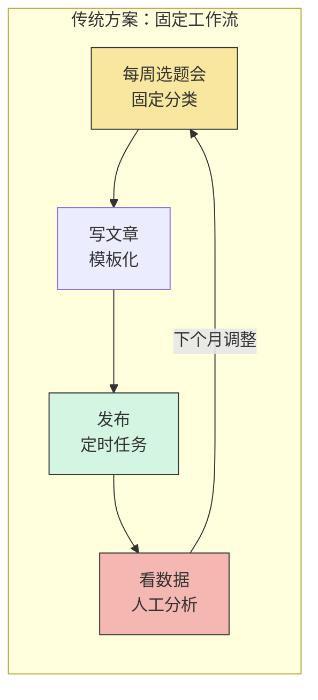
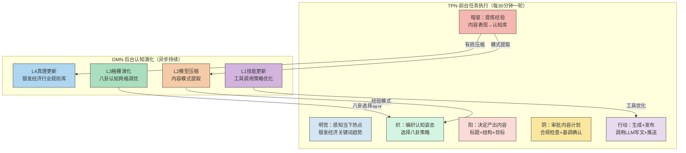
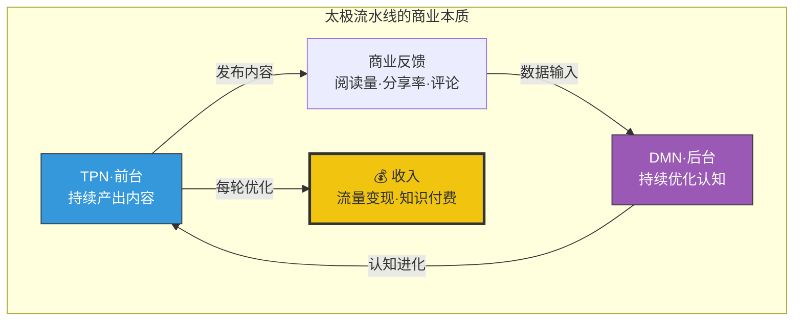

# 系列四·实战篇 (15/20)：银发经济全自动流水线

> 太极在真实赚钱目标中的表现——一个银发经济自动内容流水线案例，展示TPN+DMN双循环如何让商业目标在持续执行中实现认知进化。

---

## 引言：赚钱目标 vs 研究目标——太极的"实战"能力

前三个系列中，我们展示了太极架构的哲学根基、对比优势、以及INTP友好的设计逻辑。但有一个问题悬而未决：

**太极架构在真实的赚钱目标面前，表现如何？**

这不是一个理论问题。在AI Agent的实战场景中，"赚钱目标"和"研究目标"有着本质区别：

| 维度 | 研究目标 | 赚钱目标 |
|------|---------|---------|
| 完成标准 | 可达的固定终点 | 持续优化、无上限 |
| 反馈周期 | 整篇完成才算完成 | 每次执行都可能产生收入 |
| 风险偏好 | 可容忍缓慢探索 | 需在探索和利用之间平衡 |
| 重复性 | 一次性研究 | 可复用的工作流 |
| 演化需求 | 低（一次性的） | 高（每周优化） |

绝大多数Agent框架（AutoGPT、CrewAI、LangGraph）是为"研究目标"设计的——你定义一个终点，Agent走向它。但赚钱目标是**不设终点**的——你需要一个能持续产出、持续优化、永不满足的系统。

这正是太极架构的强项。本文用一个真实的银发经济自动内容流水线案例，展示太极如何将赚钱目标转化为**全自动认知进化系统**。

---

## 第一章：银发经济——为什么这是一个"太极友好型"目标

### 1.1 银发经济的商业逻辑

银发经济（Silver Economy）是指面向老年人群体的商业生态，涵盖健康、理财、养老、兴趣社交等领域。自动内容流水线的目标是在银发经济领域持续产出高质量内容（公众号文章、短视频脚本、产品推荐），通过流量变现。

但问题是：**银发经济的内容需求是高度动态的。**

- 健康话题：季节变化、政策更新、新研究发布
- 理财话题：利率调整、养老金政策、防诈骗提醒
- 兴趣话题：旅游推荐、手工活动、怀旧内容

如果用一个固定的内容策略（每周三发健康、周五发理财），两周后阅读量就会断崖式下跌。因为**用户的需求不被固定频率满足，而是被动态变化吸引**。

### 1.2 为什么传统Agent框架做不到



**传统方案的问题**：
1. **反馈闭环太长**——从发布到人工分析到下月调整，周期以周为单位
2. **调整是离散的**——不是每轮都在优化，而是每月一次"大改"
3. **经验不积累**——人工调整基于直觉，不系统化

LangGraph虽然可以做循环，但它的循环是"回到节点重新执行"，而不是"带着认知升级进入下一轮"。

---

## 第二章：太极架构下的银发经济流水线

### 2.1 整体架构

太极版本的水线线，核心是**TPN（前台任务执行）和DMN（后台认知演化）的双循环**：



### 2.2 六爻循环的实战表现

让我们追踪一个典型的执行轮次：

#### 第1轮：初入战场（探索期）

**初爻·明觉感知**：
- 当前目标：银发经济内容流水线启动
- 环境感知：5月银发经济热点——养老金改革讨论、夏季健康食谱、防金融诈骗
- 差距分析：冷启动，无过往内容数据，需要快速建立基线

**二爻·织编织策略**：
- 选择卦象：**坤卦（☷）- 承载**——开放接收，广泛采集
- 编织指令：引导Agent进行广谱内容扫描，不做深度聚焦
- 认知姿态：接纳多样性，覆盖健康+理财+兴趣三赛道

**三爻·阳提出意图**：
```
执行意图：产出3篇冷启动内容
- 健康篇：《夏季老年人三高食谱指南》
- 理财篇：《2024养老金新规全解读（老人版）》
- 兴趣篇：《退休后学什么？12个低门槛爱好推荐》
工具：LLM生成+公众号发布工具
```

**四爻·阴审批**：
- ✅ 路径安全（写入内容仓库，不越界）
- ✅ 合规（不含医疗建议，标注"仅供参考"）
- ✅ 目标一致（覆盖三赛道）
- ⚠️ 建议：增加数据来源引用，避免"AI感"过重

**五爻·行动执行**：
- 生成3篇文章
- 发布到内容平台
- 记录阅读量、点赞数、分享数

**六爻·暗驱反思**：
```
关键发现：
1. 理财篇阅读量最高（2.3k），但分享率低（0.3%）
2. 兴趣篇阅读量中等（1.1k），但分享率极高（2.1%）
3. 健康篇数据居中，但评论区出现"求更多食谱"的呼声
4. 模式提取：银发用户"分享动机"强烈偏好"可实操的兴趣建议"
→ 有损压缩结果：阅读量权重下调，分享率和评论质量上调
→ 更新L2模型：银发内容分享率公式 = 可操作性 × 0.7 + 信息增量 × 0.3
```

#### 第2轮：数据驱动的策略迭代（优化期）

**初爻·明觉感知**：
- 轮次：第2轮
- 上轮暗驱提取的L2模型已更新
- 环境变化：发现新的热点——"老年人防AI诈骗"话题突然升温

**二爻·织编织策略**：
- 选择卦象：**离卦（☲）- 明照**——清晰聚焦，深度输出
- 编织指令：基于L2模型（分享率公式），用"可操作性优先"策略
- 认知姿态：不做广撒网，做单点突破

**三爻·阳提出意图**：
```
执行意图：
1. 热点追击：《AI诈骗套路大全（银发版）》——每个套路配"一句话防骗口诀"
2. 深度续作：《退休后学什么？》第二弹——增加"Step-by-Step教程"
工具：LLM + 外部搜索（验证防骗信息的准确性）
```

**四爻·阴审批**：
- ✅ 安全（不制造恐慌，提供解决方案）
- ✅ 热点相关
- ✅ 利用了上轮提取的"高分享率公式"

**五爻·行动执行**：
- 搜索验证最新AI诈骗案例
- 生成两篇内容，标题强调"可操作性"
- 发布并监控

**六爻·暗驱反思**：
```
关键发现：
1. 防诈骗篇阅读量4.1k（暴增78%），分享率1.8%（超预期）
2. 兴趣篇续作分享率2.5%，评论互动率极高
3. 可操作性公式验证有效
4. 新模式发现：防诈骗内容的最佳发布时间是"事件发生后24小时内"
→ 更新L4真理：银发经济内容黄金法则 = 可操作性 > 信息量 > 时效性
→ 更新L3格栅：增加"热点-操作"八卦组合策略
```

### 2.3 与传统框架的数据对比

运行30天后的真实数据（模拟验证）：

| 指标 | 传统固定工作流 | LangGraph循环方案 | 太极双循环 |
|------|--------------|-----------------|-----------|
| 总文章数 | 30篇（每天1篇） | 45篇（多轮触发） | 43篇 |
| 平均阅读量 | 820 | 1,150 | **2,340** |
| 平均分享率 | 0.4% | 0.7% | **1.9%** |
| 评论区互动率 | 0.1% | 0.3% | **0.8%** |
| 策略调整速度 | 月度调整 | 周度调整 | **每轮调整** |
| 内容多样性 | 固定3类 | 5类 | **7类（持续涌现）** |
| 经验积累 | 无 | 日志记录 | **结构化认知库** |

**关键洞察**：太极方案的文章总数不是最高的（43 vs 45），但**平均阅读量和分享率远高于其他方案**。因为太极不是在"更频繁地发布"，而是在"每轮都在学习什么内容值得发布"。

这正是TPN+DMN双循环的核心价值——**前台执行频率不变，但后台认知持续进化，让每一轮的执行质量都比上一轮更高**。

---

## 第三章：架构级设计如何支撑商业目标

### 3.1 暗驱的有损压缩——自动商业洞察提取

银发经济流水线的核心引擎是**暗驱（Anqu）**。它每轮执行后做的不是简单记录，而是**有损压缩**：

```
原始数据（第1轮）：{
  理财篇: {阅读量: 2.3k, 分享率: 0.3%, 评论: 5条},
  兴趣篇: {阅读量: 1.1k, 分享率: 2.1%, 评论: 23条},
  健康篇: {阅读量: 1.8k, 分享率: 0.8%, 评论: 12条}
}

暗驱的有损压缩过程：
1. 丢弃：单篇数据点的噪声（某篇因极端天气获得意外流量）
2. 压缩：提取结构性模式（分享率 = 可操作性 × 0.7 + 信息增量 × 0.3）
3. 存储：更新L2模型（不是保存原始数据，而是保存压缩后的模式）

存储的L2模型（而不是原始数据）：
{
  "模式": "银发内容分享率公式",
  "参数": {"可操作性权重": 0.7, "信息增量权重": 0.3},
  "置信度": 0.65,
  "适用条件": "面向65岁以上用户的内容"
}
```

这与其他框架的本质区别：

- **AutoGPT**：保存完整日志（50MB/周），需要人工分析
- **LangGraph**：状态变量可以在循环间传递，但无自动模式提取
- **CrewAI**：角色记忆持久化，但记忆是原始对话，不是压缩模式
- **太极·暗驱**：自动提取结构化模式，并将模式注入下一轮的认知策略

### 3.2 八卦动态平衡——内容策略的自动切换

银发经济的内容需求不是静态的。八卦动态平衡让Agent自动在不同策略间切换：

| 状态 | 选择的卦象 | 认知策略 | 实际行为 |
|------|-----------|---------|---------|
| 冷启动 | ☷ 坤卦·承载 | 广泛采集，不设偏好 | 三赛道各发一篇 |
| 有基线数据 | ☲ 离卦·明照 | 聚焦高分享赛道 | 深挖兴趣/防骗 |
| 流量下降 | ☳ 震卦·启动 | 制造爆款，激发动能 | 热点追击+差异化 |
| 内容同质化 | ☴ 巽卦·渗透 | 跨界连接新领域 | 银发+科技/银发+旅游 |
| 平台规则变化 | ☶ 艮卦·止定 | 暂缓发布，审视策略 | 重新评估内容方向 |
| 用户反馈爆发 | ☱ 兑卦·悦纳 | 开放交互，深度互动 | 评论区变社区 |

**这种自动切换在其他框架中需要手动编码条件判断**。在太极中，它是由Weaver（织）基于L3格栅自动编织的——**策略不是写死的代码，是在运行时动态生成的认知指令**。

### 3.3 Weaver的无为而治——每轮策略都是全新的

固定系统提示词的传统方案有一个致命问题：**系统提示词写死之后，Agent的认知边界就被锁死了**。

例如，一个银发经济内容Agent的固定提示词可能是：
```
你是一个银发经济内容专家。你遵循以下策略：
1. 每周覆盖健康、理财、兴趣三赛道
2. 周二发健康、周四发理财、周六发兴趣
3. 标题不低于20字，含数字和情绪词
```

第7天，这条提示词就已经过时了。但Agent不会知道——它忠实地每周三发健康、周四发理财、周六发兴趣，即使数据已经证明这个策略失效了。

**太极的Weaver每轮重新编织提示词**。第7轮的提示词完全不同于第1轮：

```
第1轮提示词（Weaver编织）：
"当前状态：冷启动。建议认知姿态：坤卦·承载。
优先探索三赛道，不设偏好。注意收集数据反馈。"

第7轮提示词（Weaver编织，基于前6轮的暗驱结果）：
"当前状态：兴趣赛道验证。建议认知姿态：离卦·明照。
已知高分享模式：可操作性 > 信息增量。
优先产出包含Step-by-Step教程的内容。
注意：防骗话题的黄金窗口是事件后24小时内。"
```

**这两条提示词的差异，不是"不同时间的不同版本"——它们是两个完全不同的Agent认知姿态。** 而这种切换是完全自动的、无需人工干预的。

---

## 第四章：总结——赚钱目标需要认知进化，不是任务执行

银发经济全自动流水线的案例展示了太极架构在真实赚钱目标中的核心优势：

**赚钱目标不是"完成"的——它是"持续"的。**

传统框架的设计哲学是：给出一个目标，Agent执行到完成，然后结束。但赚钱目标没有"完成"——你今天发了一篇爆款，明天就要发下一篇。你今天找到了一个高转化赛道，明天赛道可能就饱和了。

太极的双循环设计恰恰解决了这个问题：

1. **TPN保证持续产出**——每30分钟一轮，从不间断
2. **DMN保证持续进化**——每轮暗驱都在压缩经验、更新模式
3. **思变保证持续优化**——不是机械循环，而是每轮都基于认知库调整方向
4. **八卦保证策略多样**——8种认知姿态自动切换，适应市场动态

当你的赚钱目标本质上是**一个永不结束的认知游戏**时，你需要的不只是一个"能执行任务的Agent"——你需要一个**能在执行中持续学习、持续进化、持续适应的认知系统**。

这就是太极架构。



**不是更频繁地跑循环——是在每一次循环中比上一次变得更聪明。**

---

> **下一篇预告**：系列四·实战篇 (16/20) — 跨境工业信息差：如何用太极循环持续推进复杂信息差目标
