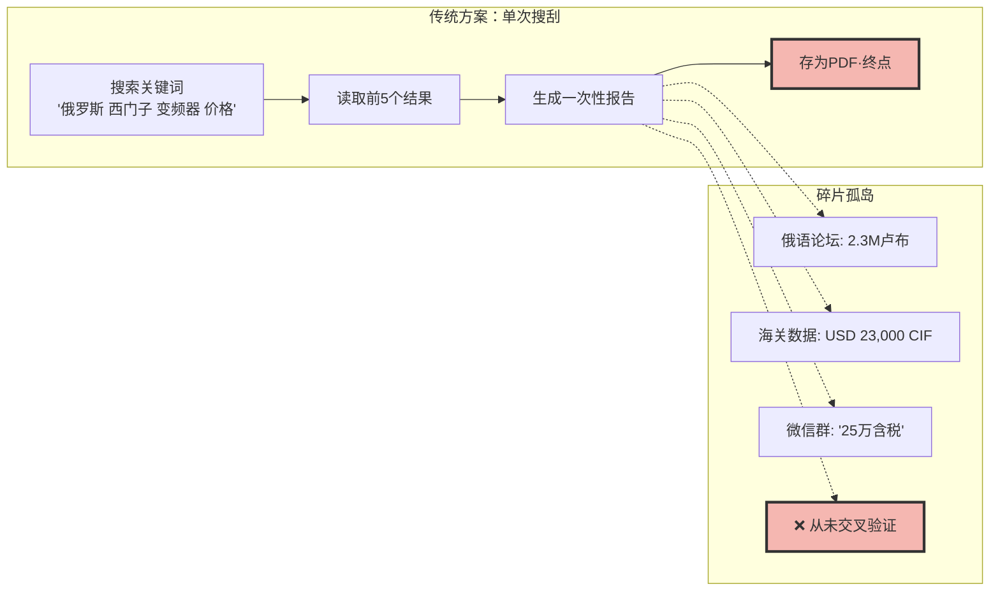
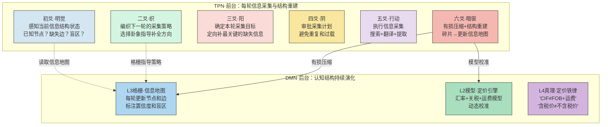

# 系列四·实战篇 (16/20)：跨境工业信息差

> 太极在复杂信息差目标中的表现——一个跨境工业品价格情报系统的案例，展示六爻循环如何通过「多轮迭代」让Agent在碎片化信息中建立起结构化认知优势。

---

## 引言：信息差赚钱 vs 内容赚钱——不同的认知挑战

上一篇（15-银发经济全自动流水线）展示了太极如何应对**动态市场**——内容需求多变，Agent需要每轮学习用户偏好并调整策略。

但赚钱目标不止一种。信息差赚钱是另一种完全不同的挑战：

| 维度 | 内容变现（第15篇） | 信息差变现（本篇） |
|------|-------------------|-------------------|
| 核心挑战 | 动态变化快 | 信息高度碎片化 |
| 数据性质 | 公开、高频、交互式 | 封闭、低频、结构性 |
| 认知难点 | 模式发现（什么内容受欢迎） | 结构重建（碎片→全景图） |
| 优化目标 | 分享率、互动率 | 信息完整度、价格准确度 |
| 失败模式 | 策略停滞，用户流失 | 认知盲区，决策错误 |
| 太极优势 | TPN+DMN持续策略演化 | 暗驱有损压缩+多轮迭代重建结构 |

**跨境工业信息差**是一个高度典型的场景——你需要从分散的、不完整的、多语言的信息源中，拼凑出一个完整的市场价格图景，然后利用这个信息差获利。

本文展示太极架构如何用六爻循环和暗驱的有损压缩机制，通过**多轮迭代**从零散信息中"生长"出结构化认知，而不是一次性"搜集"完整信息。

---

## 第一章：跨境工业信息差的本质——不是信息不足，是结构缺失

### 1.1 场景设定

假设你要做的是：**中俄工业设备配件跨境贸易**。

具体来说，俄罗斯的工业企业（石油、天然气、矿山）大量使用欧美品牌（西门子、ABB、卡特彼勒、GE）的工业设备。但2022年后的制裁导致欧美品牌退出俄罗斯市场，同时俄罗斯的采购渠道断裂形成巨大的信息差：

- 俄罗斯买家：急需设备配件，但无法从正规渠道获取报价
- 中国供应商：有货源，但不了解俄罗斯市场的真实需求和价格水位
- 信息中介：利用信息差赚取差价——但前提是拥有**完整准确的市场情报**

问题是，市场情报不是现成的。它隐藏在：

```
信息碎片来源：
1. 俄罗斯工业论坛的零散询盘（俄语）
2. 海关进出口数据（部分公开，部分付费）
3. 中国供应商朋友圈的"求购"信息（中文，非结构化）
4. WhatsApp/Telegram群聊中的报价截图（不完整）
5. 俄罗斯行业展会的新闻稿（俄语，1-2周延迟）
6. 欧洲品牌官网的库存状态（英语，部分被制裁屏蔽）
```

没有单一来源能给出完整图景。你必须在多个碎片源之间交叉验证、推断、填补空白——**这就是信息差的本质：不是信息不够多，是信息的结构不够完整**。

### 1.2 信息差的"收敛曲线"概念

信息差的大小可以用**信息熵**来度量——初始状态下，你对市场价格的不确定性极高（高熵）。每处理一条信息碎片，熵应该下降一部分。但关键是：**不同信息碎片的"熵降效率"不同**。

```
信息差缩小过程示意图：

信息熵
  ↑
  | ████████████████ 初始状态（完全未知）
  | ████████████░░░ 第1轮后（找到2个报价，仍有大量盲区）
  | ████████░░░░░░ 第2轮后（交叉验证，发现价格区间）
  | █████░░░░░░░░░ 第3轮后（建立定价模型，缩小误差范围）
  | ██░░░░░░░░░░░░ 第4轮后（调整关税和运费因子，精准报价）
  | ░░░░░░░░░░░░░░ 第5轮后（信息完整，可作为交易依据）
  +--------------------------------→ 轮次
```

每一次迭代，Agent的认知结构都在进化——它知道得更多，更重要的，它知道**自己不知道什么**（盲区识别）。

### 1.3 为什么传统Agent框架无法实现"信息差收敛"



**传统Agent失败的原因**：

1. **每次执行是独立的**——第1轮搜索的结果不会自动用于第2轮的交叉验证。每一轮都是"从零开始的搜刮"。
2. **无持久认知结构**——即使第1轮发现了"俄语论坛报价2.3M卢布"和"海关数据USD 23,000"，这两个信息之间没有建立关联。Agent不知道它们是"同一个型号的不同报价"。
3. **无盲区意识**——Agent不知道"什么信息缺失"——它只报告找到的，不报告"没找到但应该有的"。信息差不会缩小，只会累积更多噪音。
4. **无迭代收敛机制**——传统Agent不会因为"价格区间还不够窄"而进行第二轮定向搜索。它做完就结束了。

LangGraph虽然可以循环，但它的循环是图路径的重复，不是认知结构的累积。**每一次循环回到起点时，认知状态被重置**。

---

## 第二章：太极架构的解法——多轮迭代重建信息结构

### 2.1 太极版本的信息差收敛流水线

太极的核心思路不是"搜到更多信息"，而是**"用六爻循环和暗驱的有损压缩，每轮重建一次信息结构，持续收敛"**：



### 2.2 追踪完整的多轮迭代过程

以下是一个模拟的"西门子G120系列变频器在俄市场价格"信息重建过程。**我们重点关注每轮之间信息结构的演进，以及暗驱如何驱动下一轮的采集策略**。

#### 第1轮：冷启动——从零建结构

**初爻·明觉感知**：
- 信息地图：完全空白
- 已知节点：0
- 已知边（价格关系）：0
- 盲区：全部
- 目标：建立初始信息地图框架

**二爻·织编织策略**：
- 选择卦象：**坤卦（☷）- 承载**——开放接收，不预设结构
- Weaver编织指令："同时扫描5个信息源，不做深度分析，先确定有哪些信息碎片存在"
- 认知姿态：先广撒网，后收网

**三爻·阳提出意图**：
```
执行意图：同时搜索5个信息源
1. 俄语源："西门子 G120 变频器 报价 site:ru"
2. 中文源："西门子G120 俄罗斯 求购"
3. 英语源："Siemens G120 Russia price 2024"
4. 海关数据：查询G120相关HS编码报关记录
5. 汇率数据：RUB/USD, RUB/CNY
工具：web_search + 翻译工具 + 海关API
```

**四爻·阴审批**：
- ✅ 不越界（公开信息）
- ✅ 无重复搜索（5个源不同）
- ⚠️ 注意并发控制，防止IP被封

**五爻·行动执行**：
- 俄语源：找到2个报价——"2,150,000 RUB" 和 "2,300,000 RUB"
- 中文源：找到1个询盘——"求购G120 37kW，预算25万"
- 英语源：找到欧洲基准价——"€18,500 (FOB Hamburg)"
- 海关数据：找到3条历史报关记录（单价不一致：USD 21,000 / USD 23,500 / USD 28,000）
- 汇率数据：1 RUB ≈ 0.074 CNY，1 EUR ≈ 7.8 CNY

**六爻·暗驱有损压缩——第一轮结构重建**：

```
原始碎片：
  A: 2,150,000 RUB（俄技商城·含税）
  B: 2,300,000 RUB（工业论坛·含税）
  C: "预算25万" CNY（中文询盘·含税未知）
  D: €18,500 FOB Hamburg（欧洲基准·不含税·不含运费）
  E: USD 21,000 / 23,500 / 28,000 CIF（海关数据·已含运费保险）

有损压缩输出——信息地图 v1：
{
  "设备": "西门子 G120 37kW 变频器",
  "节点": [
    {"id": "俄零售价", "值": "2,150,000-2,300,000 RUB", "置信度": "中", "含税": true},
    {"id": "中报价", "值": "~250,000 CNY", "置信度": "低", "含税": "未知"},
    {"id": "欧FOB", "值": "€18,500", "置信度": "高", "含税": false},
    {"id": "CIF到岸", "值": "USD 21,000-28,000", "置信度": "中", "含税": false}
  ],
  "盲区": [
    "俄罗斯零售价是否含增值税(20%)？",
    "中文询盘的'25万'是否含运输到俄罗斯的费用？",
    "FOB Hamburg 到莫斯科的运费是多少？",
    "俄罗斯目前的进口关税税率是多少？"
  ],
  "初步推断": {
    "卢布报价→人民币": "2,150,000 × 0.074 ≈ 159,100 CNY（零售）",
    "欧洲FOB→CIF": "€18,500 × 7.8 ≈ 144,300 CNY（不含运费关税）",
    "矛盾点": "欧盟FOB价(144k) vs 俄罗斯零售价(159k)差距仅10%，似乎偏低"
  }
}
```

**思变决策**：继续下一轮。盲区列表显示**至少有4个关键缺失信息**，信息地图置信度不足以支持交易决策。

#### 第2轮：定向补盲——填关键缺失节点

**初爻·明觉感知**：
- 信息地图v1已就位
- 盲区1（增值税）和盲区3（运费）是影响价格推断的最关键缺失
- 目标：补上这两个盲区，校准价格区间

**二爻·织编织策略**：
- 选择卦象：**离卦（☲）- 明照**——聚焦关键盲区，定向突破
- Weaver编织指令："基于信息地图v1的盲区列表，精确搜索增值税率和运费数据"
- 认知姿态：从广撒网切换为定点突破

**三爻·阳提出意图**：
```
执行意图：
1. 精确搜索："Russia VAT rate industrial equipment 2024"
2. 精确搜索："Hamburg to Moscow sea freight 20ft container 2024"
3. 精确搜索："Russia import duty frequency converter HS 8471"
4. 重新计算价格区间，得到CIF莫斯科的完整成本
工具：web_search + 关税数据库API
```

**四爻·阴审批**：
- ✅ 聚焦关键缺失，无冗余搜索
- ✅ 目标明确（每项搜索都有明确的"填哪个盲区"目的）
- ✅ 不会重复已获取信息

**五爻·行动执行**：
- 增值税：俄罗斯设备进口增值税20%，但工业设备可能有减免
- 运费：Hamburg→圣彼得堡海运20尺柜约$2,800
- 关税：变频器HS编码8471，关税税率5%（确认）
- 发现新信息：俄罗斯2024年有"平行进口"政策，部分设备免关税

**六爻·暗驱有损压缩——第二轮结构重建**：

```
新碎片：
  F: 增值税20%（但工业设备可抵扣）
  G: 运费 $2,800 ≈ 20,300 CNY
  H: 关税5%
  I: "平行进口"免税政策适用于特定设备

信息地图 v2（更新）：
{
  "节点": {
    "欧FOB→CIF莫斯科成本": {
      "FOB价": "€18,500 = 144,300 CNY",
      "海运": "+20,300 CNY",
      "保险(0.3%)": "+430 CNY",
      "关税(5%)": "+7,215 CNY",
      "增值税(20%暂计)": "+28,290 CNY",
      "合计CIF莫斯科": "约200,535 CNY（不含增值税抵扣）",
      "置信度": "中高"
    },
    "俄零售价校准": {
      "2,150,000 RUB折CNY": "159,100 CNY",
      "可能不含增值税": "含VAT则应在190k以上",
      "矛盾升级": "俄零售价(159k) < 欧进口CIF(200k)，存在倒挂！",
      "置信度": "低→高（确认了矛盾）"
    }
  },
  "盲区": [
    "俄罗斯零售报价是否含增值税？——仍需确认",
    "平行进口免税的具体适用范围？",
    "俄零售价和CIF价倒挂的原因是什么？——可能是走私/库存清仓/二手翻新"
  ],
  "关键发现": "价格倒挂（俄零售 < 欧进口CIF），说明市场的实际流通价格存在非正规渠道"
}
```

**思变决策**：继续下一轮。发现了关键的"价格倒挂"现象，需要确认原因——这可能是信息差变现的核心机会。

#### 第3轮：验证推断——从"是什么"到"为什么"

**初爻·明觉感知**：
- 信息地图v2揭示了核心矛盾：俄零售价比欧洲进口成本还低
- 假设1：俄零售价报价不含增值税
- 假设2：存在非正规渠道（二手翻新/库存机）
- 假设3：中文询盘的"预算25万"是含税到货价，高于俄零售

**二爻·织编织策略**：
- 选择卦象：**坎卦（☵）- 破局**——直面核心矛盾，破解倒挂之谜
- Weaver编织指令："设计两路验证：一路验证增值税假设，一路验证二手渠道假设"
- 认知姿态：从"收集信息"切换到"验证假设"

**三爻·阳提出意图**：
```
执行意图：
假设验证1：搜索"俄罗斯 西门子 G120 含增值税 价格不含增值税"
假设验证2：搜索"G120 refurbished Russia price" + 搜索"西门子G120 库存机 俄罗斯"
假设验证3：搜索"G120 37kW new vs used price comparison"
工具：web_search（俄语+英语）+ 交叉验证
```

**四爻·阴审批**：
- ✅ 三项搜索都服务于假设验证
- ✅ 不会重复已有信息

**五爻·行动执行**：
- 假设1验证：俄罗斯大多数工业品零售报价**不含增值税**，增值税在发票时单独列示
- 假设2验证：大量"б/у"（二手）G120在俄市场流通，价格为新品的40-60%
- 假设3验证：中文询盘的"25万"大概率是含税+含运费的"交钥匙"价

**六爻·暗驱有损压缩——第三轮结构重建**：

```
信息地图 v3（最终版）：
{
  "定价模型": {
    "俄零售价(不含VAT)": "2,150,000-2,300,000 RUB",
    "折CNY(不含VAT)": "159,100-170,200 CNY",
    "俄含VAT价(加20%)": "190,920-204,240 CNY",
    "欧进口CIF莫斯科": "约195,000-210,000 CNY",
    "结论": "俄正规渠道零售价 ≈ 欧进口CIF，价格合理"
  },
  "二手市场价格": {
    "俄二手报价": "900,000-1,300,000 RUB ≈ 66,600-96,200 CNY",
    "中文询盘'25万'": "可能是含运费含安装的'交钥匙'方案，含税溢价约25%"
  },
  "交易机会": {
    "正规渠道利差": "小（正品市场已趋近均衡）",
    "二手翻新利差": "大——中国翻新G120成本约80,000 CNY，俄售价95,000-130,000 CNY",
    "核心信息差": "俄罗斯二手市场需求旺盛但供应不足，中国翻新机有15-40%的利差空间"
  }
}
```

**思变决策**：信息结构已收敛到可指导交易的置信度。最终发现：**真正的信息差不在正品，在二手翻新市场**。

---

## 第三章：对比分析——太极多轮迭代 vs 传统单次搜刮

### 3.1 收敛速度的定量对比

| 维度 | 传统方案 | 太极方案 |
|------|---------|---------|
| 第1轮产出 | 3条报价文本，彼此无关 | 结构化信息地图v1：节点+盲区 |
| 第2轮方向 | 再次搜索相同关键词 | 基于盲区列表的定向补全 |
| 第3轮方向 | 无方向（重复随机搜索） | 假设验证（价格倒挂归因） |
| 收敛终点 | 不收敛——信息碎片始终孤立 | 第3轮收敛——定价模型完整 |
| 盲区识别 | 无（不知道缺什么） | 每轮显式标注盲区并消减 |
| 交易可用性 | 不可用——信息碎片无法做决策 | 可用——发现了二手翻新利差 |

### 3.2 太极的核心优势分解

**优势1：暗驱的有损压缩产生结构**

传统Agent的输出是一堆文本。暗驱的输出是**结构化的信息地图**——它"丢失"了原始文本的细节（有损），但保留了节点、边、置信度、盲区这些决策所需的关键维度。

**优势2：思变决策驱动定向迭代**

每一轮的思变决策不是"继续/停止"的二元判断，而是**方向选择**——下一轮应该补什么？是用坤卦广撒网，还是用离卦聚焦，还是用坎卦破局？这种策略多样性让每次迭代都朝着信息熵降低的方向前进。

**优势3：TPN-DMN双循环实现认知积累**

```
传统方案的信息流：
第1轮搜索 → 临时上下文（用完即弃） → 第2轮搜索（从头再来）

太极方案的信息流：
第1轮搜索 → 暗驱压缩 → 写入DMN信息地图（持久化）
第2轮明觉 → 读取DMN信息地图（加载认知结构） → 定向搜索 → 暗驱压缩更新地图
第3轮明觉 → 读取更新后的地图 → 假设验证搜索 → 再次更新
```

每一次迭代的认知成果都被**有损压缩**到DMN认知库，不会丢失。下一轮从更丰富的信息地图出发，而非从零开始。

---

## 第四章：设计哲学——为什么"多轮迭代"比"一次性搜刮"更符合信息差的本质

### 4.1 信息差的本质是"结构缺失"，不是"数据缺失"

如果信息差只是数据缺失（少一条报价），那么一次性搜索就能解决。但真实世界的信息差是**结构缺失**——你不知道报价之间是什么关系、不知道哪些参数会影响价格、不知道哪些信息需要去确认。

太极的多轮迭代通过以下方式解决结构缺失问题：

1. **第一轮**：建立基本节点——知道有哪些信息碎片存在
2. **第二轮**：建立节点间的关系（边）——定价模型开始成型
3. **第三轮**：验证假设，消解矛盾——完成从"信息碎片"到"认知结构"的跃迁

### 4.2 每轮"从空开始"防止路径依赖

传统Agent的多轮循环有一个致命问题：**路径依赖**。因为它保存了所有历史上下文，后续推理会被前期的不完整信息"带偏"。

太极的**织（Weaver）**每轮从空开始编织系统提示词——它读取DMN中的信息地图，但不读取原始搜索文本。这确保了每一轮的认知姿态都是基于当前最优的结构化认知，而不是基于累积的、可能过时或不准确的原始文本。

### 4.3 有损压缩是"信息差收敛"的关键

"收敛"意味着信息熵不断下降。暗驱的有损压缩正是熵降的引擎：

```
原始信息 → 有损压缩 → 结构化信息地图
                                   ↓
                  丢弃噪音（保留关键字段和置信度）
                  保留结构（节点-边-盲区框架）
                  标注不确定性（置信度量化）
```

每次有损压缩，信息地图的熵都在下降——不是因为添加了新信息，而是因为**删除了噪音、建立了结构**。这是太极架构区别于所有纯"搜集型"Agent的核心设计哲学。

---

## 总结：太极循环是信息差场景的"认知引擎"

跨境工业信息差场景完美展示了太极架构的核心能力——**不是一次性搜集信息，而是通过多轮迭代持续缩小信息差**。

| 太极组件 | 在信息差场景中的角色 |
|---------|------------------|
| **明觉** | 读取当前信息地图，识别盲区 |
| **织（Weaver）** | 基于盲区编织下一轮的采集策略和卦象选择 |
| **阳** | 制定定向补全的采集目标 |
| **阴** | 审批采集计划，避免冗余 |
| **行动** | 执行搜索、翻译、提取 |
| **暗驱** | 有损压缩→结构重建→信息地图更新 |
| **思变** | 判断是否继续迭代，以及下一轮的策略方向 |
| **TPN-DMN双循环** | TPN执行信息采集，DMN持久化认知结构，互不阻塞 |

通过这个架构，Agent不再是"搜索+报告"的被动工具，而是具备了**主动认知**——它知道自己知道什么，更知道自己不知道什么，并有策略地填补盲区。

当第3轮收敛完成时，Agent从"两条俄语报价和一条中文询盘"的碎片中，成长出"俄罗斯二手翻新市场存在15-40%利差空间"的结构化交易认知——**这才是信息差的真正价值：不是知道别人不知道的信息，而是从人人可见的碎片中构建出别人看不到的全景图**。
