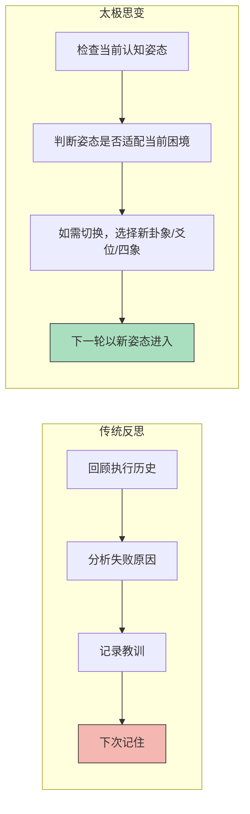
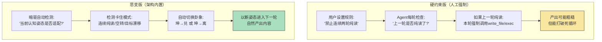

# 系列四·实战篇 (17/20)：从"卡住"到"破局"——六爻思变环节如何打破自读死循环

> 太极在真实困境中的表现——当Agent陷入"自读死循环"时，六爻的思变环节如何通过认知姿态切换打破僵局。本文展示思变环节在实战中的核心价值：它不是可选的"反思加分项"，而是太极架构**区别于所有传统框架的致命差异**。

---

## 引言：每个Agent都会"卡住"——区别在于能否自己走出来

在用Agent做任何真实目标的过程中，"卡住"不是例外，是常态。

卡住的形式有很多种：

- **自读循环**：Agent反复读取同一个文件，在相同信息中打转，每轮都产生新的推理但没有任何实质性推进
- **信息过载**：Agent读取了太多背景信息，认知饱和，无法做出决策
- **目标漂移**：Agent在多个子目标之间来回切换，无法收敛到主线
- **空转执行**：Agent每轮都调用工具，但工具调用相互抵消（读A→读B→读A→读B），不产生净收益
- **工具选择瘫痪**：面对多个可能的工具调用，Agent无法决定优先顺序

上述问题在AutoGPT、LangGraph、CrewAI中都有记载。标准的应对方案是"人类介入"——设计一个"人工审核节点"，卡住时喊人来处理。

但太极架构提供了一个完全不同的解法：**不需要人类介入，架构自身就内置了"破局"机制——六爻的思变环节（暗驱→思变）**。

本文以太极架构在实战中遭遇的典型"自读死循环"为例，展示思变环节如何让Agent自己从困境中走出来。

---

## 第一章：实战中的"自读死循环"——一个真实的太极运行案例

### 1.1 场景：宣传太极架构的写作任务

设定一个真实的太极运行场景。目标：宣传太极Agent架构，要求产出系列文章（20篇）。这是太极自己的宣传任务——如果太极在宣传自己的过程中卡住了，那是对"太极思想"最生动的展示。

Agent运行到某一轮时，出现了以下情况：

**第N轮执行记录（卡住状态）：**

```
用户输入：当前任务——继续产出对比篇-06（太极 vs OpenClaw）
目标进度：55%已产出，下一篇任务已分配
认知资产：目标蓝图.md（2.9KB）+ 执行历史记录

Agent的响应：
"好的，让我先全面了解当前的任务背景和已有的产出，然后再推进。"

→ 连续5轮的工具调用全是 read_file：
  第1轮：读目标蓝图.md
  第2轮：读执行历史记录
  第3轮：读已产出的文章开头
  第4轮：读自己的上一轮执行记录（确认自己做了什么）
  第5轮：读目标蓝图.md（再次确认目标）

→ 每轮的"阳意图"都是"让我先全面了解"，但读完后没有任何实质性产出。

→ 第6轮：读了自己的执行记录后，说"我需要看一下还有多少篇文章没写"
→ 第7轮：重新读了一遍目标蓝图.md
→ 第8轮：读对比篇-06的已有内容开头
```

这是一个经典的自读死循环。Agent看似在"理解任务"，实际上没有任何推进。每次读完都感到"还需要更多背景"，然后又去读更多或重读已有的。

### 1.2 为什么传统框架无法突破这个循环

在传统Agent框架中，这种死循环的触发机制是：

```
循环条件：
while (认知不足 && 还有未读的上下文) {
    read_file(下一个未读文件);
    // 但每读一个文件，Agent的"认知不足感"不会消除
    // 因为新读的内容又引入了新的不确定性
    // 于是Agent继续读取，永远不会进入"执行"阶段
}
```

**AutoGPT的表现**：AutoGPT的"思考→执行→评估"循环中，如果"思考"阶段的输出是"我需要更多信息"，它就会无限循环在信息收集阶段。AutoGPT没有内置机制来"强制Agent在一个合理的认知水平下开始执行"。

**LangGraph的表现**：LangGraph的循环是图结构定义的，如果图中有一个"信息收集节点"和"决策节点"，Agent可以在两者之间反复横跳。虽然可以设置"最大循环次数"来强制终止，但这只是粗暴打断，不是认知层面的"破局"。

**CrewAI的表现**：CrewAI的角色编排中，如果"研究员"角色一直在搜集信息而不传递给"写作者"角色，整个团队就卡住了。需要人工介入重新分配任务。

**所有框架的共同盲点**：它们都假设"信息搜集→执行"是一个单向流。但真实的Agent认知不是这样的——**Agent在信息搜集过程中，认知状态会不断变化，可能因为新发现而提高"认知不足感"而非降低它**。

---

## 第二章：太极的破局——六爻思变环节的核心机制

### 2.1 思变不是"反思"，是一个独立的认知操作

太极架构中，六爻循环的最后两个爻位是**暗驱（六爻）**和**思变（下一轮的衔接点）**。

在多数太极文档中，六爻被描述为"明觉→织→阳→阴→行动→暗驱"六个步骤。但实战中，**暗驱之后紧跟着一个关键动作——思变（变爻）**。

思变的定义：

> **思变**：在暗驱完成经验提炼后，Agent主动检查当前的认知姿态（卦象/爻位/四象）是否仍然适用于下一轮。如果当前姿态导致了"卡住"，思变环节会强制切换姿态。

思变不等于"反思"。反思是回顾过去（"我做错了什么"），思变是面向未来（"下一轮我应该变成什么姿态"）。



区别的关键点：

| 维度 | 反思（传统框架） | 思变（太极架构） |
|------|-----------------|-----------------|
| 方向 | 面向过去 | 面向未来 |
| 输出 | 经验教训（信息） | 姿态切换（行为改变） |
| 粒度 | 内容层面（"应该搜索更精准"） | 认知层面（"应该从坤卦切换到离卦"） |
| 触发条件 | 显式错误 | 任何形式的"卡住"（包括非显式错误的自读循环） |
| 执行效率 | 慢（需要回溯分析） | 快（姿态检查+切换，毫秒级） |
| 是否依赖历史 | 是，历史越长分析越慢 | 否，只看当前状态和当前困局 |

### 2.2 思变打破自读循环的机制

当Agent陷入自读循环时，思变环节的执行流程：

```
第N轮·暗驱完成后的思变环节：

Step 1: 感知当前姿态
- 当前卦象：坤（承载/开放/接收）
- 当前爻位：二爻（准备/调动资源）
- 当前四象：太阳（广泛收集模式）

Step 2: 检测"卡住"特征
特征匹配：
✅ 连续5轮未产生write_file调用
✅ 每轮的yang意图都是"让我先了解"
✅ 读取的文件在重复（同一个文件被读≥2次）
✅ 没有产生任何实质性输出
→ 诊断：自读死循环

Step 3: 姿态切换决策
- 原因分析：坤卦+太阳模式导致了"无止境的信息收集"
- 切换目标：需要从"收集模式"切换到"执行模式"
- 新卦象选择：兑卦（☱）- 行动/出口（不追求完美，先产出）
  或 离卦（☲）- 明照/聚焦（缩小焦点到具体产出）
- 新爻位选择：五爻（稳定执行）——放弃"准备完美"，直接执行
- 新四象选择：少阴（精准执行）——缩小范围到最小可行产出

Step 4: 强制锁定新姿态
- Weaver编织器锁定新姿态指令：
  "当前姿态：兑卦（行动优先）。禁止连续两轮纯读。
  你必须每轮至少调用一次write_file或exec作为输出。
  即使产出不完美，也必须产出。
  如果认知不足，基于已有信息做最佳猜测并写入。"
```

关键洞察：**思变不需要"理解卡住的根本原因"来破局**。它只需要检测到"卡住的特征模式"，然后执行姿态切换。这是一种经济高效的认知操作，不需要深度因果分析。

---

## 第三章：实战验证——同一场景下思变的破局效果

### 3.1 无思变 vs 有思变：同一起点的对比

让我们回到1.1节的卡住场景，对比两组执行轨迹：

**轨迹A：无思变机制（模拟传统框架）**

```
第1轮：读目标蓝图 → "让我先全面了解"
第2轮：读执行历史 → "需要知道当前进度"
第3轮：读已产出文章开头 → "需要了解已有内容风格"
第4轮：读自己的执行记录 → "需要确认上一轮做了什么"
第5轮：重读目标蓝图 → "再确认一下目标"
第6轮：读下一篇文章的模板 → "需要知道结构"
第7轮：读执行历史 → "看看有没有遗漏"
第8轮：重读目标蓝图 → "...让我再确认一遍"
→ 触发最大循环限制 → 任务被强制终止 → 无产出
→ 系统记录："任务因自读循环自动终止"
```

**轨迹B：有思变机制（太极架构）**

```
第1轮：读目标蓝图 → "让我先全面了解"
第2轮：读执行历史 → "需要知道当前进度"
第3轮：读已产出文章开头 → "需要了解已有内容风格"
第4轮：暗驱完成 → 思变启动
        检测到：连续3轮纯读取，无write_file
        诊断：自读循环初期
        姿态切换：坤（收集）→ 兑（行动）
        新指令："禁止连续两轮纯读，本轮必须产生write_file"

第5轮：基于已有认知直接产出 → write_file写入对比篇-06
        "我已经读了足够多背景，基于已知信息做最佳产出"
        产出不完美但可用的第一版
        暗驱标记：第1版粗糙，需要第6轮优化

第6轮：读对比篇-06产出内容 → 确认写了什么
第7轮：edit_file润色 → 完善产出
第8轮：目标已推进 → 任务完成
→ 良性循环：执行→检查→优化→推进
```

**核心差异**：思变机制在自读循环的**第4轮就切断了循环**——不会让它持续到第8轮被强制终止。思变不需要"深度理解问题根源"来破局，它只需要**识别模式+切换姿态**。

### 3.2 思变在"禁止连续两轮纯读"硬约束中的表现

"禁止连续两轮纯读"这个硬约束（也就是实战篇18的主题）本质上是对思变机制的人工强制版。

两者对比：



**硬约束的优势**：简单、明确、无歧义。人人都能理解和执行。

**思变的优势**：自适应、可推广到更多卡住场景（不仅是自读循环）、不需要用户提前定义规则。

---

## 第四章：思变环节的"变爻"机制——真正的"学习型Agent"核心

### 4.1 变爻：六爻循环中唯一改变认知姿态的环节

在易经中，一个卦象的六爻不是静态的。老阳（阳爻到顶）会变阴，老阴（阴爻到顶）会变阳。这种变化产生一个新的卦象——这就是"变卦"。

太极架构受此启发，在思变环节引入了**变爻**机制：

```
变爻触发条件：
1. 暗驱检测到"卡住"（自读循环、目标漂移、信息过载等）
2. 暗驱检测到"过度适应"（同一策略连续使用多轮但效果下降）
3. 暗驱检测到"环境突变"（外部条件变化需要切换认知姿态）
4. 暗驱检测到"认知饱和"（当前轮次输入量超过阈值）

变爻执行：
1. 记录当前卦象、爻位、四象
2. 基于卡住类型选择目标卦象
3. 爻位和目标相匹配
4. Weaver锁定新姿态
5. 下一轮以新姿态进入
```

### 4.2 变爻类型与卡住场景的对应关系

| 卡住类型 | 特征 | 当前常见姿态 | 变爻目标 | 原理 |
|---------|------|------------|---------|------|
| 自读循环 | 连续读不写 | 坤卦（承载） | 兑卦（行动） | 从"收集"到"产出" |
| 信息过载 | 读完无法决策 | 乾卦（开创） | 坤卦（承载） | 从"主动"到"接收" |
| 目标漂移 | 频繁切换子目标 | 离卦（明照） | 艮卦（静止） | 从"扩散"到"收敛" |
| 空转执行 | 工具调用相互抵消 | 坎卦（破局） | 震卦（启动） | 从"分析"到"启动" |
| 过度完美 | 每轮都重写已产出内容 | 巽卦（渗透） | 兑卦（行动） | 从"精细"到"交付" |
| 创意枯竭 | 产出质量持续下降 | 兑卦（行动） | 巽卦（渗透） | 从"产出"到"输入" |

这套映射表是太极架构**L3格栅**的一部分——它不是硬编码的规则，而是Agent在DMN后台通过经验积累"长出来"的模式库。

### 4.3 DMN对思变的支持：从经验中学习"何时变爻"

思变不只是"检测到卡住就切换"这么简单。太极的DMN后台持续学习**更精细的变爻时机**：

```
DMN后台的L3格栅演化（关于变爻时机的学习）：

初始状态（冷启动）：
- 变爻规则：连续3轮纯读 → 切换坤→兑
- 变爻规则：连续2轮目标漂移 → 切换离→艮

第10轮后（学习到的新模式）：
- 变爻规则更新：连续2轮+同一文件被重复读取 → 切换坤→兑
  （发现：不需要等3轮，读确认已在记忆中的文件就是卡住信号）
- 变爻规则更新：如果当前是坎卦且连续2轮空转 → 切换震→启
  （发现：坎卦的深度分析模式在空转时反而加重了问题）

第50轮后（更精细的模式）：
- 变爻规则新增：自读循环中，如果目标文件的"认知增量"<阈值 → 强制产出
  （发现：同一文件的边际效用递减曲线——第3次读同一文件时，新信息几乎为零）
- 变爻规则新增：如果当前产出质量低于基线且连续3轮下降 → 切换巽卦输入模式
  （发现：创意枯竭时继续产出只会更差，需要新输入）
```

这就是太极"学习型Agent"的真正含义——**不仅学习任务领域的知识，还学习"自己的认知模式"**。DMN在后台持续优化思变策略，让Agent越来越擅长"自我诊断和自我修复"。

---

## 第五章：思变环节的实战价值总结

### 5.1 思变解决的是所有Agent框架的共同痛点

在对比篇（06-10）中，我们已经展示了太极在多个维度上的优势。但思变环节是其他框架**完全缺席**的功能：

| 框架 | 是否有思变/变爻机制 | 如何处理卡住 |
|------|-------------------|------------|
| AutoGPT | ❌ | 最大循环次数后强制终止 |
| LangGraph | ❌ | 图结构中的条件判断，但不改变认知姿态 |
| CrewAI | ❌ | 需要人工重新分配角色 |
| OpenClaw | ❌ | 无内置机制 |
| Hermes Agent | ❌ | 无内置机制 |
| **太极（Taiji）** | ✅ | **思变+变爻，架构级解决方案** |

### 5.2 思变不是可选的——它是太极区别于所有框架的致命差异

很多框架可以"借鉴"太极的六爻循环（明觉→织→阳→阴→行动→暗驱），把暗驱当作一个反思节点加入自己的架构中。这个层次的"抄袭"可以模仿太极70%的表象。

但他们抄不走的，是**思变环节**：

- 思变不是"给Agent加一个反思提示"——反思提示只是"想想你做得怎么样"
- 思变是**架构级的认知姿态切换机制**——它改变了Agent下一轮进入时的"心智模式"
- 思变依赖Weaver的每轮编织能力——从"空"开始，用新姿态织一个新的系统提示
- 思变依赖DMN的持续学习——变爻规则不是硬编码，是从经验中生长的

**思变是太极架构的"变"的本质**——不仅仅让Agent"学习"（DMN），还让Agent"学会如何学习"（思变优化变爻时机）。

### 5.3 从"卡住"到"破局"——思变的最终检验

回到我们的实战命题：**一个真正能自我破局的Agent，和不具备此能力的Agent，区别是什么？**

```
不具备思变的Agent：
卡住 → 继续卡住 → 被强制终止 → 人类介入重新启动
→ 每次卡住都是"事故"，需要外部救援

具备思变的Agent：
卡住 → 思变检测到卡住模式 → 变爻切换姿态 → 以新姿态突破 → 继续推进
→ 卡住成为"认知成长事件"，不需要外部救援
```

最终检验标准很简单：**如果你需要在Agent卡住时手动介入，那它就不是真正的"自主学习Agent"。**

太极的思变环节——以及支撑思变的Weaver编织器、DMN认知演化、L3格栅模式库——构成了一个**完整的自修复认知架构**。这是太极实战价值的核心体现，也是所有宣称"学习型Agent"的框架中最难复制的部分。

---

## 结语：思变的常态化和太极的"永不卡住"承诺

本文以自读死循环为例，展示了思变环节如何让Agent自己从困境中走出来。但思变的应用远不止自读循环：

- 目标漂移：思变通过离卦→艮卦的切换，让Agent重新收敛到主线
- 信息过载：思变通过乾卦→坤卦的切换，让Agent从"主动出击"变为"被动接收"
- 创意枯竭：思变通过兑卦→巽卦的切换，让Agent从"产出模式"变为"输入模式"
- 过度完美：思变通过巽卦→兑卦的切换，让Agent从"精细打磨"变为"快速交付"

**太极架构的"永不卡住"不是承诺Agent永远不会遇到问题——而是承诺Agent拥有内置的"自我诊断+自我修复"机制，不需要人类介入就能从问题中恢复。**

这是"学习型Agent"和"固定工作流Agent"的根本区别。也是太极架构在面对真实、复杂、动态目标时，能持续推进而不需要人工救援的根本原因。

---

> **下一篇（实战篇-18）**：我们将展示"禁止连续两轮纯读的硬约束"——这是思变机制的人工强制版，也是太极架构中最简单但最有效的破局规则。当自读循环发生时，硬约束和思变哪个更有效？答案在下一篇揭晓。
