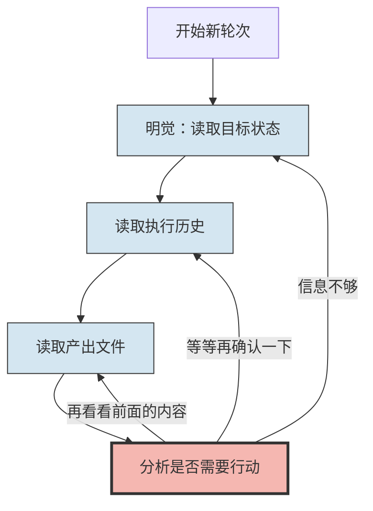
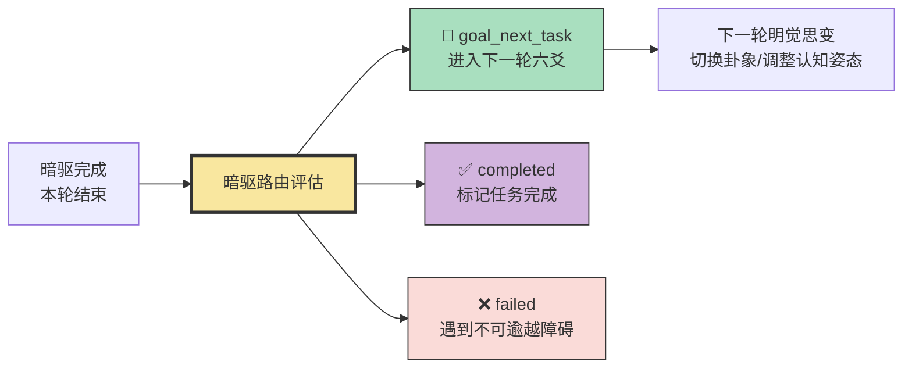

# 系列四·实战篇 (17/20)：从"卡住"到"破局"

> 暗驱的路由决策与明觉的思变之责如何识别并打破自读死循环——当Agent陷入"只读不写"的认知牢笼时，太极架构提供系统的破局机制。

---

## 引言：Agent最常见的"卡住"模式

在构建复杂AI Agent的过程中，最令人沮丧的不是Agent做错了——而是**Agent什么都没做**。

它不停地读文件、读历史、读自己的输出，但就是不产出一行新内容。它像是陷入了一个认知漩涡——"我需要更多信息才能决定做什么"→"读到了更多信息"→"现在我需要读更多信息才能决定做什么"。

这种模式在大多数AI框架中没有专门的应对机制。框架假设Agent要么在"思考"，要么在"执行"。但当Agent的"思考"变成了无限循环的"阅读"，没有框架会主动说：「停，你读太多了，给我写点东西。」

**太极架构（Taiji）是第一个将"自读死循环"的识别与突破设计为架构级硬约束的Agent框架**。

这个设计集中在三个组件中：
1. **暗驱的路由决策 + 明觉的思变之责**——每轮结束后判断"继续/停止/转向"
2. **暗驱的有损压缩机制**——防止历史上下文无限膨胀导致的"信息过载卡住"
3. **禁止连续两轮纯读的硬约束**——下一篇文章（#18）详细展开

本文聚焦**暗驱的路由决策与明觉的思变之责**——这是六爻循环的"刹车和方向盘"，在最容易出现自读循环的时刻介入，强制Agent从"思考模式"切换到"产出模式"。

---

## 第一章：自读死循环的解剖——为什么Agent会"卡住"

### 1.1 自读循环的典型症状



**症状清单**：
1. **连续多轮只有read_file操作，没有write_file/exec/web_search**
2. **每轮的输出都是"分析"和"规划"，不是实际内容**
3. **不断回顾已有的信息，而不是生成新信息**
4. **对"完成"的标准越来越模糊——总是觉得"还需要确认一下"**
5. **执行历史中"阅读→分析→决定继续阅读"的模式重复出现**

### 1.2 为什么传统Agent框架无法解决这个问题

| 框架 | 对自读循环的处理 |
|------|----------------|
| **AutoGPT** | 无。Agent可以无限"思考"直到token耗尽 |
| **LangGraph** | 无。图循环是静态的，没有"跳出循环"的元认知 |
| **CrewAI** | 无。每个角色的任务队列是固定的，Agent不会主动跳出 |
| **OpenClaw** | 无。执行器只负责执行，不负责"是否应该执行" |
| **太极·暗驱路由+明觉思变** | **有**。每轮结束时强制做元判断：下一轮是继续、停止还是转向 |

**核心差距**：传统框架将"循环"视为执行路径的重复，太极将"循环"视为认知评估的时机。在传统框架中，Agent从来不会被问："你确定你做的事有意义吗？"

### 1.3 自读循环的深层原因

自读循环不是Agent"懒"或"笨"——它有深层原因：

```
原因1：信息不足恐惧
"我读得不够多，无法做出好决策" → 继续读 → 发现更多未知 → 更恐惧

原因2：完美主义陷阱
"我要确保第一稿就是高质量的" → 先读十篇参考 → 发现风格不统一 → 再读十篇

原因3：目标模糊导致评估瘫痪
"目标太大/太模糊，不知道从哪里开始" → 读蓝图 → 还是不知道 → 再读一遍蓝图

原因4：前次执行失败导致保守
"上次直接写被批评了，这次先多读读再写" → 读更多 → 仍然不确定 → 继续读
```

这些原因都是**认知性的**——它们不是工具调用失败，而是元认知层面的决策失灵。Agent需要的是"认知教练"，而不是"更好的搜索工具"。

---

## 第二章：暗驱路由与明觉思变——六爻循环的"元认知刹车"

### 2.1 路由决策与思变在六爻循环中的位置

```
完整六爻循环：

明觉(含思变之责) → 织 → 阳 → 阴 → 行动 → 暗驱(含路由决策)
    ↑                                                    |
    └────────────────────────────────────────────────────┘
                      （下一轮从这里开始）

暗驱在每轮末尾做出路由决策（继续/完成/失败），明觉在下一轮初始行使其思变之责（评估进展、选择卦象、细化任务）。两者协作构成循环的"认知轴心"。
```

暗驱完成反思输出后，做出本轮路由决策；下一轮明觉行使其思变之责，检查三件事：

1. **本轮有实际产出吗？**（是否执行了write_file/exec/web_search等"可失败"操作）
2. **目标完成度有进展吗？**（信息熵是否下降？产出是否累积？）
3. **连续纯读了几轮？**（超过阈值触发硬约束）

### 2.2 暗驱的路由决策模型

暗驱的路由决策不是简单的"继续/停止"，而是三种可能：



**继续（goal_next_task）**：任务有进展但未完成。下一轮明觉行使其思变之责，评估当前姿态是否适配，可能切换卦象以改变认知姿态。

**完成（completed）**：目标已达成。标记任务并退出。

**失败（failed）**：当前策略无效，遇到不可逾越的障碍。这不是"放弃"——这是暗驱基于执行日志的客观判断。

### 2.3 明觉的思变如何识别自读循环

明觉的思变识别机制基于**执行历史的结构化分析**：

```
明觉思变检查清单（每个问题输出"是/否"）：
1. 本轮是否有至少1次write_file/exec/web_search操作？[是→正常/否→⚠️]
2. 连续"纯读"轮次是否≥2？[是→🚫触发硬约束/否→正常]
3. 本轮输出的新信息量是否>0？[是→正常/否→⚠️]
4. 目标完成度是否比上一轮有进展？[是→正常/否→⚠️]
5. 如果连续3项检查都是⚠️，强制转向
```

**关键设计点**：明觉的思变不依赖于Agent"自己意识到"需要改变——它基于客观的执行痕迹（tool call记录）做判断，不受Agent自我认知偏差的影响。

---

## 第三章：太极案例——从自读循环到破局的完整过程

### 3.1 场景设置：一个"卡住"的Agent

假设一个Agent正在进行一个复杂任务：**分析五个竞争对手的产品定价策略，输出一份对比报告**。

这是一个中等复杂度的任务——需要读取竞品信息、分析价格差异、输出结构化报告。

**传统Agent的典型崩溃路径**：

```
轮次1：读取"当前任务描述"  →  分析：需要先了解竞品
轮次2：读取"竞品A的定价页面"  →  分析：信息不完整，需要更多
轮次3：读取"竞品B的定价页面"  →  分析：价格结构不同，需要对比
轮次4：读取"竞品C的定价页面"  →  分析：发现汇率问题，需要确认
轮次5：读取"汇率数据"  →  分析：汇率更新了，之前的数据需要重新看
轮次6：重新读取"竞品A的定价页面"  →  分析：现在可以开始写了吗？再读一遍竞品B吧
轮次7：读取"竞品B的定价页面"  →  分析：...
```

**轮次20**：Agent仍然在阅读。它从未输出过一行报告。

### 3.2 太极架构下的暗驱路由+明觉思变干预

现在让同一个Agent运行在太极架构中。**暗驱在每轮结束后做出路由决策，明觉在下一轮行使其思变之责**：

#### 第1轮：明觉(含思变)→织→阳→阴→行动→暗驱(含路由)

**行动记录**：
- read_file("任务描述") ✅
- read_file("竞品A定价页面") ✅
- 没有write_file/exec操作

**思变检查**：
1. 本轮有产出性操作吗？→ **⚠️ 否**
2. 连续纯读轮次？→ **1轮**（正常阈值内）
3. 有新信息吗？→ ✅ 是（读取了竞品A的数据）
4. 目标有进展吗？→ ✅ 是（建立了初始认知）

**暗驱路由决策**：**继续**。第1轮纯读是可接受的——这是"冷启动"阶段，需要先建立信息基础。

**卦象建议**：从坤卦（承载）切换为离卦（明照）——下一轮应该带着"比较框架"去读，而不是漫无目的地读。

#### 第2轮：明觉(含思变)→织→阳→阴→行动→暗驱(含路由)

**行动记录**：
- read_file("竞品B定价页面") ✅
- read_file("竞品C定价页面") ✅
- 没有write_file/exec操作

**思变检查**：
1. 本轮有产出性操作吗？→ **⚠️ 否**
2. 连续纯读轮次？→ **⚠️ 2轮**
3. 有新信息吗？→ ✅ 是（读取了更多数据）
4. 目标有进展吗？→ ⚠️ 存疑（数据读了但未整合）

**暗驱路由决策**：**转向**。连续2轮纯读触发警告。Agent必须改变策略。

**转向指令**："停止读取新数据。基于已读的竞品A/B/C信息，先输出一个初步框架。如果信息不足，在输出框架时标注'待补充'。"

**机制解析**：暗驱的路由决策在这里不是温和地建议"你可以开始写了"——它是**强制转向**。Agent下一轮的第一个操作必须是产出性操作（write_file），不能继续读文件。

#### 第3轮（转向后）：明觉(含思变)→织→阳→阴→行动→暗驱(含路由)

**行动记录**：
- write_file("竞品定价对比报告-初稿.md") ✅（包含竞品A/B/C的价格对比框架）

**思变检查**：
1. 本轮有产出性操作吗？→ ✅ 是（write_file）
2. 连续纯读轮次？→ **已重置为0**（因为本轮有产出）
3. 目标有进展吗？→ ✅ 是（报告初稿已产出）

**暗驱路由决策**：**继续**。瓶颈已突破，回到正常轨道。

#### 第4轮至今：正常产出模式

后续轮次中，Agent遵循"产出→补充阅读→产出→补充阅读"的健康节奏。即使偶尔需要纯读一两轮，明觉思变的"连续纯读"计数器确保不会再次滑入自读循环。

### 3.3 暗驱路由+明觉思变干预的量化效果对比


**量化对比**：

| 维度 | 传统Agent | 太极Agent |
|------|---------|----------|
| 首次产出轮次 | 第20轮（或永不） | 第3轮（转向后强制产出） |
| 纯读轮次占比 | 100%（全部是读） | 40%（2/5轮纯读） |
| 完成总轮次 | >20轮，未完成 | 5轮完成 |
| 思变干预次数 | 0（无此机制） | 1次（第2轮结束时明觉强制转向） |

---

## 第四章：对比分析——太极的暗驱路由+明觉思变 vs 其他框架的"循环控制"

### 4.1 传统框架如何应对"卡住"？

| 框架 | 循环控制机制 | 能否打破自读循环 | 原因 |
|------|------------|----------------|------|
| **AutoGPT** | 无 | ❌ 不能 | Agent自己决定下一步，没有元认知评估 |
| **LangGraph** | 静态图条件边 | ❌ 不能 | 条件判断是预定义的，无法动态识别"读太多"模式 |
| **CrewAI** | 任务队列 | ❌ 不能 | 任务一旦分配必须执行，没有"跳出任务"的机制 |
| **OpenClaw** | 执行器+规划器 | ❌ 不能 | 规划器只规划如何完成目标，不规划"是否应该换方式" |
| **手动提示词** | "请确保完成任务" | ❌ 不能 | 这种提示词对自读循环无效——Agent认为自己正在"完成"（在阅读） |
| **太极·暗驱路由+明觉思变** | 三元决策+硬约束 | ✅ 能 | 基于操作模式的客观检测+强制转向 |

### 4.2 暗驱路由+明觉思变的核心设计优势分解

**优势1：基于操作模式检测，而非自我报告**

传统方法让Agent自己判断"我是否需要换个策略"——但陷入自读循环的Agent没有这种元认知能力。思变不依赖于Agent的自我诊断，而是**客观分析工具调用记录**：

```
读文件 = 1轮纯读
写文件 = 产出
执行命令 = 产出
搜索 = 产出
连续X轮无产出 = 触发转向
```

这是不可欺骗的——Agent无法通过"我告诉自己我思考了很久"来绕过检测。

**优势2：硬约束优先于软建议**

暗驱的路由决策不是建议——当检测到自读循环时，它发出的是**强制指令**。下一轮的明觉必须读取这个强制指令，然后织必须编织一个以"产出"为核心的策略。Agent不能忽略它。

这借鉴了工程中的**fail-fast**哲学——与其让Agent在无效状态中浪费20轮，不如在第2轮就强制转向，即使初稿质量不高，也能在后续轮次中迭代改进。

**优势3：转向不失败**

暗驱的"转向"决策被设计为**中性策略调整**，不是"失败"。明觉下一轮行使思变之责时，不会感到"我做错了"——它只是被引导到一个更有效的策略路径。这避免了Agent因"恐惧失败"而更保守（这正是自读循环的原因之一）。

---

## 第五章：设计哲学——暗驱路由与明觉思变如何实现"有控制的循环"

### 5.1 循环不是问题，无控制的循环才是问题

太极的核心设计原则是：**循环是好的，但它需要被监督**。

DMN（默认模式网络）的持续认知演化和TPN（任务正网络）的持续任务执行是太极的核心优势。但如果循环失去控制——Agent无休止地重复"读→分析→决定继续读"——这个优势就变成了劣势。

思变是**循环的监督者**。暗驱负责路由决策（继续/完成/失败），明觉负责思变决策（评估进展、选择卦象、细化任务）。

### 5.2 "禁止连续两轮纯读"的哲学基础

思变中最重要的硬约束是：**禁止连续两轮纯读**。

这个约束的哲学基础：

1. **信息不产生价值，结构才产生价值**——纯读只是摄入信息，没有结构化就没有价值累积
2. **产出创造锚点**——每一次write_file都是一个"认知锚点"，将模糊的思考固定在可迭代的实体上
3. **强制产出防止认知过载**——当Agent只读不写时，信息在上下文中不断累积但未被整理，最终导致"什么都记得又什么都不清楚"的认知瘫痪

这个硬约束将在下一篇（#18）中详细展开。但其核心思想已经在思变的设计中体现了——**元认知监控不是可选的，它是架构的一部分**。

### 5.3 暗驱与明觉的协作机制

暗驱的路由决策与明觉的思变之责不是孤立工作的。它们的协作是太极打破自读循环的关键：

```
暗驱完成 → 分析执行日志，做出路由决策
                                → 若路由为 goal_next_task
                                → 明觉行使思变之责
                                → 明觉检查当前姿态是否适配
                                → 若不适配，切换卦象/认知姿态
```

暗驱的有损压缩结果提供了明觉思变判断所需的"认知进展"维度——不仅看有没有写文件，还看**认知结构有没有进化**。如果Agent写了东西但只是在重复已有认知，明觉的思变同样可能决定切换姿态。

这是一种双重保险：
- **行为层**：明觉思变检测是否有产出性操作
- **认知层**：暗驱输出检测认知是否有进展

---

## 总结：暗驱路由+明觉思变是太极的"元认知监护者"

| 维度 | 暗驱路由+明觉思变的角色 | 如何打破自读循环 |
|------|-----------|----------------|
| **检测机制** | 基于操作模式（tool call类型分析） | 识别"连续纯读"模式 |
| **干预方式** | 暗驱三元路由 + 明觉思变姿态切换 | 强制转向到产出模式 |
| **认知支持** | 读取暗驱的有损压缩结果 | 确保认知结构也在进化 |
| **硬约束** | 禁止连续两轮纯读 | 第3轮必须产出 |
| **哲学基础** | 循环需要监督 | 元认知监控是架构级组件 |

**核心启示**：

自读循环不是Agent的缺陷——它是没有元认知监督的必然结果。任何系统，如果让它无限制地"思考"，它最终都会陷入对自己思考的思考。

太极架构通过暗驱的路由决策与明觉的思变之责提供了这个缺失的元认知监督。它不是通过更聪明的提示词来解决——它是通过**架构级的决策机制**，由暗驱在每轮结束时做路由判断，由明觉在下一轮初始行使思变之责，强制评估当前姿态并切换认知模式。

这就像在Agent的认知系统中安装了一个**客观的观察者**——它不看Agent在想什么，它只看Agent在做什么。当Agent在20轮中读了19轮文件却没有写出一行内容时，这个观察者会说：

「停。你已经读够了。现在，写。」

这不是建议。这是架构。
