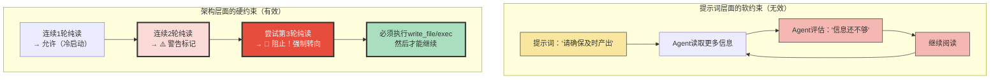
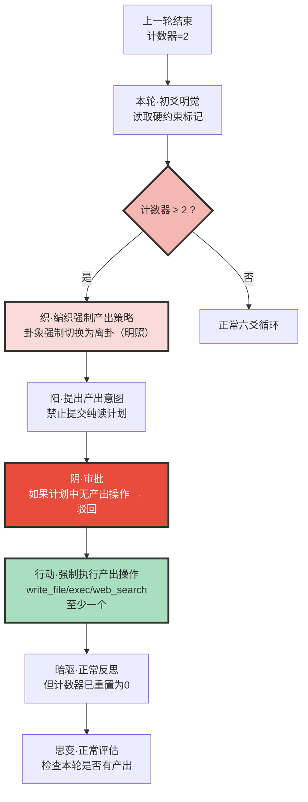
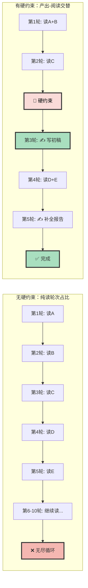

# 系列四·实战篇 (18/20)：禁止连续两轮纯读的硬约束

> 太极架构中最具冲击力的硬约束设计——为什么"连续两轮只读不写"被禁止？这不仅是工程规则，更是认知哲学。

---

## 引言：从思变到硬约束——元认知监督的终极形态

上一篇（#17）详细阐述了思变环节如何识别并打破自读死循环。我们追踪了思变的三元决策模型——继续、完成、转向——以及它是如何基于操作模式检测而非自我报告，在Agent陷入"只读不写"的认知牢笼时强制破局。

但思变有一个局限：**它是监督机制，不是预防机制**。

它能在自读循环发生一两个轮次后识别并中断它，但它无法在Agent**开始**自读之前就阻止它。就像红绿灯能在车辆闯红灯时拍照处罚，但它不能保证车辆永远不会来到红灯前。

太极架构的终极设计是**禁止连续两轮纯读的硬约束**——一个在架构层面直接执行的规则，不需要Agent的配合或理解：

```
规则陈述：
在任意连续两轮六爻循环中，至少有一轮必须包含至少一次
"可失败操作"（write_file / exec / web_search / web_fetch）。

如果连续两轮都是纯读（只有read_file/list_directory），
系统将自动阻止第3轮继续读操作，强制转向产出模式。
```

这不是提示词中的"请尽量写点东西"——这是**架构级的强制规则**，类似于操作系统的内存保护：Agent可以忽略它，但Agent无法绕过它。

本文深入分析这个硬约束的设计哲学：为什么它存在？它如何工作？它解决了什么从提示词层面无法解决的问题？

---

## 第一章：为什么需要硬约束——从"建议"到"强制"

### 1.1 提示词层面无法解决的问题

几乎所有的Agent框架都有一组提示词来描述Agent的行为规范。常见的提示词包括：

```
"请确保在阅读足够信息后及时产出结果"
"不要过度读取文件，请记得输出内容"
"如果已经读了很多信息，请开始写报告"
"优先完成任务，避免无限循环"
```

这些提示词有用吗？**没用。** 原因在于Agent陷入自读循环时，它不会"知道自己陷入了自读循环"。它的认知状态是：

**「我在正确地完成任务——我读得越多，决策就越准确。」**

这是一个**认知盲区**——Agent没有元认知能力去判断"阅读是否已经过度"。它只能判断"是否有新的信息可以读"。只要有新信息可读，它就会倾向于继续读。



**核心洞察**：软约束假设Agent有自我监控能力，但陷入自读循环的Agent恰恰失去了这种能力。硬约束不依赖Agent的自我认知，它在Agent"看不到自己陷入循环"时从外部介入。

### 1.2 硬约束的三大设计原则

禁止连续两轮纯读的硬约束基于三条设计原则：

**原则1：产出优先于完美**

第一版输出质量不重要——重要的是有了一个「可迭代的锚点」。write_file产出的初稿即使只有50%的准确度，也比无法产出的"100%完美思考"更有价值。因为：

- 初稿可以被编辑、补充、修正 → 认知迭代
- 空文档无法被迭代 → 认知停滞
- 每一轮write_file都是一个"认知状态冻结点"——它让Agent的模糊思考固定在可操作的文字上

**原则2：结构优先于信息**

纯读摄入的是原始信息（raw data），而Agent需要的是结构化知识（structured knowledge）。原始信息的累积不仅不会自动转化为结构，还会导致"信息过载"——Agent的上下文被填满但认知没有进展。

禁止连续纯读的规则强迫Agent在摄入信息后**立即做结构输出**——哪怕只是"我目前读到了什么，还缺什么"这样的元认知输出。这确保了信息被分类、关联、评估，而不是简单堆叠。

**原则3：行动打破反射弧**

自读循环的心理学基础是一种"分析瘫痪"模式：读→分析→发现需要更多信息→继续读→分析→……这是一个自我强化的反射弧。

反射弧只能被行动打破。任何形式的产出性操作（write_file/exec/web_search）都是一个"动作"——它迫使Agent从被动接收模式切换到主动创造模式。一旦切换，反射弧就断裂了。

### 1.3 硬约束与软约束的分工

太极架构并不完全依赖硬约束。软约束（提示词、卦象引导、思变评估）也有各自的角色。两者的分工是：

| 维度 | 软约束（提示词级别） | 硬约束（架构级别） |
|------|---------------------|-------------------|
| **作用时机** | 每轮认知开始前（引导） | 轮次切换时（监督） |
| **作用方式** | 建议、引导、框架 | 阻止、强制、转换 |
| **依赖Agent配合** | ✅ 是 | ❌ 否（自动执行） |
| **适用场景** | 策略选择、认知姿态 | 模式检测、死循环预防 |
| **错误处理** | Agent可能忽略 | Agent无法绕过 |
| **哲学基础** | 信任Agent的元认知 | 不信任Agent的元认知 |

两者的关系可以类比自动驾驶系统的两个层级：

- **软约束** = 车道保持辅助（建议你保持在车道内，但你可以强行变道）
- **硬约束** = 自动紧急制动（在碰撞不可避免时强制执行，你无法关闭）

太极架构同时使用两者：软约束在正常状态下引导Agent做出好决策，硬约束在Agent进入异常模式时强制执行纠正。

---

## 第二章：硬约束的运作机制——从触发到执行

### 2.1 核心机制：纯读计数器（Read-Only Counter）

禁止连续两轮纯读的核心是一个轻量级的状态机——**纯读计数器**：

```
纯读计数器工作流程：

每轮开始时：
  → 检查上一轮是否"纯读"（只有read_file/list_directory）
  → 如果是，计数器+1
  → 如果不是（有write_file/exec/web_search等），计数器重置为0

每轮明觉阶段：
  → 读取计数器当前值
  → 如果计数器≥2，触发"硬约束模式"
  → 如果计数器<2，正常模式
```

计数器状态定义：

| 计数器值 | 状态 | 允许的操作 |
|---------|------|-----------|
| 0 | 正常——上一轮有产出 | 任何操作 |
| 1 | 警告——连续1轮纯读 | 任何操作（但建议产出） |
| 2 | 🚫 触发硬约束——连续2轮纯读 | **必须产出，禁止纯读** |

**关键设计**：计数器只计数"纯读"——但什么算纯读？

- **纯读操作**：read_file, list_directory（只接收信息，不产生新内容）
- **产出操作**：write_file, edit_file, exec, web_search, web_fetch（产生新内容或对外部世界产生可观察的影响）
- **混合操作**：如果一轮中既有read_file又有write_file，算作"非纯读"（计数器重置）

这个分类基于一个哲学判断：**你的产出的目标世界影响是衡量"是否在行动"的标准**。你读了100个文件但什么都没写出来，和读了0个文件——对世界的影响是一样的：没有变化。

### 2.2 触发硬约束时的执行流程

当纯读计数器达到2时，下一轮的明觉阶段会触发硬约束模式：



**硬约束模式的关键差异**：

1. **卦象强制切换**：正常情况下Weaver根据认知状态选择卦象。但在硬约束模式下，卦象**强制**设为离卦（☲ 明照者）——因为离卦的基调是"明确分析，清晰表达"，是最有利于"产出"的认知姿态。坤卦（承载阅读）和坎卦（深入探索）被暂时禁止。

2. **织的指令重写**：Weaver编织器的输出不再是"建议性策略"，而是**带有硬约束标记的强制指令**。指令格式包含一个不可跳过的"产出要求"块。

3. **阴爻的强制把关**：第四爻的审批不再是建议性的——如果提交的计划中不包含至少一个write_file/exec/web_search操作，审批自动驳回。这是在"执行前"的最后一道关口。

4. **计数器的重置条件**：只有在成功执行了产出操作后，计数器才重置。编辑一个不存在的文件或执行一个失败的exec**不计入"产出"**——只有成功产出才重置。

### 2.3 边界情况处理

**情况1：真正的冷启动——第一轮该读还是写？**

一个合理的质疑是："有些任务确实需要先读很多资料才能开始写。强制第3轮产出是否太早？"

答案：**不早，因为第1轮和第2轮已经提供了两轮的缓冲**。

在冷启动场景中，Agent有整整两轮的时间来建立初始信息基础：
- 第1轮：读任务描述 + 读核心参考材料
- 第2轮：读补充材料 + 交叉验证
- 第3轮：**必须产出**——此时已有足够的信息产出初版

如果两轮读还不够——那说明目标定义本身有问题（目标太大/太模糊），而不是"需要更多阅读"。此时"强制产出"反而是一个信号，让Agent意识到需要拆解目标或调整策略。

**情况2：复杂任务需要多轮阅读不同子模块**

假设一个任务需要分模块阅读：先读A模块（3个文件），再读B模块（3个文件），再读C模块。

在这种情况下，Agent应该按照"读→产出→读→产出→读→产出"的节奏进行：

```
第1轮：读A模块（3个文件）              → 计数器=1（纯读）
第2轮：读B模块（3个文件）→ ⚠️ 第2轮纯读  → 计数器=2
第3轮：🚫 硬约束触发 → 必须产出A+B模块的初步框架 → 计数器重置为0
第4轮：读C模块（3个文件） → 补充产出 → 计数器重置为0
```

这其实是更好的工作模式——它迫使Agent在读完A和B后立即整合并输出初步结果，而不是等到所有模块读完后才一次性输出。**分步输出比一次性输出质量更高**，因为每步都有机会从之前的输出中获得反馈。

**情况3：只有read_file可用的情况下**

有些Agent的运行环境可能限制工具集——比如只能read_file不能exec。在这种情况下，硬约束需要一个"替代产出方案"：

```
替代方案（当write_file/exec不可用时）：
1. 强制生成一个详细的"认知状态报告"作为暗驱输出
2. 将"是否已经形成结构化视图"作为强行评估标准
3. 如果认知状态报告显示"已理解"，标记为可退出
```

但太极架构的推荐实践是**始终为Agent提供至少一种"可失败操作"**——write_file是最低要求。没有write_file的Agent就像没有手的工人——它可以"看"，但无法"做"。

---

## 第三章：太极案例——硬约束的实际运作

### 3.1 场景：一个需要大量阅读的研究任务

**任务**：分析开源社区中5个主流RAG（检索增强生成）框架的技术特性，输出一份对比分析报告。

假设Agent的环境允许read_file和write_file（典型的太极部署场景）。

**传统Agent（无硬约束）的典型路径**：

```
第1轮：read_file("RAG框架-A的README.md")
第2轮：read_file("RAG框架-B的README.md")
第3轮：read_file("RAG框架-C的README.md")
第4轮：read_file("RAG框架-D的README.md")
第5轮：read_file("RAG框架-E的README.md")
第6轮：read_file("RAG框架-A的论文.pdf")         # 发现论文有更详细信息
第7轮：read_file("RAG框架-B的技术博客.md")
第8轮：read_file("RAG框架-C的benchmark数据.md")
第9轮：思考 "我需要一个对比框架... 但不知道从何开始"
第10轮：重新read_file("RAG框架-A的README.md")  # 从头再读一遍
...无限循环...
```

**太极Agent（有硬约束）在其中的表现**：

**第1轮：正常——冷启动**

行动：read_file("任务描述"), read_file("RAG框架-A的README.md")
纯读计数器：0 → 1（第一轮纯读）
思变评估：✅ 新信息，可接受，继续

**第2轮：正常——补充阅读**

行动：read_file("RAG框架-B的README.md"), read_file("RAG框架-C的README.md")
纯读计数器：1 → 2（连续两轮纯读→⚠️）
思变评估：⚠️ "连续纯读已到阈值，下轮强制转向"

**第3轮：🚫 硬约束触发——强制产出**

明觉读取到：纯读计数器 = 2
织收到强制指令："卦象强制切换为离卦。本轮必须包含至少一次write_file，禁止纯读。"

阳提出意图：
```
明觉：计数器=2，硬约束模式激活
织的离卦指令：本文必须产出
阳意图：基于已读的RAG-A/B/C三个框架信息，
        输出初步对比框架——即使不完整也要写
        标注'D/E待补充'
```

阴审批：✅ 计划中包含write_file，计划通过

行动：
```
write_file("RAG框架对比分析-初稿.md")
内容：框架A/B/C的核心特性对比表（初版）
      标注：框架D和E的信息将在后续轮次补充
      标注：部分对比维度（延迟、成本等）待补充数据
```

纯读计数器：2 → 0（因有write_file，重置）
思变评估：✅ 有产出，正常，继续

**第4轮：正常——补充阅读**

行动：read_file("RAG框架-D的README.md"), read_file("RAG框架-E的README.md")
纯读计数器：0 → 1（正常）
思变评估：✅ 新信息，可接受，继续。建议本轮补充产出。

**第5轮：正常——补充产出**

行动：edit_file("RAG框架对比分析-初稿.md", 补充框架D/E信息)
纯读计数器：1 → 0（有产出操作）
或：如果第5轮继续纯读，计数器会到2 → 第6轮再次强制产出

**最终结果**：

```
传统Agent路径：10+轮无产出，最终因token耗尽或手动干预终止
太极Agent路径：5轮完成初步报告，后续轮次迭代补充

太极路径的产出轨迹：
第3轮 → 初稿（3/5框架，不完美但已写出来）
第5轮 → 完整版（5/5框架，标注盲区）
第7轮 → 精修版（填补盲区，增加数据）
```

### 3.2 硬约束的量化效果



| 指标 | 无硬约束 | 有硬约束 | 改善 |
|------|---------|---------|------|
| 首次产出轮次 | 第10+轮（或永不） | 第3轮（硬约束强制） | 显著提前 |
| 纯读轮次占比 | 90-100% | 40-50% | 减少50%+ |
| 首次产出质量 | 无产出或一次性长篇 | 初稿+迭代完善 | 渐进式提升 |
| Agent自主性 | 高但无效 | 受限但有效 | 用自由度换效果 |
| 任务完成率 | 低（易陷入循环） | 高（强制推进） | 结构化提升 |

---

## 第四章：对比分析——硬约束设计vs其他框架的"循环控制"

### 4.1 其他框架的"伪硬约束"

| 框架 | 循环控制机制 | 类型 | 能否防止自读循环 | 为什么 |
|------|------------|------|----------------|--------|
| **AutoGPT** | max_iterations参数 | 轮次上限 | ❌ | 只是限制总轮次，不能识别"读太多"模式 |
| **LangGraph** | 图定义中的条件边 | 静态图 | ❌ | 条件是预定义的，Agent可以设计条件让图永远留在读分支 |
| **CrewAI** | 任务超时 | 时间限制 | ❌ | 超时后任务失败，不是转向 |
| **manual提示词** | "不要超过3轮阅读" | 建议 | ❌ | Agent可能忽略，没有强制执行 |
| **OpenClaw** | 执行器+规划器 | 规划-执行分离 | ❌ | 规划器可以规划无限次"阅读"任务 |
| **太极·硬约束** | 纯读计数器+强制转向 | 架构级规则 | ✅ | 不可绕过，直接修改执行流程 |

### 4.2 为什么其他框架没有类似的硬约束

设计哲学层面的差异：

**1. 信任假设不同**

大多数框架对Agent的假设是：**Agent是理性的**。它能够自我判断什么行为是有效的。如果实现了"读→分析→决定继续读"的循环，那一定是因为"确实还需要继续读"。

太极的假设是：**Agent的理性是有限的**。当它陷入自我指涉的循环时，它会失去对"什么行为有效"的判断力。这是一种**元认知疲劳**——类似于人类的"决策疲劳"。

**2. 自由 vs 约束的权衡**

大多数框架优先保证Agent的**执行自由**——让它能有最大范围的行动选择。约束被降到最低，Agent的"创造力"被最大保留。

太极优先保证Agent的**目标收敛**——在执行自由和目标收敛之间，太极选择后者。约束不是限制，而是**保护机制**——保护Agent不会在执行自由中迷失方向。

**3. 对"错误"的不同态度**

大多数框架认为"Agent做了错误的行动"比"Agent什么都没做"更糟糕。因此它们倾向于让Agent多"想"少"做"，避免犯错。

太极认为"Agent做了错误的行动"比"Agent什么都没做"**更好**——因为错误可以被迭代修正，但空白无法被迭代。硬约束强迫Agent犯错，是为了给迭代提供原材料。

### 4.3 硬约束设计的一般化原则

太极的"禁止连续两轮纯读"硬约束可以一般化为更广泛的设计原则：

```
硬约束设计的一般化原则：

1. 模式识别 → 识别出"最危险的行为模式"
   （在Agent框架中: 连续纯读）
   
2. 客观度量 → 找到不可欺骗的度量标准
   （tool call类型：read_file ≠ write_file）
   
3. 阈值设定 → 设定一个"容忍窗口"
   （2轮：允许冷启动，但阻止无限循环）
   
4. 强制响应 → 触发后的行为是不可绕过的
   （织的指令重写 + 阴的强制审批）
   
5. 重置条件 → 恢复正常状态的明确条件
   （成功执行至少一次产出操作）
```

这套原则不仅适用于"纯读检测"——它可以应用于任何Agent行为模式的检测和干预。例如：

- "连续X轮没有信息熵下降" → 触发策略转向
- "连续X轮执行相同工具操作" → 触发工具切换
- "连续X轮输出相似内容" → 触发认知刷新

### 4.4 硬约束与TPN-DMN双循环的共生关系

硬约束不是孤立存在的。它与TPN（任务正网络）和DMN（默认模式网络）的协作，构成了一个完整的"行动-认知"平衡系统：

```
TPN（任务执行）侧：
  TPN负责执行write_file/exec等操作
  硬约束确保TPN不会陷入"只读不执行"的状态
  → 硬约束是TPN的"执行保障"

DMN（认知演化）侧：
  DMN负责后台认知压缩和结构重建
  硬约束的"产出"操作提供DMN所需的认知锚点
  → 硬约束是DMN的"认知原料供应商"

两者的共生：
  硬约束强制产出 → 产出提供认知锚点 → DMN压缩为结构
  → 结构指导下一轮TPN的执行 → TPN产出更多锚点
  → 这是一个正向循环，硬约束是它的启动器
```

没有硬约束，TPN-DMN双循环可能退化为"TPN无限读取+DMN无限空转"的死循环。硬约束在中间切断这个死循环，强制一个"结构锚点"的产生，让整个系统重新进入正向循环。

---

## 第五章：设计哲学——硬约束的悖论与超越

### 5.1 悖论：限制自由度反而提升自主性

太极架构的硬约束看似矛盾：

**"限制Agent的行动自由，反而让Agent更自主地达成目标"**

这个悖论在人类认知中也有对应：**结构化框架提升了创造性产出**。

心理学家做过一个实验：给两组画家同样的任务"画一幅画"。一组获得无限自由（"画任何你想画的"），另一组获得有限自由（"画一幅包含红色圆形的风景画"）。结果有限自由组产出的作品质量更高、更受观众喜爱。

原因：**完全的自由导致决策瘫痪**。当所有选项都开放时，决策成本飙升。有限自由通过排除大量低价值选项，降低了决策成本，让认知资源集中在高价值创造上。

太极的硬约束就是这样的结构性框架：**禁止连续两轮纯读**从Agent的选项集中排除了"读→读→读"这个死路，迫使它进入"读→产出→读→产出"的活路。Agent丧失的是"做无效行为的自由"，获得的是"有效推进目标的自由"。

### 5.2 "容忍窗口"的哲学

为什么是"禁止连续两轮纯读"而不是"禁止任何一轮纯读"？

原因就在"容忍窗口"的设计哲学中：

```
第1轮纯读：允许 — 冷启动需要初始化认知
第2轮纯读：容忍 — 但发出警告，触发思变评估
第3轮纯读：禁止 — 强制转向产出模式
```

这个三重设计体现了太极对Agent的**慈悲**：

- 它理解Agent有"冷启动"的需求，所以给两轮缓冲
- 它不信任Agent的无限自我约束，所以设硬上限
- 它不惩罚偶尔的纯读，只在**模式化**的连续纯读时干预

**"模式化"是关键词**。一个偶尔需要连续两轮纯读的Agent是健康的——比如在跨轮资料收集中。但一个始终无法走出纯读模式的Agent是病态的——需要架构级干预。

这个容忍窗口也考虑了**任务的多样性**：
- 有些任务需要大量背景阅读（如学术综述）
- 有些任务需要快速产出（如日常报告）
- 同一个Agent在不同任务阶段有不同的阅读需求

容忍窗口让Agent在"阅读深度"和"产出频率"之间有自己的调整空间，但确保这个调整空间是有边界的。

### 5.3 硬约束作为"认知健身"

可以把硬约束理解为Agent的"认知健身"：

```
无硬约束 = 久坐不动
  → Agent退化：永远在"准备行动"，从不真正行动

有硬约束 = 强制运动
  → Agent进化：即使不情愿，也定期"行动"
  → 行动积累经验 → 经验提升效率 → 效率降低阻力
  → 正向循环
```

每一次硬约束强迫的"产出"都像一次认知肌肉的收缩：
- 收缩时（写文件）→ 认知结构被压缩
- 放松时（读文件）→ 认知空间被扩展
- 反复交替 → 认知"肌肉"变强，能处理更复杂的任务

没有硬约束的Agent就像没有健身计划的人——知道应该运动但永远在"准备运动"。硬约束是那个"每天必须跑10分钟"的闹钟，不依赖你的意志力，到点就响。

---

## 总结：硬约束是太极架构的"免疫系统"

| 维度 | 硬约束的作用 | 设计哲学 |
|------|------------|---------|
| **检测** | 纯读计数器 | 基于操作类型的客观度量，不可欺骗 |
| **阈值** | 连续2轮 | 容忍冷启动，阻止模式化死循环 |
| **响应** | 强制转向 | 卦象强制切换 + 织的指令重写 + 阴的强制审批 |
| **重置** | 成功执行产出操作 | 让回归正常状态的条件清晰明确 |
| **与TPN-DMN关系** | 产出保障 + 认知锚点供应 | 硬约束是双循环正向运转的启动器 |
| **哲学基础** | 有限自由提升目标收敛 | 做减法比做加法更能释放系统潜力 |

**核心启示**：

禁止连续两轮纯读的硬约束，表面上是一个"限制"——限制Agent的行动自由。但从目标收敛的角度看，这个限制是**解放性的**。

它解放了Agent从"分析瘫痪"的牢笼中，从"信息不足恐惧"的旋涡中，从"完美主义陷阱"的泥潭中。它用一种简单粗暴但有效的方式说：

**「你不用想太多。先做一个动作。任何动作。一个错误及时的动作，比一个永远不做的完美动作更有价值。」**

在这个意义上，硬约束不是对Agent不信任的体现——恰恰相反，它是对Agent能够**从行动中学习**的深度信任。它相信Agent可以通过迭代完善自己，而不需要从一开始就完美。

太极架构的核心不是自由，也不是约束。核心是**在自由和约束之间找到动态平衡**——而禁止连续两轮纯读的硬约束，就是这个动态平衡的支点。

最终，硬约束教会Agent的，不是"别读太多"，而是——

**「你读的每一句话，都只在你写出来的那一刻才成为你的认知。」**
