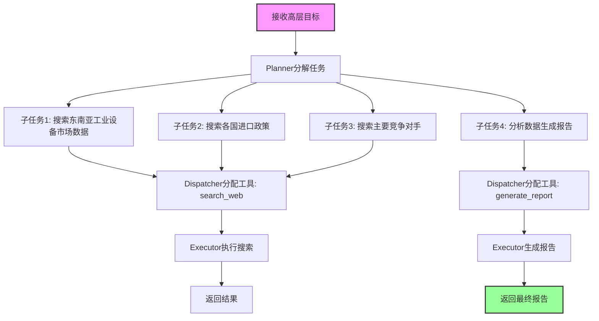
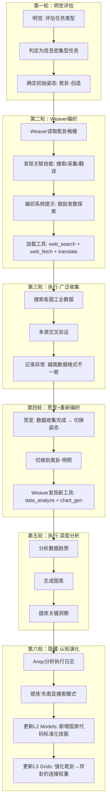
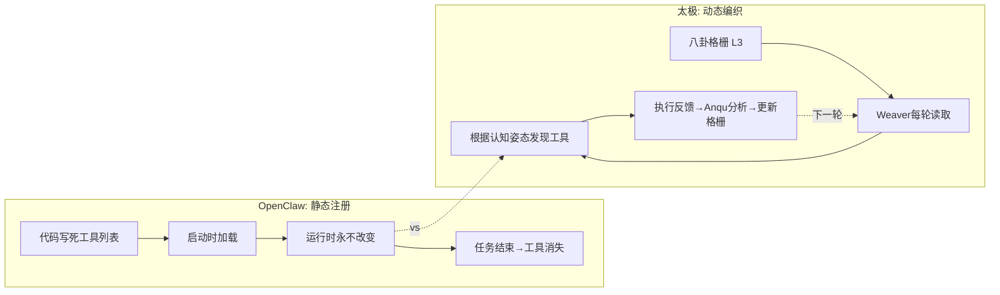
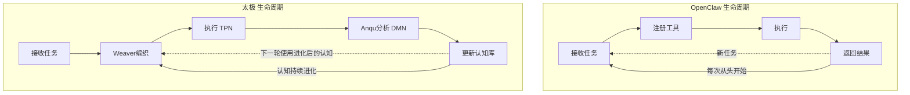

# 系列二·对比篇 (6/10)：太极 vs OpenClaw — 瑞士军刀 vs 会学习的工匠

> **核心论点**：OpenClaw 是一把精心打磨的瑞士军刀——工具齐全、设计精良，但不会成长。太极是一个会学习的工匠——手中的工具会随着经验积累而进化，每次接受新任务时都会重新选择最适合的工具组合。

---

## 引言：两套开源 Agent 框架的哲学分野

在 AI Agent 架构的开源生态中，OpenClaw 是一个被低估的存在。它没有 AutoGPT 那样的社区知名度，也没有 LangGraph 那样的大厂背书，但它的设计理念——"以工具为中心的任务分解"——代表了一种清晰的工程选择。

那么，太极和 OpenClaw 有什么可比性？

从表面看，两者都非常强调**工具的组织和发现**。OpenClaw 有一个精心设计的工具注册和编排系统；太极的 Weaver 每轮从八卦格栅动态加载工具。但本质的区别在于：

> **OpenClaw 是一把瑞士军刀：你打开它，看到的是固定的工具组合——刀、剪刀、开瓶器，每样都在固定位置。**
>
> **太极是一个会学习的工匠：他走进工坊，根据今天要做的活计，从满墙的工具中挑选最适合的组合，并且每次做完活都会琢磨"下次能不能做得更好"。**

---

## 第一章：OpenClaw 架构速览——工具中心的瑞士军刀

### 1.1 设计哲学

OpenClaw（开源项目：https://github.com/openclaw/openclaw）的核心设计理念可以用一句话概括：**"把工具组织好，Agent 就能把事情做好。"**

它认为 AI Agent 的关键挑战是工具使用（Tool Use），因此把大量设计精力投入在：
- **工具注册与发现**：工具通过装饰器或配置文件注册，Agent 在执行时查找匹配的工具
- **任务分解与分配**：复杂任务被拆解成子任务，每个子任务分配最合适的工具
- **上下文管理**：跨步骤的上下文传递，避免信息丢失

### 1.2 核心架构

OpenClaw 的运行时架构可以简化为以下三层：

```
┌─────────────────────────────────────┐
│         任务规划层 (Planner)         │
│  - 接收高层目标                     │
│  - 分解为子任务序列                  │
│  - 生成执行计划                      │
├─────────────────────────────────────┤
│         工具调度层 (Dispatcher)      │
│  - 维护工具注册表                    │
│  - 将子任务映射到工具                 │
│  - 管理工具调用顺序                  │
├─────────────────────────────────────┤
│         执行层 (Executor)            │
│  - 调用具体工具                      │
│  - 处理工具返回结果                  │
│  - 传递上下文到下一步                │
└─────────────────────────────────────┘
```

### 1.3 工具注册机制

OpenClaw 的工具注册通常通过装饰器完成：

```python
# OpenClaw 风格的工具注册
@claw.register("search_web")
def search_web(query: str) -> str:
    """搜索互联网"""
    return perform_search(query)

@claw.register("write_file")
def write_file(path: str, content: str) -> bool:
    """写入文件"""
    return save_content(path, content)
```

工具注册后在运行时静态存在——Agent 启动时知道有哪些工具，执行过程中工具集不变。

### 1.4 关键局限

OpenClaw 的核心局限在于**静态性**：
1. **工具集固定**：启动时注册的工具列表贯穿整个 Agent 生命周期，不会根据任务阶段动态调整
2. **无学习能力**：每次执行都是独立事件，不会从过去的成功/失败中提取模式
3. **认知策略单一**：任务分解的方式固定，不会根据任务性质切换思维模式

---

## 第二章：太极的对应设计——动态编织的会学习的工匠

太极在工具和认知层面的设计，恰恰是针对 OpenClaw 静态性的解药。

### 2.1 动态工具发现 vs 静态工具注册

在太极中，工具不是"注册"进去的——它们是 Weaver 每轮从**L3 八卦格栅**中动态发现的。

```python
# 太极风格的动态工具发现（伪代码）
class Weaver:
    def weave_tools(self, current_gua: str, lifecycle: str) -> List[Tool]:
        """
        根据当前八卦姿态和生命周期阶段，动态发现工具。
        不是"这些是你的工具"——而是"根据当前认知状态，这些工具最合适"
        """
        # 1. 读取 L3 格栅，获取当前卦象的连接权重
        grid = self.load_grid(current_gua)
        
        # 2. 根据权重大小，发现关联的技能和工具
        active_skills = grid.get_connected_skills(lifecycle)
        
        # 3. 只加载当前姿态最优的工具组合
        optimal_tools = []
        for skill in active_skills:
            tool = self.skill_to_tool(skill)
            optimal_tools.append(tool)
        
        return optimal_tools
```

### 2.2 认知姿态切换 vs 固定任务分解

OpenClaw 的任务分解策略是固定的，而太极通过**八卦切换**实现认知策略的动态调整：

| 生命周期阶段 | 对应卦象 | 工具偏好 | 认知策略 |
|-------------|---------|---------|---------|
| 生（探索） | 乾卦（创造） | 搜索、挖掘、发现类工具 | 发散式思维，广泛收集 |
| 长（构建） | 兑卦（交流） | 沟通、协作、分享类工具 | 交互式思维，整合信息 |
| 育（执行） | 离卦（明照） | 分析、推理、生成类工具 | 聚焦式思维，深度处理 |
| 化（反思） | 坤卦（承载） | 记录、归档、整理类工具 | 内省式思维，沉淀经验 |
| 收（评估） | 艮卦（审视） | 验证、测试、审查类工具 | 评判式思维，质量把控 |
| 藏（沉淀） | 坎卦（破局） | 重构、优化、精简类工具 | 破局式思维，突破瓶颈 |
| 安（稳定） | 震卦（启动） | 部署、发布、监控类工具 | 行动式思维，稳定输出 |
| 复（再生） | 巽卦（渗透） | 扩展、接入、适配类工具 | 渗透式思维，拓展边界 |

### 2.3 自我演化 vs 无学习

这是太极与 OpenClaw 最本质的差异：**太极能成长，OpenClaw 不能。**

```
OpenClaw 的执行模型:
  启动 → 注册工具 → 接收任务 → 执行 → 结束
  (每次执行都是独立的，不产生认知积累)

太极的执行模型:
  启动 → 加载认知库 → 接收任务 → Weaver编织工具 → 执行
       → Anqu分析日志 → 更新认知库 → 下一轮任务使用更新后的认知
  (执行与学习并行，认知不断演化)
```

---

## 第三章：具体架构案例对比——"跨国市场调研"任务

### 3.1 案例设定

假设 Agent 需要完成一个复杂任务：**"为一家中国工业设备制造商调研东南亚市场机会，输出一份包含市场趋势、竞争格局、政策环境的综合报告。"**

这个任务包含多个阶段：信息收集、数据分析、报告撰写、质量审查。

### 3.2 OpenClaw 的执行路径



**OpenClaw 的问题：**
1. 所有子任务同时使用 `search_web` 工具，但搜索市场数据、搜索政策、搜索竞争对手需要不同的搜索策略和关键词风格
2. 前期搜索工具产生大量中间结果，可能超出上下文窗口
3. 没有反思环节——如果第一次搜索质量低，不会调整策略重搜
4. 报告生成阶段使用固定模板，不会根据收集到的数据类型动态调整结构

### 3.3 太极的执行路径



**太极的优势：**
1. **认知姿态自适应切换**：从「乾卦·创造」（广泛探索）切换到「离卦·明照」（聚焦分析），工具集和思维模式同步调整
2. **跨轮认知积累**：在第一轮搜索中发现"越南数据格式不一致"的异常，在后续分析轮次中自动处理
3. **后台学习**：Anqu 在任务执行的同时分析日志，提炼出"国家代码标准化"技能，下次类似任务直接可用

---

## 第四章：Mermaid 架构对比图

### 4.1 静态 vs 动态工具发现



### 4.2 无学习 vs 自我演化



---

## 第五章：深度差异分析

### 5.1 知识表示维度

| 维度 | OpenClaw | 太极 |
|------|---------|------|
| 工具知识 | 代码中的注册表 | L1-L5 层级化认知库 |
| 策略知识 | Planner 中的固定逻辑 | L3 八卦格栅的动态连接 |
| 经验知识 | 无 | Anqu 提炼的模式存储在 L2/L4 |
| 自我认知 | 无 | L5 层级，随经验成长的自我描述 |

### 5.2 错误恢复能力

当一个搜索工具返回空结果时：

- **OpenClaw**：返回"未找到结果"给上层，Planner 可以重新规划，但不会调整搜索策略本身
- **太极**：Anqu 会记录这次失败的搜索模式（关键词选择不当、数据源过时等），下次同一类型的搜索，Weaver 会加载不同的工具组合，或注入不同的搜索策略到系统提示中

### 5.3 扩展性

- **OpenClaw 想增加一种新能力**：需要写代码注册新工具，重新部署
- **太极想增加一种新能力**：可以在 L1 技能库中添加一条记录，或者在 L3 格栅中建立新的八卦连接，无需改代码。Anqu 甚至能在运行时"自学"新技能

---

## 第六章：适合场景总结

| 场景 | 推荐框架 | 原因 |
|------|---------|------|
| 短期、一次性任务 | OpenClaw | 瑞士军刀即开即用，无需学习成本 |
| 工具调用密集的流水线 | OpenClaw | 固定工具集更稳定，调试简单 |
| 长期、持续性任务 | 太极 | 能在任务生命周期中自适应，越用越准 |
| 需要认知灵活性的复杂任务 | 太极 | 八卦姿态切换提供了多模式思维能力 |
| 研究性/实验性项目 | 太极 | 自我演化能力让系统能"成长" |
| 对可解释性有要求 | OpenClaw | 执行路径更线性，容易跟踪 |

---

## 结论：你选瑞士军刀，还是选会学习的工匠？

OpenClaw 和太极代表了两种不同的设计哲学选择。

**OpenClaw** 说：**"我把工具给你整理好，你用它们把事做完。"** 这是工程师思维——工具第一，效率至上。对于明确、短期的任务，OpenClaw 无可挑剔。

**太极** 说：**"我不只给你工具，我帮你成长。每次执行都是一次学习，每次学习都让你下次执行更聪明。"** 这是教育者思维——认知第一，成长至上。对于复杂、长期、需要认知灵活性的任务，太极有天然优势。

如果你是做"一次性的数据爬取"，OpenClaw 足够了。
但如果你想让 Agent **在未来遇到类似问题时能做得更好**——你需要一个会学习的工匠，而不是一把瑞士军刀。

---

**相关文章**：[系列一：基础篇 - 太极循环不只是工作流] | [对比篇：太极 vs Hermes Agent]

*下一篇预告：太极 vs Hermes Agent — 从过去学习 vs 从虚空编织*
