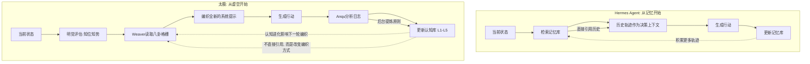
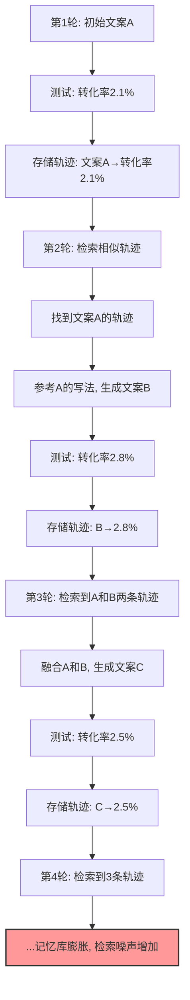
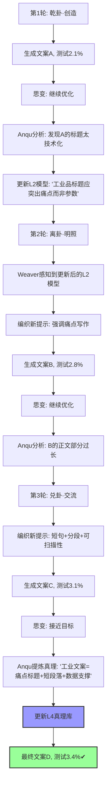
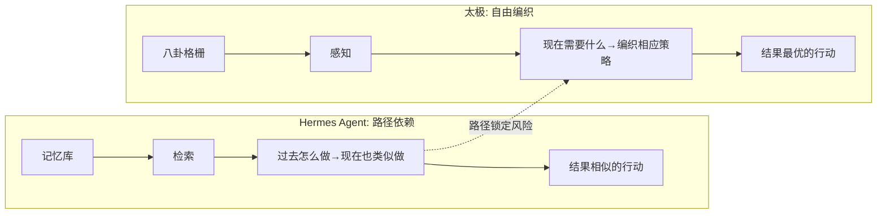

# 系列二·对比篇 (7/10)：太极 vs Hermes Agent — 从过去学习 vs 从虚空编织

> **核心论点**：Hermes Agent 从"过去"学习——它依赖历史轨迹来指导当前决策；太极从"虚空"编织——它每轮清空认知预设，根据当前势态重新构建认知策略。这不仅是技术差异，而是两种截然不同的认知哲学：记忆驱动 vs 空性驱动。

---

## 引言：两种"学习"的本质差异

在 AI Agent 领域，"学习"这个词被用得很滥。有人用"学习"指代 prompt 工程——写更好的提示词；有人用"学习"指代微调——更新模型权重；有人用"学习"指代多轮对话中的上下文积累。

Hermes Agent 和太极都声称自己能"学习"，但它们的"学习"本质完全不同。

> **Hermes Agent 的学习是"从过去学习"**：它记录执行历史，将历史轨迹存储为"记忆"，然后在新任务中检索相关记忆作为参考。
>
> **太极的学习是"从虚空编织"**：它不依赖历史轨迹，而是每轮根据当前目标的完整评估和八卦格栅的动态状态，从"空"中重新构建认知策略。它的学习发生在后台——Anqu 分析日志后更新认知库，而非直接在决策中引用历史。

这个区别至关重要：一个是**显式记忆驱动的回溯式学习**，一个是**隐式认知进化的前瞻式编织**。

---

## 第一章：Hermes Agent 架构速览——从痕迹中学习

### 1.1 设计哲学

Hermes Agent（源自相关研究论文 "Hermes: A Memory-Driven Agent for Complex Tasks"）的核心理念是：**"如果过去有类似场景，可以参考过去的做法。"**

它的关键创新在于**记忆检索系统**：
- 每次任务执行后，将状态-行动-结果序列存储为"轨迹记忆"
- 新任务到达时，根据当前状态检索最相似的过去轨迹
- 将检索到的轨迹作为上下文注入 Agent 的决策过程

### 1.2 核心架构

```
┌──────────────────────────────────────────────┐
│           Hermes Agent 核心架构               │
├──────────────────────────────────────────────┤
│  ┌─────────────┐    ┌───────────────────┐    │
│  │  任务接收    │───→│  状态编码器        │    │
│  └─────────────┘    └────────┬──────────┘    │
│                              │                │
│                              ▼                │
│  ┌───────────────────────────────────┐       │
│  │      记忆检索器 (Retriever)        │       │
│  │   - 根据当前状态编码检索             │       │
│  │   - 返回 K 条最相似的轨迹记忆        │       │
│  └────────────────┬──────────────────┘       │
│                   │                           │
│                   ▼                           │
│  ┌───────────────────────────────────┐       │
│  │      决策融合器                   │       │
│  │   - 融合检索到的轨迹 + 当前状态    │       │
│  │   - 生成行动                       │       │
│  └────────────────┬──────────────────┘       │
│                   │                           │
│                   ▼                           │
│  ┌───────────────────────────────────┐       │
│  │   记忆编码器 (更新轨迹库)          │       │
│  │   - 将本次执行编码为新轨迹          │       │
│  │   - 存入记忆库                      │       │
│  └───────────────────────────────────┘       │
└──────────────────────────────────────────────┘
```

### 1.3 记忆驱动的决策过程

```python
# Hermes Agent 风格的记忆检索决策（伪代码）
class HermesAgent:
    def decide(self, current_state):
        # 1. 编码当前状态为向量
        state_vector = self.encode(current_state)
        
        # 2. 从记忆库检索 K 条最相似轨迹
        similar_trajectories = self.memory_retriever.search(
            query=state_vector, k=5
        )
        
        # 3. 将检索到的轨迹作为上下文
        memory_context = self.format_trajectories(similar_trajectories)
        
        # 4. 注入 LLM 决策
        action = self.llm.decide(
            system_prompt=self.system_prompt,
            current_state=current_state,
            memory_context=memory_context  # 历史轨迹作为上下文
        )
        
        # 5. 执行并记录
        result = self.execute(action)
        
        # 6. 将本次执行编码为新轨迹
        new_trajectory = self.encode_trajectory(
            state=current_state,
            action=action,
            result=result
        )
        self.memory_store.append(new_trajectory)
        
        return result
```

### 1.4 关键局限

1. **检索-决策耦合**：历史轨迹直接影响当前决策，可能导致"路径依赖"——过度依赖过去成功的模式，忽视当前任务的独特上下文
2. **记忆膨胀**：随着执行次数增加，记忆库持续增长，检索延迟和噪声增加
3. **冷启动问题**：初始状态记忆库为空，前几次任务没有历史可参考
4. **缺乏抽象提炼**：存储的是具体轨迹而非抽象原则，难以泛化到不同场景

---

## 第二章：太极的对应设计——从虚空编织，在后台演化

太极选择了完全不同的路径。它不在前台的决策中直接引用历史轨迹，而是通过**后台认知演化**间接影响决策。

### 2.1 "空" vs "记忆"：两种认知起始点



**关键差异**：
- Hermes Agent 的决策中包含"过去的具体案例"
- 太极的决策中不包含"过去的具体案例"，但决策能力本身因为认知库的更新而变得更精准

### 2.2 Weaver：从空编织而非从记忆中检索

这是太极最反直觉的设计之一。Weaver 每轮编织系统提示时，**不会去检索过去的成功提示词**。它会：

1. 读取当前目标的完成状态和八卦状态
2. 读取 L3 格栅中当前卦象的连接权重
3. **从零开始**编织适合当前轮次的系统提示

```python
# 太极 Weaver 的"虚空编织"（伪代码）
class Weaver:
    def weave_system_prompt(self, goal_state: GoalState, gua: str) -> str:
        """
        从"空"中编织系统提示。
        不检索历史提示，不引用过去轨迹。
        只有：当前状态 + 八卦格栅 + 当前目标的蓝图。
        """
        # 1. 获取当前卦象的认知姿态描述
        gua_profile = self.grid.get_gua_profile(gua)
        
        # 2. 获取目标蓝图的完成标准
        blueprint = self.load_blueprint(goal_state.goal_id)
        completion_criteria = blueprint.completion_criteria
        
        # 3. 编织全新的提示
        prompt = f"""
你当前处于【{gua_profile.name}】认知姿态。
核心任务：{goal_state.description}
当前进度：{goal_state.progress}
完成标准：{completion_criteria}

{gua_profile.execution_guidance}

【关键约束】
- 本轮必须有实际产出（禁止纯读）
- 使用以下认知策略：{gua_profile.cognitive_strategy}
"""
        return prompt
```

### 2.3 Anqu：后台提炼原则而非存储轨迹

Hermes Agent 存储的是**具体轨迹**——"在状态X下，我做了行动Y，得到了结果Z"。

太极的 Anqu 存储的是**抽象原则**——经过多次执行验证后提炼出的"在X类场景下，Y策略比Z策略更有效"。

```python
# 太极 Anqu 的抽象提炼（伪代码）
class Anqu:
    def analyze_logs(self, task_logs: List[Log]) -> List[Insight]:
        """
        分析执行日志，不存储原始轨迹。
        只存储经过验证的抽象原则。
        """
        patterns = []
        
        # 1. 扫描成功案例的共同特征
        success_patterns = self.extract_success_patterns(task_logs)
        
        # 2. 扫描失败案例的共性原因
        failure_patterns = self.extract_failure_patterns(task_logs)
        
        # 3. 提炼为抽象原则（非具体轨迹）
        for pattern in success_patterns:
            insight = Insight(
                principle=pattern.abstract_description,
                confidence=pattern.confidence_score,
                source_count=pattern.matched_count,
                level=self.determine_level(pattern)  # L2 Model 或 L4 Truth
            )
            patterns.append(insight)
        
        # 4. 更新到认知库
        self.update_cognitive_library(patterns)
        
        return patterns
```

---

## 第三章：具体案例对比——"持续优化营销文案"任务

### 3.1 案例设定

假设 Agent 需要持续优化一个工业设备产品的营销文案，经过多轮 A/B 测试和迭代，最终要产出一份高转化率的文案。

### 3.2 Hermes Agent 的执行路径



**Hermes Agent 的问题**：
1. 随着轮次增加，记忆库膨胀，检索延迟和噪声增加
2. 多轮轨迹之间可能存在矛盾（B 成功但 C 失败），检索到矛盾轨迹会混淆决策
3. 没有提炼出真正的"高质量文案原则"——每次都在参考具体案例而非抽象规律
4. 如果遇到全新的产品品类（没有历史轨迹），冷启动困难

### 3.3 太极的执行路径



**太极的优势**：
1. 不存储具体轨迹，只提炼抽象原则——"痛点标题比参数标题好"
2. Weaver 每轮从"空"编织，不受历史轨迹噪声影响
3. Anqu 提炼的真理（L4）可以在不同品类的文案任务中复用
4. 冷启动无障碍——没有历史轨迹也不影响第一轮执行

---

## 第四章：学习机制的深度对比

### 4.1 记忆形态对比

| 维度 | Hermes Agent | 太极 |
|------|-------------|------|
| **记忆内容** | 具体执行轨迹（状态-行动-结果三元组） | 抽象原则（经过提炼的通用规律） |
| **存储方式** | 向量数据库轨迹库 | L1-L5 层级化认知库 |
| **检索方式** | 语义相似度检索 | Weaver 根据卦象主动发现 |
| **检索时机** | 每轮决策前 | 不在决策时检索，只在编织时感知 |
| **记忆更新** | 追加新轨迹（不断增长） | 提炼后归并（保持精炼） |
| **遗忘机制** | 无（轨迹永久保留） | 有（低置信度模式被淘汰） |
| **跨任务复用** | 仅在同一任务会话内 | 全局认知库，跨任务复用 |

### 4.2 路径依赖 vs 自由编织



### 4.3 冷启动对比

| 场景 | Hermes Agent | 太极 |
|------|-------------|------|
| 首次执行 | 记忆库为空，检索无结果，等同无记忆 | L1-L5 认知库初始即有，Weaver 正常编织 |
| 执行 1 次后 | 1 条轨迹，检索精度极低 | Anqu 已经可能提炼出初步模式 |
| 执行 10 次后 | 10 条轨迹，检索开始有参考价值 | 多轮抽象原则累积，认知库趋于稳定 |
| 执行 100 次后 | 100 条轨迹，检索噪声显著 | 认知库精炼，高置信度真理占据主导 |

---

## 第五章：适合场景总结

| 场景 | 推荐框架 | 原因 |
|------|---------|------|
| 强上下文依赖的任务（如客服对话） | Hermes Agent | 需要检索过去类似对话 |
| 需要严格记忆的任务（如文档版本追踪） | Hermes Agent | 轨迹存储更适合精确回溯 |
| 需要认知灵活性的创意任务 | 太极 | 不受历史轨迹束缚，自由编织 |
| 长期演化的复杂项目 | 太极 | 抽象原则比具体轨迹更易泛化 |
| 大规模多任务执行 | 太极 | 认知库精炼，不会被记忆膨胀拖慢 |
| 研究性/实验性项目 | 太极 | 从虚空编织的本质更接近人类创造力 |

---

## 结论：从过去学习 vs 从虚空编织

Hermes Agent 和太极代表了两种学习哲学的终极差异。

**Hermes Agent 相信经验**：过去做对了什么，未来就照着做。这是一种**保守、稳定、可解释**的学习方式。但它的代价是路径依赖和记忆膨胀。

**太极相信空性**：每次都是全新的开始，不受过去的束缚。后台的学习不干扰前台的自由决策。这是一种**激进、灵活、充满创造力**的学习方式。它的代价是需要更复杂的认知架构来支撑这种"空"。

用一句话总结：

> **Hermes Agent 说："让我看看以前怎么做的。"**
> **太极说："让我看看现在需要什么。"**

一个是考古学家，在历史的痕迹中寻找答案。
一个是艺术家，在空白的画布上创造答案。

---

**相关文章**：[对比篇：太极 vs OpenClaw] | [对比篇：太极 vs AutoGPT]

*下一篇预告：太极 vs AutoGPT — 单线程死循环 vs 双循环认知进化*
