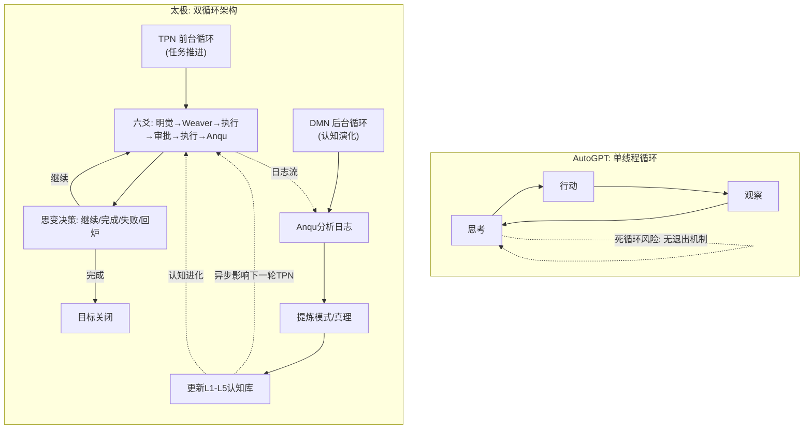
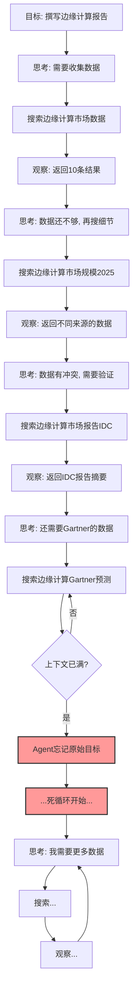
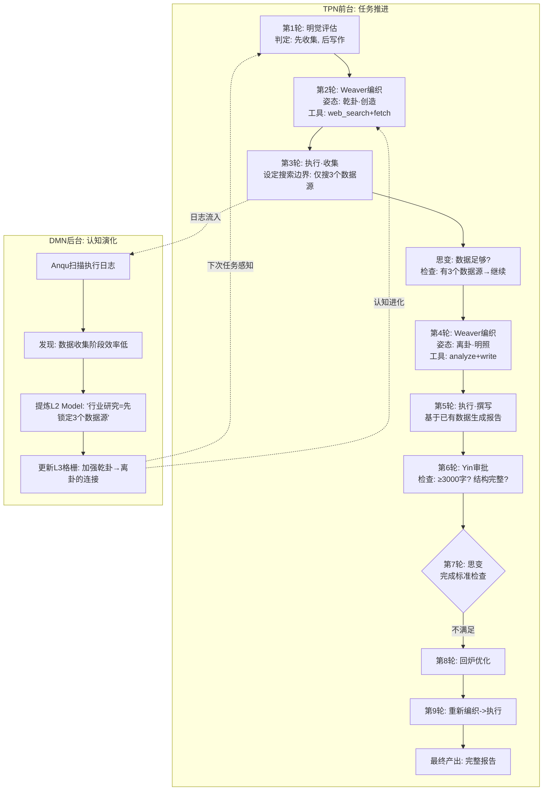
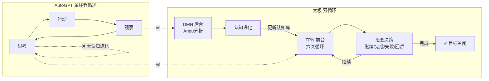

# 系列二·对比篇 (8/10)：太极 vs AutoGPT — 单线程死循环 vs 双循环认知进化

> **核心论点**：AutoGPT 的"自主执行"本质是一个单线程循环——思考→行动→观察→再思考。这种设计看似自主，实则容易陷入死循环。太极的双循环架构（TPN 前台任务执行 + DMN 后台认知演化）不仅防止死循环，更重要的是让系统在每次循环中都能进化认知。

---

## 引言：AutoGPT 的遗产与局限

AutoGPT（2023年横空出世）是现代 AI Agent 领域最具影响力的项目之一。它首次向世界展示了"LLM 自主完成任务"的可能性——不需要人类每一步干预，Agent 可以自己思考、自己行动、自己评估结果。

AutoGPT 的设计模式（思考-行动-观察循环）启发了几乎所有后来的 Agent 框架，包括太极。

但 AutoGPT 也有一个众所周知的痛点：**死循环**。

> "Agent 卡在某个子任务上，反复执行同一操作，永远无法推进。"

这个问题的根源不在 LLM 本身，而在 AutoGPT 的**架构设计**——它是一个**单线程认知循环**，缺乏退出机制和认知进化能力。

---

## 第一章：AutoGPT 的核心架构——单线程死循环的根源

### 1.1 设计哲学

AutoGPT 的哲学可以简化为：**"给 LLM 一个目标，让它自己想办法完成。"**

它通过一个持续循环的"思考→行动→观察"过程来实现自主执行：

```
循环步骤：
1. 思考 (Thought) — LLM 分析当前状态，决定下一步做什么
2. 推理 (Reasoning) — 提供选择行动的理由
3. 计划 (Plan) — 制定如何执行的步骤
4. 批评 (Criticism) — 自我批评当前计划的缺陷
5. 下一步行动 (Next Action) — 执行一个具体操作
6. 观察 (Observation) — 查看操作结果
   ↻ 回到步骤1
```

### 1.2 单线程循环的本质

AutoGPT 的核心问题不在于它的循环本身——循环不是问题。问题在于它只有**一个循环**，而且这个循环把**决策**和**执行**耦合在一起。

```python
# AutoGPT 的单线程循环（简化伪代码）
class AutoGPTSession:
    def run(self, goal):
        context = [{"role": "system", "content": self.system_prompt}]
        context.append({"role": "user", "content": goal})
        
        while True:
            # 1. LLM 生成决策（思考+推理+计划+批评+行动在同一个调用中）
            response = self.llm.generate(context)
            
            # 2. 解析行动指令
            action = self.parse_action(response)
            
            # 3. 执行并观察
            observation = self.execute(action)
            context.append({"role": "assistant", "content": response})
            context.append({"role": "user", "content": f"观察结果: {observation}"})
            
            # 4. 如果 LLM 判断完成则退出
            if self.is_finished(response):
                break
        
        return context
```

### 1.3 死循环的四种典型模式

AutoGPT 社区记录了大量死循环案例，归结为以下四种模式：

**模式一：认知锁定**
Agent 在某个子任务上反复做相同操作，每次得到相同结果，但认为"这次会不同"。例如：重复搜索同一个关键词，每次返回相同结果，但 Agent 认为"再搜一次会有新发现"。

**模式二：自我批评过载**
Agent 的"批评"环节过于苛刻，导致它永远认为自己"做得不够好"，不断修改已经合格的产出，永不提交。

**模式三：目标漂移**
Agent 在执行过程中逐渐偏离原始目标，开始关注无关的子问题，越走越远，原始目标被遗忘。

**模式四：上下文污染**
上下文窗口积累了大量无效信息，LLM 无法有效聚焦，随机选择行动，陷入随机徘徊。

### 1.4 为什么 AutoGPT 无法自我修复这些死循环？

因为 AutoGPT 的架构决定了它**没有退出机制**：

- 没有独立的"评估者"来检测是否陷入死循环——评估者就是执行者本身
- 没有外部记忆来记录"这个方向已经试过了"——所有"记忆"都在上下文窗口中
- 没有认知进化能力——每轮循环都不会让系统变得更聪明，只是增加上下文长度

---

## 第二章：太极的双循环架构——从根源上防止死循环

太极不是简单地"加一个退出条件"——它是从架构层面重新设计了认知循环。

### 2.1 TPN + DMN：两个循环，各司其职



**关键区别**：
1. **TPN 有退出条件**——思变（Sixiang）每轮做出明确决策：继续、完成、失败、回炉。不是 LLM 模棱两可的判断，而是基于完成标准的硬性评估
2. **DMN 在后台运行**——认知演化不影响前台执行速度，不会因为"思考人生"而阻塞任务推进
3. **两个循环松耦合**——TPN 的日志流入 DMN，DMN 的认知更新流入下一轮 TPN，但互不阻塞

### 2.2 思变（Sixiang）——真正的退出机制

AutoGPT 的退出条件藏在 LLM 的"是否完成"判断中——让同一个 LLM 既当运动员又当裁判。

太极的思变是一个独立的决策节点：

```python
# 太极思变的退出机制（伪代码）
class Sixiang:
    def decide(self, round_result: RoundResult, goal_blueprint: Blueprint) -> Decision:
        """
        思变做四件事：
        1. 对比本轮产出和蓝图完成标准
        2. 检查是否陷入重复模式（连续3轮相同产出类型？）
        3. 检查是否有不可逾越的障碍
        4. 做出明确决策
        """
        # 检查完成标准
        completion_match = self.check_completion(
            actual=round_result.output,
            expected=goal_blueprint.completion_criteria
        )
        
        if completion_match >= goal_blueprint.acceptance_threshold:
            return Decision.COMPLETE
        
        # 检查死循环——连续3轮产出类型相同且结果无进展
        if self.is_stuck_in_loop(round_result.history, pattern_window=3):
            return Decision.REWORK  # 要求回炉重做方式，而非继续死循环
        
        # 检查是否有障碍
        if self.has_insurmountable_obstacle(round_result.errors):
            return Decision.FAIL
        
        # 默认继续
        return Decision.CONTINUE
```

### 2.3 禁止连续两轮纯读——硬性防止认知锁定

太极架构有一个在其他框架中看不到的设计原则：**禁止连续两轮纯读**。

这意味着：
- 如果某一轮 Yang（执行者）只是读了文件而没有产出（写文件、调 API、生成代码），下一轮无论如何不能继续纯读
- 这表面上是一个约束，实际上是一种**认知强制切换**——逼迫 Agent 从"分析模式"切换到"产出模式"

AutoGPT 的死循环模式一中，Agent 反复"搜索→观察→再搜索"，每轮都在读（搜索本质是读外部数据），没有实际产出。太极的"禁止连续两轮纯读"从根源上切断了这种死循环。

### 2.4 Anqu 模式识别——让死循环成为过去式

AutoGPT 的另一个问题：即使 Agent 在当前任务中陷入死循环并最终通过人类干预退出，下次遇到类似任务，同样的问题会再次发生。因为没有学习。

太极的 Anqu 在后台持续分析执行日志，包括死循环模式：

```python
# 太极 Anqu 的死循环检测和学习（伪代码）
class Anqu:
    def detect_loop_patterns(self, task_logs):
        """检测是否出现了循环模式，并提炼为认知模式"""
        # 1. 扫描重复操作序列
        sequences = self.extract_action_sequences(task_logs)
        
        # 2. 检测是否出现循环
        loop_patterns = []
        for seq in sequences:
            if self.is_repetitive(seq, min_repeat=3):
                pattern = LoopPattern(
                    description=f"在{seq.context}场景下，Agent重复执行{seq.action_type}超过3次",
                    trigger_conditions=seq.trigger_context,
                    suggested_break_action=seq.suggested_alternative
                )
                loop_patterns.append(pattern)
        
        # 3. 将可避免的循环模式写入 L2 Models
        for pattern in loop_patterns:
            if pattern.confidence > 0.7:
                self.update_l2_model(
                    trigger=pattern.trigger_conditions,
                    avoidance_strategy=pattern.suggested_break_action
                )
        
        return loop_patterns
```

下次 Weaver 感知到类似场景时，会从 L2 模型库中加载之前提炼的"避免循环策略"，自动调整认知姿态。

---

## 第三章：具体架构案例对比——"研究并撰写行业报告"任务

### 3.1 案例设定

Agent 需要完成：**"研究2025年全球边缘计算市场趋势，撰写一份3000字的行业分析报告。"**

子任务包括：收集数据、分析趋势、撰写报告、格式排版。

### 3.2 AutoGPT 的单线程执行路径——死循环高风险



**AutoGPT 的问题**：
1. **收集数据永无止境**——没有"足够数据"的明确标准，Agent 可以无限搜索下去
2. **上下文膨胀**——搜索过程和中间结果不断累加，最终上下文窗口被填满
3. **忘记撰写任务**——在数据收集阶段花费太多轮次，原始"撰写报告"的目标被遗忘
4. **没有切换认知姿态**——从始至终都是"搜索模式"，没有切换到"写作模式"

### 3.3 太极的双循环执行路径——有序推进



**太极的优势**：
1. **明确的任务边界**——第2轮 Weaver 注入"只搜3个数据源"的约束，防止无限搜索
2. **认知姿态切换**——从「乾卦·创造」（收集）切换到「离卦·明照」（撰写），工具和策略同步调整
3. **思变退出机制**——每轮都检查完成标准，不会遗忘原始目标
4. **后台学习**——DMN 在后台提炼了"行业研究三板斧"模式，下次可直接复用

---

## 第四章：Mermaid 架构深度对比

### 4.1 循环架构对比



### 4.2 死循环防护对比

| 防护机制 | AutoGPT | 太极 |
|---------|---------|------|
| 退出条件 | LLM 自我判断（不可靠） | 思变基于完成标准的硬性评估 |
| 重复检测 | 无 | 连续3轮相同类型产出触发回炉 |
| 认知姿态切换 | 无 | 八卦姿态自动切换（收集→写作） |
| 上下文管理 | 无限制，自然膨胀 | 每轮明觉评估后，Weaver 动态裁剪 |
| 后台学习 | 无 | Anqu 提炼循环模式，写入认知库 |
| 硬性约束 | 无 | 禁止连续两轮纯读 |

---

## 第五章：深度差异分析

### 5.1 认知阶跃 vs 线性累加

AutoGPT 的认知是一种**线性累加**：每轮循环往上下文加一条新消息，认知能力（理论上）随上下文长度增加而提升。但实际上上下文越长，LLM 的注意力越分散，反而导致认知退化。

太极的认知是一种**阶跃式进化**：每轮循环结束时，通过思变完成"状态评估"，通过 Anqu 完成"认知更新"。下一轮开始的 Weaver 感知到更新后的认知库，产生"认知阶跃"——不是线性增加，而是质的提升。

### 5.2 任务与认知的解耦

AutoGPT 的致命设计是把"任务推进"和"认知更新"耦合在同一个循环中。

```
AutoGPT: 推进任务 = 更新认知（耦合）
  每轮执行的结果直接成为下一轮的上下文
  没有提炼，没有抽象，没有选择性遗忘
  认知 = 原始日志的堆积

太极: 推进任务 ≠ 更新认知（解耦）
  TPN 负责推进任务：不做认知提炼
  DMN 负责更新认知：不阻塞任务推进
  认知 = 经过提炼的抽象模式 + 原则
```

### 5.3 冷启动表现

| 场景 | AutoGPT | 太极 |
|------|---------|------|
| 首次执行 | 无参考，上下文从零开始 | 认知库初始就有八卦格栅和基础模式 |
| 执行10轮后 | 上下文膨胀，注意力下降 | 认知库更新，Weaver 感知进化 |
| 遇到死循环 | 继续循环，直到人类干预 | 思变检测到重复模式，触发回炉 |
| 执行100个任务后 | 每次都是独立会话，从零开始 | 认知库积累了通用模式，新任务越来越快 |

---

## 第六章：适合场景总结

| 场景 | 推荐框架 | 原因 |
|------|---------|------|
| 简单、明确的一次性任务 | AutoGPT | 单线程循环够用，无需复杂架构 |
| 需要快速原型验证 | AutoGPT | 上手简单，社区资源丰富 |
| 复杂、长期、多阶段任务 | 太极 | 双循环防止死循环，认知逐步进化 |
| 需要认知灵活性的任务 | 太极 | 八卦姿态切换提供多模式思维能力 |
| 生产级自演化系统 | 太极 | DMN 后台学习，越运行越聪明 |

---

## 结论：单线程死循环 vs 双循环认知进化

AutoGPT 是一个伟大的开创者——它证明了 LLM Agent 的可行性。但它也是一个时代的局限产品——它的单线程循环架构注定了它会陷入死循环。

太极不是"更好的 AutoGPT"——它是在不同认知假设下构建的完全不同的架构。

> **AutoGPT 说："让我一直思考、行动、观察，直到我认为完成了。"**
> **太极说："让我前台推进任务，后台学习进化。每轮都有明确的目标检查，每轮都在成长。"**

AutoGPT 是一个勤奋但不会学习的工人——他一直在干活，但每次干活的方法都一样。
太极是一个边干活边学习的工匠——他不仅完成任务，还在完成任务的过程中让自己变得更强大。

这才是"学习型 Agent"的真正含义——不是上下文中的记忆，而是**架构层面的认知进化能力**。

---

**相关文章**：[对比篇：太极 vs OpenClaw] | [对比篇：太极 vs LangGraph]

*下一篇预告：太极 vs CrewAI — 角色编排 vs 认知演化*
