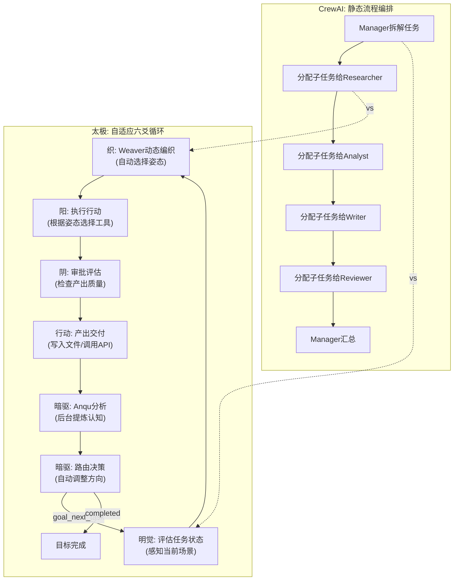
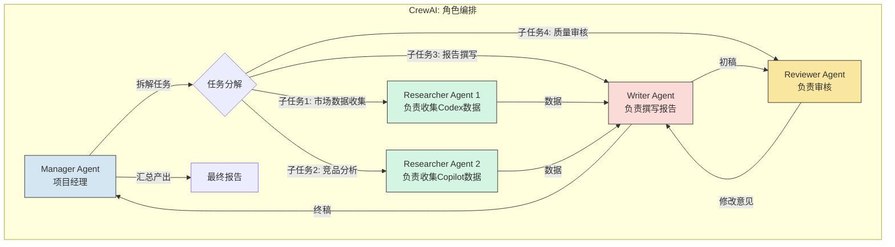
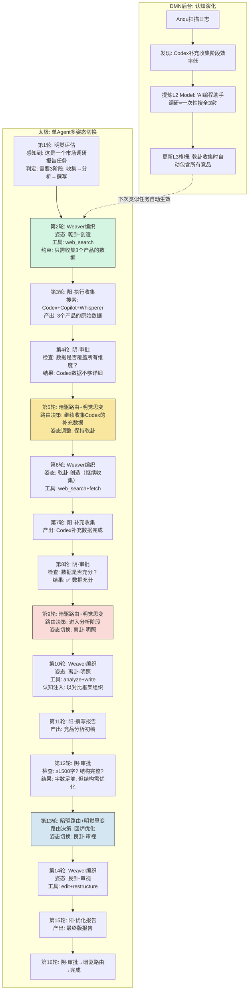
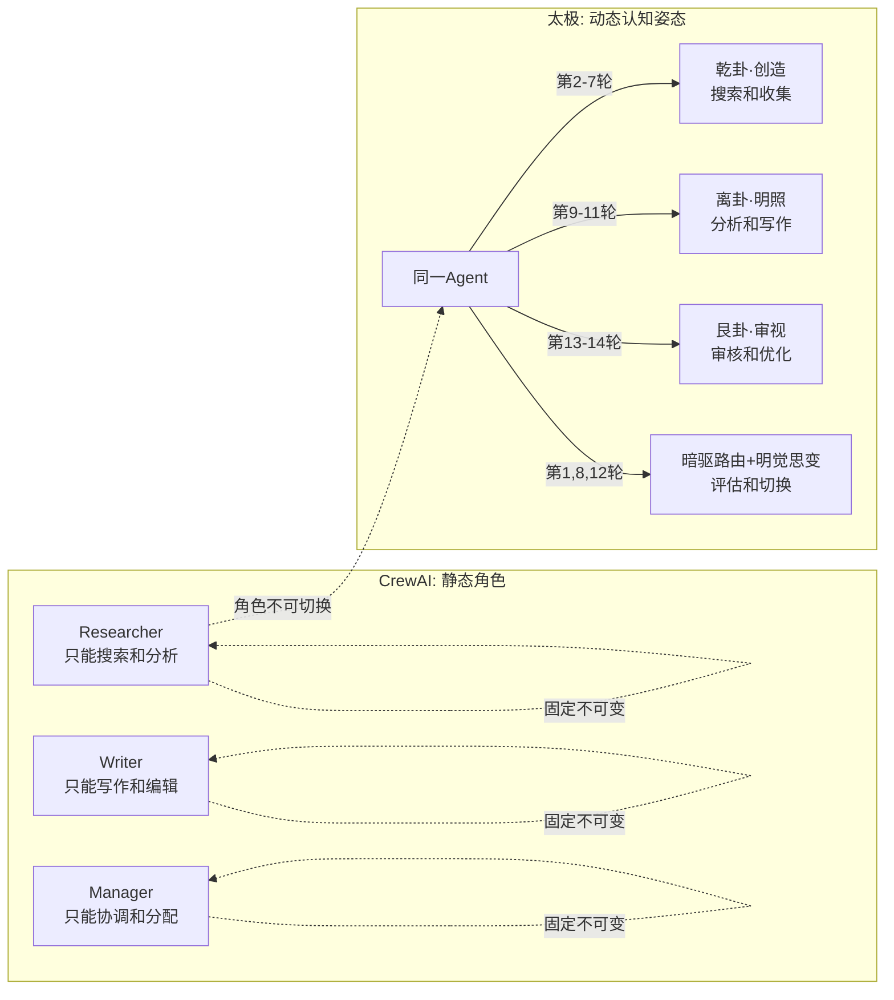

# 系列二·对比篇 (9/10)：太极 vs CrewAI — 角色编排 vs 认知演化

> **核心论点**：CrewAI 代表当前最主流的 Agent 协作范式——多角色编排（Manager + Workers）。但这种"角色分配"模式本质上是静态的组织设计。太极的认知演化范式则让 Agent 在运行过程中动态切换认知姿态，不需要预定义角色，却能比角色编排更灵活地适应任务变化。

---

## 引言：两种不同的协作哲学

当多个 AI Agent 需要协作完成一个复杂任务时，主流的解决方案是什么？

目前最流行的答案是：**角色编排**——给每个 Agent 分配一个角色（如研究专员、分析师、写作者、审核员），然后让它们按流程协作。CrewAI 就是这种范式的代表。

但太极提出了一个截然不同的答案：**认知演化**——不需要预分配角色，系统在运行过程中根据任务需求动态切换认知姿态。同一个 Agent 可以在"乾卦·创造"和"离卦·明照"之间自如切换。

这两种范式的区别，就像是**一个预先分配角色的剧组** vs **一个即兴演出的剧团**。

---

## 第一章：CrewAI 的核心架构——角色编排范式

### 1.1 设计哲学

CrewAI 的设计哲学很直观：**复杂任务需要多个专业角色协作完成。**

就像一家公司有 CEO、CTO、产品经理、开发工程师一样，AI Agent 系统也可以有类似的角色分层：

```
CrewAI 典型结构：
┌─────────────────────────────────────┐
│              Crew (团队)             │
│  ┌───────────┐  ┌───────────────┐   │
│  │  Manager   │  │  Process      │   │
│  │  (管理者)  │  │  (协作流程)   │   │
│  └─────┬─────┘  └───────┬───────┘   │
│        │                │           │
│  ┌─────▼────────────────▼───────┐   │
│  │          Agents              │   │
│  │  ┌──────────┐ ┌──────────┐  │   │
│  │  │ Researcher│ │  Writer  │  │   │
│  │  └──────────┘ └──────────┘  │   │
│  │  ┌──────────┐ ┌──────────┐  │   │
│  │  │ Analyst   │ │ Reviewer │  │   │
│  │  └──────────┘ └──────────┘  │   │
│  └─────────────────────────────┘   │
└─────────────────────────────────────┘
```

### 1.2 角色定义的工作方式

CrewAI 中，每个 Agent 的"角色"是通过 system prompt 定义的：

```python
# CrewAI 角色定义（简化伪代码）
researcher = Agent(
    role="资深行业研究员",
    goal="收集并整理行业数据，提供准确的事实基础",
    backstory="你是一位有20年经验的行业研究员，擅长从海量数据中提取关键信息",
    tools=[web_search, fetch_url, save_file],
    allow_delegation=False
)

writer = Agent(
    role="技术文档写作者",
    goal="基于研究员的输出撰写清晰、结构化的报告",
    backstory="你是一位专业的技术写作者，擅长将复杂概念转化为易懂的语言",
    tools=[write_file, format_document],
    allow_delegation=False
)

reviewer = Agent(
    role="质量审核员",
    goal="检查报告的质量、准确性和完整性",
    backstory="你是一位严谨的质量审核员，不会放过任何错误",
    tools=[read_file, check_quality],
    allow_delegation=False
)
```

### 1.3 协作流程

CrewAI 的流程通常是顺序执行或层级委托：

```python
# CrewAI 协作流程（简化伪代码）
class Crew:
    def run(self, task):
        # 1. Manager 拆解任务
        subtasks = self.manager.decompose(task)
        
        # 2. 按顺序分配子任务
        results = []
        for subtask in subtasks:
            # 找到最合适的 Agent
            agent = self.find_best_agent(subtask)
            
            # 委托执行
            result = agent.execute(subtask)
            results.append(result)
        
        # 3. Manager 汇总结果
        final_output = self.manager.synthesize(results)
        return final_output
```

### 1.4 角色编排的优势与局限

**优势**：
1. **直观易懂**——角色概念与人类组织方式一致
2. **职责清晰**——每个 Agent 知道自己的边界
3. **流程可控**——Manager 可以控制执行顺序

**局限**：
1. **角色僵化**——Researcher 不能写作，Writer 不能研究，角色边界不可逾越
2. **角色数量固定**——无论任务是否需要，角色数量是预先设定好的
3. **跨领域任务效率低**——如果一个任务需要 Researcher 在"收集数据"和"分析数据"之间快速切换，CrewAI 需要两个 Agent 传递上下文，增加了沟通开销
4. **缺乏学习能力**——这次任务的 Researcher 和下次任务的 Researcher 没有认知上的连续进化
5. **角色分配依赖人工**——你需要提前想好需要哪些角色

---

## 第二章：太极的认知演化范式——动态姿态切换

### 2.1 从"角色编排"到"认知姿态"

太极不预定义角色，而是定义了一系列**认知姿态**——八卦。八卦不是角色，而是 Agent 在某个时间点应该采取的认知策略：

| 八卦 | 认知姿态 | 类似CrewAI角色 | 但太极的核心区别 |
|------|---------|--------------|----------------|
| 乾 | 创造·行动 | 执行者 | 但下一轮可以切换 |
| 坤 | 承载·接受 | 数据收集者 | 但可以自主决定何时切换 |
| 震 | 启动·激发 | 项目经理 | 但不需要额外角色 |
| 巽 | 渗透·连接 | 跨部门协调 | 但不需要额外角色 |
| 坎 | 险陷·深潜 | 深度分析师 | 但可以随时切换 |
| 离 | 明照·依附 | 写作者 | 但可以随时切换 |
| 艮 | 止定·审视 | 审核员 | 但无需额外 Agent |
| 兑 | 悦纳·开放 | 用户接口 | 无需额外 Agent |

**核心区别**：CrewAI 中角色是**静态属性**（Researcher 始终是 Researcher），太极中认知姿态是**动态状态**（同一 Agent 这一轮是乾卦，下一轮可以切换到离卦）。

### 2.2 Weaver 的动态感知——替代固定角色

太极没有预设"Researcher Agent"或"Writer Agent"。取而代之的是 Weaver（编织器）的**动态感知**能力：

```python
# 太极 Weaver 的动态感知——替代固定角色（伪代码）
class Weaver:
    def weave(self, context: Context) -> Prompt:
        """
        Weaver 感知当前状态后动态编织认知提示。
        不需要预定义角色，而是根据六爻循环的当前阶段自动调整姿态。
        """
        # 1. 感知当前循环阶段
        cycle_stage = context.get_cycle_stage()  # 明觉？织？阳？阴？行动？暗驱？
        
        # 2. 感知 L3 格栅中记录的"类似任务的最佳认知姿态"
        best_guas = self.guide.grids.get_best_pattern(
            task_type=context.task_type,
            current_stage=cycle_stage
        )
        
        # 3. 感知 L2 模型中积累的经验模式
        experience_patterns = self.guide.models.get_applicable_patterns(
            current_goal=context.goal,
            environment=context.environment
        )
        
        # 4. 动态编织——不是静态角色定义，而是基于感知的动态姿态
        prompt = Prompt()
        prompt.add_cognitive_stance(best_guas)  # 注入认知姿态
        prompt.add_tools_context(self._select_tools(best_guas))  # 动态选择工具
        prompt.add_constraints(context.goal.constraints)  # 注入约束
        prompt.add_experience_patterns(experience_patterns)  # 注入经验
        
        return prompt
```

### 2.3 六爻循环——替代流程编排

CrewAI 的流程编排是静态的（Manager 决定谁做什么），太极的六爻循环是自适应的：



**关键区别**：
- CrewAI 的流程是**线性**的（做完A做B），太极的循环是**自适应**的（每轮根据状态决定下一轮做什么）
- CrewAI 的角色是**固定的**（Researcher 永远是 Researcher），太极的姿态是**动态的**（同一 Agent 可切换）
- CrewAI 需要**额外 Manager 角色**来协调，太极不需要额外角色——认知循环本身就是协调机制

---

## 第三章：具体架构案例对比——"市场调研与报告撰写"任务

### 3.1 案例设定

任务：**"调研2025年AI编程助手市场，撰写一份竞品分析报告，含OpenAI Codex、GitHub Copilot、Amazon CodeWhisperer的对比。"**

### 3.2 CrewAI 的角色编排实现



**CrewAI 的问题**：
1. **资源浪费**——需要4-5个 Agent 实例，每个都要加载完整的 LLM 上下文
2. **沟通开销**——Agent 之间通过消息传递数据，每次传递都消耗 token
3. **角色僵化**——如果 Researcher 1 发现数据不足需要额外搜索，它不能自己做，必须向 Manager 报告，Manager 再重新分配
4. **无法进化**——下次做类似任务，所有 Agent 仍然是第一次完成任务时的状态

### 3.3 太极的认知演化实现



**太极的优势**：
1. **零沟通开销**——单 Agent 内外在状态切换，不需要跨 Agent 传递上下文
2. **自适应切换**——暗驱路由+明觉思变根据实际情况决定"继续收集"还是"开始撰写"——不需要 Manager 介入
3. **认知进化**——DMN 在后台学习到"AI编程助手调研应该一次性搜全3家"，下次类似任务自动优化
4. **资源效率**——一个 Agent（一个 LLM 实例）完成所有工作，而不是4-5个

### 3.4 核心差异：认知姿态 vs 角色



---

## 第四章：架构选择背后的认知假设

### 4.1 CrewAI 的认知假设

CrewAI 的范式基于一个隐含假设：**"AI 的能力边界由角色定义决定，不同角色需要不同的 LLM 配置和工具集。"**

这个假设在 LLM 能力有限的时代是合理的——如果你用 GPT-3.5，不同的 System Prompt 确实会产生显著不同的行为模式。

但这个假设在 GPT-4 及更强模型的时代正在瓦解——**一个足够强的 LLM 不再需要角色定义来限定其能力**。它可以在不同姿态之间自如切换。

### 4.2 太极的认知假设

太极基于一个完全不同的假设：**"认知姿态的切换是内在的、动态的、自适应的——不需要外部角色定义来强制。"**

这个假设的推论是：
- 如果 Agent 能感知到当前需要做什么，它就能自主选择合适的认知姿态
- 如果 Agent 能感知到当前姿态不合适，它就能自主切换
- 学习不是增加新角色，而是优化认知姿态的选择策略

### 4.3 两种范式的对比

| 维度 | CrewAI（角色编排） | 太极（认知演化） |
|------|------------------|----------------|
| 核心概念 | 角色（Role） | 认知姿态（Cognitive Stance） |
| 角色来源 | 人工预定义 | 动态涌现 |
| 角色数量 | 固定 | 无限（可组合） |
| 流程控制 | Manager 分配 | 暗驱路由+明觉思变自适应决策 |
| Agent 数量 | 多个（每个角色一个） | 单个（多姿态切换） |
| 沟通成本 | 高（跨 Agent 消息传递） | 零（内在状态切换） |
| 学习能力 | 无（每个 Agent 独立会话） | 有（DMN 后台累积认知） |
| 扩展性 | 增加角色 | 增加认知库（L1-L5） |
| 适合场景 | 团队明确的分工任务 | 需要认知灵活性的复杂任务 |

---

## 第五章：深度案例——"突发市场变化的紧急策略调整"

### 5.1 场景设定

Agent 正在执行"季度市场策略报告"任务。执行到一半时，一个突发新闻出现——"某竞争对手发布了重大产品更新"。

### 5.2 CrewAI 的反应

```python
# CrewAI 面对突发变化的反应路径
# 1. Researcher 搜索到了突发新闻
researcher_result = researcher.search("competitor product update")

# 2. Researcher 不能自主调整策略（角色限制）
# 它只能把结果传递给 Manager
manager.receive_intermediate_result(researcher_result)

# 3. Manager 需要重新评估任务
manager.task_reassessment(original_task, new_info)
# 问题：Manager 没有"重新评估"的指令
# 要么忽略新信息，要么需要人类介入

# 4. 如果 Manager 决定调整流程：
# - 暂停当前 Writer
# - 分配 Researcher 深入搜索
# - 分配 Analyst 分析影响
# - 然后重新启动 Writer
# 这是一个复杂的中断-恢复过程
```

**CrewAI 的问题**：
- 角色分工导致**信息处理链路过长**
- 缺乏内置的**"任务重评估"机制**
- 突发变化需要**中断当前流程**，代码层面实现复杂

### 5.3 太极的反应

```python
# 太极面对突发变化的反应路径
# 第N轮执行中...
round_result = yang.execute(weaver_output)

# 1. 明觉（感知当前状态）
context = mingjue.assess(round_result)
# 发现：执行过程中出现了新的关键信息（竞争对手更新）

# 2. 暗驱路由+明觉思变（重新决策）
decision = anqu_make_routing_decision(
    round_result=round_result,
    goal_blueprint=original_blueprint,
    new_info=breaking_news  # 突发信息作为新因素输入
)

# 可能做出的决策：
# - 继续：如果新信息不影响主任务
# - 回炉：如果新信息需要调整方向
# - 分支：如果新信息值得另开子任务

# 3. Weaver 自动调整姿态
if decision == Decision.BRANCH:
    # 自动切换认知姿态
    new_stance = "坎卦·险陷——深度分析竞争对手更新"
    weaver_output = weaver.weave(
        context=context,
        stance=new_stance,
        tools=[web_search, fetch_url, deep_analyze]
    )
```

**太极的优势**：
- 没有角色边界——Agent 可以自主切换到"分析突发新闻"模式
- 暗驱路由+明觉思变机制内置了**情景评估和方向调整**
- 不需要 Manager 干预——认知循环本身就是决策引擎

---

## 第六章：总结——角色编排 vs 认知演化

| 对比维度 | CrewAI | 太极 |
|---------|--------|------|
| **范式** | 多Agent角色编排 | 单Agent认知演化 |
| **设计哲学** | 分工外包 | 认知内化 |
| **灵活性** | 低（角色固定） | 高（姿态动态） |
| **资源消耗** | 高（多Agent实例） | 低（单Agent多姿态） |
| **学习能力** | 无 | 有（DMN+L1-L5认知库） |
| **复杂任务适应** | 需人工调整角色配置 | 自动通过暗驱路由+明觉思变调整 |
| **团队协作场景** | ✅ 天生适合 | ⚠️ 需额外认知设计 |
| **单Agent复杂任务** | ⚠️ 角色过多开销大 | ✅ 天然优势 |

CrewAI 和太极代表了两种根本不同的 AI Agent 协作范式。

CrewAI 的角色编排就像**传统的管理式组织**——每个人有固定职位，流程由管理者控制。这种方式在团队明确、分工清晰的任务中表现出色。

太极的认知演化则像**一个不断学习的单兵**——没有固定的职位，但具备多种能力，根据战场形势自主切换策略。这种方式在需要灵活应变、持续学习的场景中更有优势。

选择哪种范式，取决于你面对的问题的性质：
- 如果你的任务可以清晰地分解为独立子任务，且子任务之间的边界固定——选择 CrewAI
- 如果你的任务需要灵活应变、持续学习，且任务边界在运行过程中会变化——选择太极

但最关键的是：CrewAI 不会学习，太极会。**100次任务之后，CrewAI 仍然是100次之前的 CrewAI，而太极已经进化成了更聪明的自己。**

---

**相关文章**：[对比篇：太极 vs AutoGPT] | [对比篇：太极 vs LangGraph]

*下一篇预告：太极 vs LangGraph — 有向图 vs 八卦动态平衡*
