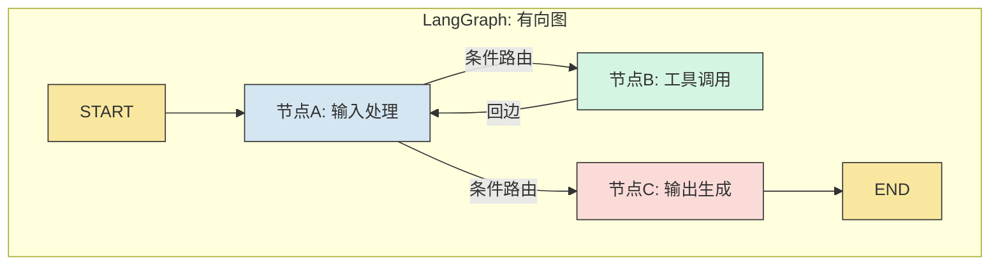
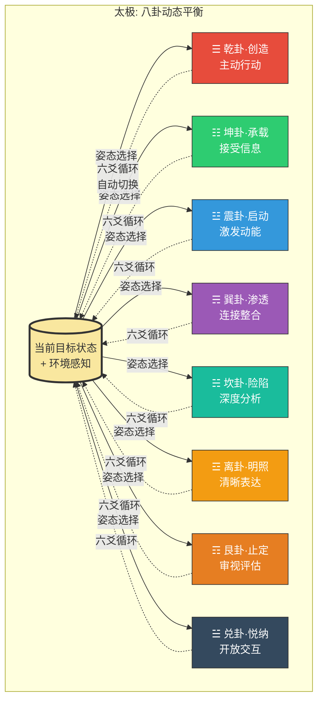
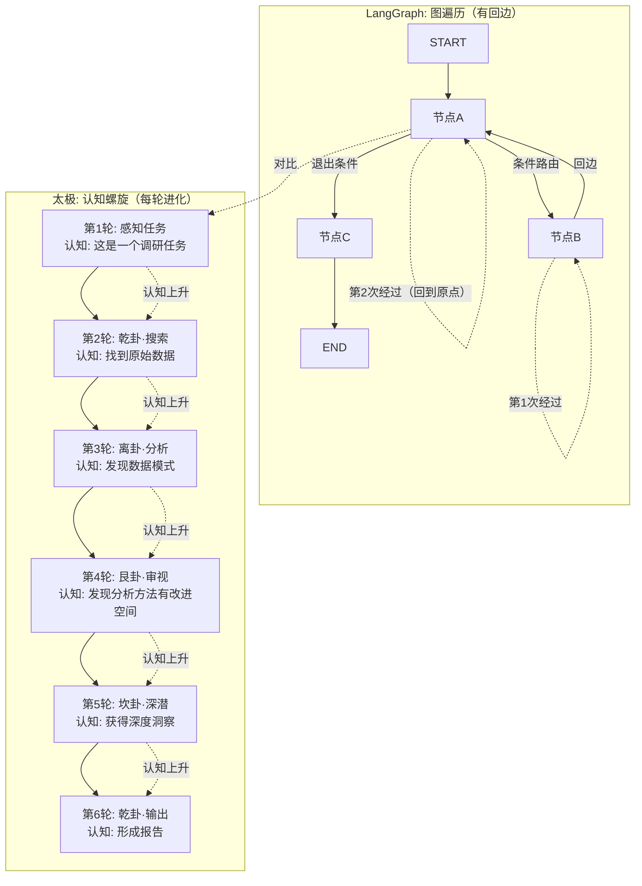
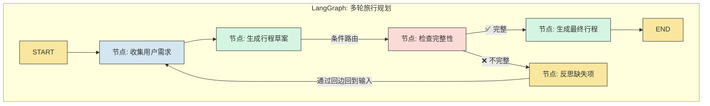
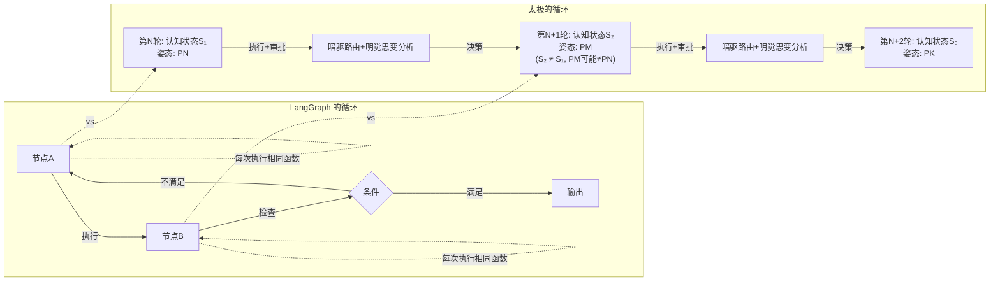

# 系列二·对比篇 (10/10)：太极 vs LangGraph — 有向图 vs 八卦动态平衡

> **核心论点**：LangGraph 定义了以"有向图"为核心的 Agent 编排范式——节点和边是编写 Agent 行为的基本原语。太极则以八卦为认知姿态的"动态平衡"系统——不是预定义执行路径，而是在运行时根据目标状态动态选择认知姿态。两者都是"循环"系统，但本质不同：LangGraph 的循环是**图结构中的回路**，太极的循环是**认知演化的螺旋**。

---

## 引言：两种"循环"的不同含义

在 AI Agent 架构设计中，"循环"是一个高频词。几乎所有主流框架都在宣称支持"循环执行"。

但"循环"的含义截然不同：

对于 LangGraph，循环意味着**图中有向边的回路**——节点 A 可以回到节点 B 再回到节点 A，形成一个循环路径。循环是图结构的一个属性。

对于太极，循环意味着**认知演化的螺旋**——每一轮不是回到起点，而是带着上一轮的认知结果上升到新的层次。循环是认知演化的一个机制。

这两种"循环"的区别，就像是**一个环形跑道**（你跑了一圈回到原点） vs **一个螺旋楼梯**（你转了一圈但站到了更高的位置）。

---

## 第一章：LangGraph 的核心架构——有向图范式

### 1.1 设计哲学

LangGraph 的设计哲学来自图论：**Agent 的行为可以建模为有向图（Directed Graph）**。

- **节点（Nodes）**：Agent 可以执行的函数/操作
- **边（Edges）**：节点之间的控制流和数据流
- **条件边（Conditional Edges）**：基于节点输出动态选择下一个节点

LangGraph 最核心的 API 就是定义这个图：

```python
# LangGraph 典型结构（伪代码）
from langgraph.graph import StateGraph, END

# 1. 定义状态
class AgentState(TypedDict):
    messages: list
    next_node: str
    context: dict

# 2. 定义节点（Agent 的操作）
def node_a(state: AgentState) -> AgentState:
    # 执行某个操作
    return {"messages": new_messages}

def node_b(state: AgentState) -> AgentState:
    # 执行另一个操作
    return {"messages": more_messages}

# 3. 定义条件边
def router(state: AgentState) -> str:
    if state["next_node"] == "node_b":
        return "node_b"
    elif state["next_node"] == "node_c":
        return "node_c"
    else:
        return END

# 4. 构建图
graph = StateGraph(AgentState)
graph.add_node("node_a", node_a)
graph.add_node("node_b", node_b)
graph.set_entry_point("node_a")
graph.add_conditional_edges("node_a", router, {
    "node_b": "node_b",
    "node_c": "node_c",
    END: END
})
graph.add_edge("node_b", "node_a")  # 循环边
```

### 1.2 循环如何在 LangGraph 中实现

LangGraph 中的循环是通过图中的**回边（back edge）**实现的：



**LangGraph 循环的典型工作方式**：

1. START → 节点A（处理输入）
2. 节点A → 条件路由（根据输出决定下一步）
3. 如果路由到节点B → 执行工具调用
4. 节点B → 通过回边回到节点A（形成循环）
5. 节点A → 条件路由 → 如果满足退出条件，路由到节点C
6. 节点C → END

### 1.3 LangGraph 的核心优势与局限

**优势**：
1. **图结构直观**——节点和边的概念易于理解
2. **条件路由灵活**——条件边允许动态选择执行路径
3. **显式循环**——回边让循环行为明确可见
4. **状态管理**——StateGraph 内置状态管理

**局限**：
1. **图结构固定**——节点和边的拓扑在构建时已确定，运行时只能选择走哪条边，不能新增节点或边
2. **循环是一种路径**——每次循环本质上是"回到某个节点重新执行"，而不是"进化到新的认知状态"
3. **认知能力与图结构耦合**——Agent 的全部行为被约束在预定义的有向图中
4. **跨图经验不共享**——每次执行使用同一个图结构，但图本身不会学习进化
5. **复杂循环需要复杂图**——当循环逻辑复杂时，图会变得难以维护

---

## 第二章：太极的八卦动态平衡——不是图，是认知姿态选择

### 2.1 从"有向图"到"八卦姿态场"

太极不定义图结构。太极定义的是**认知姿态的平衡空间**——八卦。

八卦不是节点（nodes），不是边（edges），不是图（graph）。八卦是**Agent 在当前情境下应该采取的认知策略**。



### 2.2 核心差异：图 vs 八卦

| 维度 | LangGraph（有向图） | 太极（八卦动态平衡） |
|------|-------------------|-------------------|
| **基本单元** | 节点（Node）+ 边（Edge） | 八卦（认知姿态） |
| **执行方式** | 沿边遍历节点 | 六爻循环中动态切换姿态 |
| **循环含义** | 图中有向回路的重复执行 | 认知螺旋的持续演化 |
| **拓扑变化** | 构建时固定，运行时只做路径选择 | 每轮都可能重新编织认知姿态 |
| **学习机制** | 无（图结构不进化） | 有（L1-L5认知库持续更新） |
| **状态管理** | StateGraph 显式状态 | 六爻循环隐式状态累积 |
| **复杂性管理** | 图的可视化 | 八卦的抽象层级 |
| **核心隐喻** | 有向图（路线图） | 动态平衡（太极图） |

### 2.3 六爻循环——不是图遍历

LangGraph 的执行是**图遍历**——从 START 节点开始，沿边走到 END 节点。循环意味着回边，让执行回到前面的节点。

太极的六爻循环是**认知螺旋**——每一轮都是完整的认知周期，不是回到节点，而是带着本轮认知结果进入下一轮：



**关键区别**：
- LangGraph：同一节点可以被多次经过，但每次经过时节点的功能不变（仍然是同一个函数）
- 太极：没有"重新经过同一认知姿态"的概念。如果太极在第2轮用了乾卦，在第5轮又用了乾卦，这两个"乾卦"的认知上下文完全不同——第5轮的乾卦已经吸收了第2-4轮的认知成果

---

## 第三章：具体架构案例对比——"多轮对话驱动的复杂任务"

### 3.1 案例设定

任务：**"AI 助手需要与用户进行多轮对话，帮助用户规划一次跨三国的旅行行程。每次对话后，AI 需要反思之前的建议，优化下一轮回答。"**

### 3.2 LangGraph 的有向图实现



**LangGraph 实现的代码结构**：

```python
# LangGraph 多轮旅行规划（简化伪代码）
from langgraph.graph import StateGraph, END

class TravelState(TypedDict):
    user_input: str
    draft_plan: str
    feedback: str
    iteration: int
    max_iterations: int

def collect_input(state: TravelState) -> TravelState:
    """节点: 收集用户需求"""
    prompt = f"用户说: {state['user_input']}\n已有草稿: {state.get('draft_plan', '无')}"
    response = llm.call(prompt)
    return {"user_input": state["user_input"], "draft_plan": response}

def generate_plan(state: TravelState) -> TravelState:
    """节点: 生成行程草案"""
    prompt = f"基于: {state['draft_plan']}\n生成跨三国行程"
    plan = llm.call(prompt)
    return {"draft_plan": plan}

def check_completeness(state: TravelState) -> str:
    """条件边: 检查完整性"""
    prompt = f"检查行程是否包含三国: {state['draft_plan']}"
    check = llm.call(prompt)
    if "完整" in check and state["iteration"] < state["max_iterations"]:
        return "complete"  # 路由到 OUTPUT
    else:
        return "incomplete"  # 路由到 REFLECT

def reflect(state: TravelState) -> TravelState:
    """节点: 反思缺失项"""
    prompt = f"行程: {state['draft_plan']}\n检查结果: {state.get('check_result', '')}\n反思缺失什么"
    reflection = llm.call(prompt)
    return {
        "draft_plan": state["draft_plan"],
        "feedback": reflection,
        "iteration": state["iteration"] + 1
    }

# 构建图
builder = StateGraph(TravelState)
builder.add_node("collect", collect_input)
builder.add_node("plan", generate_plan)
builder.add_node("check", check_completeness)  # 条件节点
builder.add_node("reflect", reflect)
builder.add_node("output", generate_output)

builder.set_entry_point("collect")
builder.add_edge("collect", "plan")
builder.add_edge("plan", "check")
builder.add_conditional_edges("check", check_completeness, {
    "complete": "output",
    "incomplete": "reflect"
})
builder.add_edge("reflect", "collect")  # 回边: 形成循环
builder.add_edge("output", END)

graph = builder.compile()
```

**LangGraph 的核心特性在这个案例中体现**：
1. **显式循环**：reflect → collect 的回边形成循环
2. **状态传递**：TravelState 在节点间传递
3. **条件路由**：check 节点决定是结束还是继续循环
4. **循环上限**：max_iterations 防止无限循环

**LangGraph 的局限**：
1. 每次循环的 collect 节点执行的是**相同的函数**——它不知道这是第2次循环，以相同的认知模式处理输入
2. 如果需要"更智能地收集输入"（比如第3次循环时应该更主动提问），你需要修改 collect 节点的实现，或者在状态中添加复杂的条件逻辑
3. 图结构固定——你不能在运行过程中"突然想到需要在新西兰和澳大利亚之间加一个中转节点"

### 3.3 太极的八卦动态平衡实现

```mermaid
graph TD
    subgraph "太极: 跨三国旅行规划的多轮认知螺旋"
        T1["第1轮: 明觉·感知<br/>识别任务类型: 跨三国旅行规划<br/>判定认知复杂度: 高<br/>需要多轮交互"] 
        
        T1 --> T2["第2轮: Weaver编织<br/>姿态选择: 巽卦·渗透<br/>工具: chat input<br/>策略: 开放提问收集需求"]
        T2 --> T3["第3轮: 阳·执行<br/>对话: '你想去哪里？偏好什么？'<br/>产出: 用户初始需求"]
        
        T3 --> T4["第4轮: 阴·审批<br/>评估: 用户需求是否充分？<br/>发现: 用户只说了'欧洲三国'<br/>判定: ❌ 信息不足"]
        
        T4 --> T5["第5轮: 暗驱路由+明觉思变<br/>分析: 用户信息不足是因为问题太宽泛<br/>路由决策: 继续，下一轮用更具体的提问策略<br/>姿态切换: 离卦·明照"]
        
        T5 --> T6["第6轮: Weaver编织<br/>姿态: 离卦·明照—清晰引导<br/>工具: chat input<br/>策略: 给出具体选项引导"]
        T6 --> T7["第7轮: 阳·执行<br/>对话: '推荐3条路线: A南欧 B中欧 C北欧'<br/>产出: 用户选择路线A"]
        
        T7 --> T8["第8轮: 阴·审批<br/>评估: 需求是否足够生成草案？<br/>判定: ✅ 可生成草案"]
        
        T8 --> T9["第9轮: 暗驱路由+明觉思变<br/>路由决策: 开始生成行程草案<br/>姿态切换: 乾卦·创造"]
        T9 --> T10["第10轮: Weaver→行动<br/>姿态: 乾卦·创造<br/>工具: generate_plan<br/>产出: 3国15天行程草案"]
        
        T10 --> T11["第11轮: 阴·审批<br/>评估: 行程是否合理？<br/>发现: 交通连接时间太紧<br/>判定: ❌ 需优化"]
        
        T11 --> T12["第12轮: 暗驱路由+明觉思变<br/>分析: 需要插入缓冲时间<br/>路由决策: 继续，用坎卦深潜分析交通<br/>姿态切换: 坎卦·险陷"]
        
        T12 --> T13["第13轮: Weaver→行动<br/>姿态: 坎卦·险陷<br/>工具: deep_analyze<br/>产出: 优化后的交通方案"]
        
        T13 --> T14["第14轮: 暗驱路由+明觉思变<br/>路由决策: 重新生成行程<br/>姿态切换: 乾卦·创造"]
        T14 --> T15["第15轮: 行动<br/>产出: 优化版行程"]
        
        T15 --> T16["第16轮: 阴→暗驱路由+明觉思变<br/>DMN扫描: 学到了'跨三国旅行=需要先充分收集偏好'<br/>更新L2模型: 旅行规划任务的初始提问策略<br/>判定: ✅ 目标完成"]
    end
    
    subgraph "DMN后台认知演化"
        D1[Anqu扫描第1-16轮日志] --> D2[识别模式: '宽泛提问→信息不足→细化提问→信息充分']
        D2 --> D3[提炼L2 Model: '旅行规划任务=初始需用离卦引导提问']
        D3 --> D4[更新L3格栅: '旅行规划→第1轮用离卦而非巽卦']
        D4 -.->|下次旅行任务自动用在明觉阶段| NEXT[下次同类任务: 第1轮直接选择离卦]
    end
    
    style T2 fill:#d5f5e3,stroke:#333
    style T5 fill:#f9e79f,stroke:#333
    style T9 fill:#d4e6f1,stroke:#333
    style T12 fill:#fadbd8,stroke:#333
    style D1 fill:#e8daef,stroke:#333
```



**太极的核心特性在这个案例中体现**：
1. **认知螺旋**——每轮不是重复相同函数，而是带着上一轮的认知结果上升到新的层次
2. **动态姿态切换**——根据实际情况切换认知姿态（巽卦→离卦→乾卦→坎卦→乾卦）
3. **自主决策**——明觉思变每轮决定"下一步做什么"，不需要预定义图结构
4. **后台学习**——DMN 在后台分析出"旅行规划初始应该用离卦"的经验模式
5. **零回边概念**——不需要"回到某个节点"，因为每轮都是新的认知起点

### 3.4 核心对比：循环的本质差异



**本质差异**：
- LangGraph：循环是**路径的重复**（同一节点被多次遍历）
- 太极：循环是**状态的演化**（同一认知姿态不会出现两次，因为每轮的认知上下文不同）

---

## 第四章：从图论视角看两种架构

### 4.1 LangGraph 是静态图

LangGraph 的架构在数学上是一个**有向图 G = (V, E)**，其中：
- V 是节点集（函数/操作）
- E 是边集（控制流/数据流）
- 图结构在编译时固定

LangGraph 的"循环"在数学上是**有向图中的回路（cycle）**——存在一条路径从某个节点出发，经过若干边后回到该节点。

### 4.2 太极是动态认知场

太极的架构在数学上更接近**马尔可夫决策过程（MDP）** 或**部分可观察马尔可夫决策过程（POMDP）**：
- 状态空间 S：当前目标的认知状态（L1-L5 认知库的累积）
- 动作空间 A：八卦认知姿态（8种策略）
- 转移函数 T：六爻循环（明觉(含思变)→织→阳→阴→行动→暗驱(含路由)）
- 策略 π：暗驱路由+明觉思变决策（基于当前状态选择下一个姿态）

太极的"循环"不是图论中的回路，而是**状态空间中的轨迹**——每一轮都产生新的状态，不会回到之前的状态。

### 4.3 两种架构的数学本质

| 维度 | LangGraph | 太极 |
|------|----------|------|
| 数学模型 | 有向图 G=(V,E) | POMDP (S,A,T,R) |
| 循环定义 | 图中的回路 | 状态空间中的轨迹 |
| 状态空间 | 有限（StateGraph定义） | 无限（认知库持续扩展） |
| 动作空间 | 有限（节点数固定） | 8种姿态×无限组合 |
| 学习能力 | 无 | 有（通过L1-L5更新） |
| 动态性 | 路径选择动态 | 结构和策略皆动态 |

---

## 第五章：深度对比——"复杂知识工作任务的演化能力"

### 5.1 任务场景

假设我们需要一个 Agent 系统来做**"持续跟踪 AI 领域最新论文，并撰写每周研究简报"**。

这是一个持续演化的工作——每周的论文主题、研究方法、关注点都在变化。Agent 需要不断适应。

### 5.2 LangGraph 的实现与局限

```python
# LangGraph 实现周报系统（简化伪代码）
class WeeklyReportState(TypedDict):
    week: int
    papers: list
    draft: str
    feedback: str

# 固定节点
def search_papers(state): ...
def filter_relevant(state): ...
def generate_draft(state): ...
def review_quality(state): ...
def revise_draft(state): ...

# 固定图结构
graph = StateGraph(WeeklyReportState)
graph.add_node("search", search_papers)
graph.add_node("filter", filter_relevant)
graph.add_node("draft", generate_draft)
graph.add_node("review", review_quality)
graph.add_node("revise", revise_draft)

graph.set_entry_point("search")
graph.add_edge("search", "filter")
graph.add_edge("filter", "draft")
graph.add_edge("draft", "review")
graph.add_conditional_edges("review", router, ...)
graph.add_edge("revise", "review")

graph.compile()
```

**LangGraph 的问题**：
1. 第1周的 search 和第10周的 search 是同一个函数——它不会因为做了10周而变得更擅长搜索
2. 如果第8周突然发现"应该增加一个验证论文可靠性的节点"——你需要修改图结构，重新编译
3. 图无法感知自己的表现模式——它不知道"这周搜索效率比上周低"

### 5.3 太极的实现与优势

太极不需要修改图结构——因为它没有图结构。它通过**认知演化**来自适应：

```python
# 太极实现周报系统（概念伪代码）
class WeeklyReportAgent:
    def __init__(self):
        self.guide = Guide()  # L1-L5 认知库
        self.weaver = Weaver()
        self.iteration = 0
    
    def run_week(self, week_number):
        self.iteration = 0
        self.week_number = week_number
        
        while not self.is_goal_complete():
            self.iteration += 1
            
            # 1. 明觉：感知当前状态
            context = self.mingjue.assess(
                goal=f"撰写第{week_number}周AI研究简报",
                history=self.guide.models.get("weekly_report_patterns")
            )
            
            # 2. 织：Weaver 动态编织认知提示
            weaver_output = self.weaver.weave(
                context=context,
                cognitive_library=self.guide
            )
            
            # 3. 阳：执行行动
            result = self.yang.execute(weaver_output)
            
            # 4. 阴：审批评估
            assessment = self.yin.evaluate(result, weaver_output.constraints)
            
            # 5. 行动：产出交付
            if assessment.passed:
                self.deliver(result)
            
            # 6. 暗驱：后台认知提炼+路由决策
            self.anqu.analyze_and_decide(
                round_log=self.get_current_round_log(),
                models=self.guide.models
            )
            
            # 明觉在下一轮初始行使其思变之责
            self.current_stance = self.mingjue.sixiang_next_stance(
                assessment=assessment,
                iteration=self.iteration,
                goal_blueprint=self.blueprint
            )
            
            # 动态调整——不需要修改图结构
            self.current_stance = decision.next_stance
```

**太极在第10周时的进化表现**：

| 维度 | 第1周 | 第10周 |
|------|-------|--------|
| 搜索策略 | 乾卦·创造：广撒网 | 经过DMN学习，调整为"离卦·明照：按子领域精准搜索" |
| 筛选效率 | 手动筛选 | L2模型已积累"AI论文质量信号模式"，自动过滤低质量论文 |
| 简报结构 | 默认结构 | 已通过L3格栅调整到"被读者反馈验证的最佳结构" |
| 迭代次数 | 8-10轮 | 3-5轮（因为决策更精准） |

---

## 第六章：总结——有向图 vs 八卦动态平衡

| 对比维度 | LangGraph | 太极 |
|---------|----------|------|
| **核心隐喻** | 有向图（路线图） | 八卦动态平衡（太极图） |
| **循环本质** | 回路（回到节点） | 螺旋（认知上升） |
| **拓扑结构** | 编译时固定 | 运行时自适应 |
| **状态管理** | 显式 StateGraph | 隐式六爻循环累积 |
| **认知演化** | 无 | 有（DMN + L1-L5） |
| **灵活性** | 路径选择灵活，结构固定 | 结构可自适应调整 |
| **复杂循环** | 图变复杂 | 认知循环不变，内容自适应 |
| **学习能力** | 无 | 有（持续进化） |
| **适用场景** | 流程可预见的确定性任务 | 需要自适应演化的复杂任务 |
| **理论根基** | 图论 | 易经·动态平衡 |

LangGraph 和太极代表了两种根本不同的 "循环"设计哲学。

LangGraph 的有向图范式适合**流程可预见的确定性任务**——你知道任务有哪些步骤，步骤之间有明确的依赖关系，只需要让流程灵活地选择路径即可。

太极的八卦动态平衡范式适合**需要自适应演化的复杂任务**——你不知道任务会经历哪些阶段，需要在执行过程中不断感知、调整、学习、进化。

最关键的区别是学习能力：**LangGraph 不会因为执行100次而变得更好——它的图仍然是100次之前的图。太极会在100次执行后变成一个完全不同的架构——它的认知库和决策策略已经过100次迭代优化。**

这就像是一个**打印好的地图**（LangGraph）vs **一个能自我优化的导航系统**（太极）。地图告诉你"有这些路可以走"，导航系统告诉你"根据历史路况，今天走这条路更好"。

---

**相关文章**：[对比篇：太极 vs AutoGPT] | [对比篇：太极 vs CrewAI]

*本文为「对比篇」收官之作。五篇对比文章从不同维度展示了太极 Agent 架构与传统主流框架的本质区别：不是另一个工具，而是一种新的认知范式。*
